# 资源链接

[**JavaScrip权威网站:**](https://developer.mozilla.org/zh-CN/)

[前端开发导航](https://webjike.com/web.html#row-1)

[JavaScript 高级教程](https://www.w3school.com.cn/js/index_pro.asp)

[ES6 教程](https://www.runoob.com/w3cnote/es6-tutorial.html)

# JavaScript基础

## day01

### 1. 介绍

1. JavaScript概念（是什么）？
   1. JavaScript 是互联网上最流行的脚本语言，这门语言可用于 HTML 和 web，更可广泛用于服务器、PC、笔记本电脑、平板电脑和智能手机等设备。运行在客户端的编程语言（浏览器）的编程语言，实现人机交互的效果。
2. 作用（做什么）
   1. 网页特效（监听用户的行为作出对应的反馈）
   2. 表单验证（针对表单数据的合法性进行判断）
   3. 数据交互(获取后台的数据，渲染到前端)
   4. 服务端编程（后端方向后端语言：node.js）
      1. 
3. JavaScript组成（有什么？）
   1. ECMAScript（JavaScript语言基础）
      1. 规定了JS基础语法的核心知识
      2. 比如：变量分支语句，循环语句，对象等
   2. Web APIs
      1. DOM(页面文档对象模型) 
         1. 操作文档，对文档页面元素进行移动，大小，添加删除操作等操作
      2. BOM（浏览器对象模型)
         1. 操作浏览器，比如页面弹窗，检测窗口宽度，存储数据到浏览器等等
      3. JavaScript组成结构图
         1. 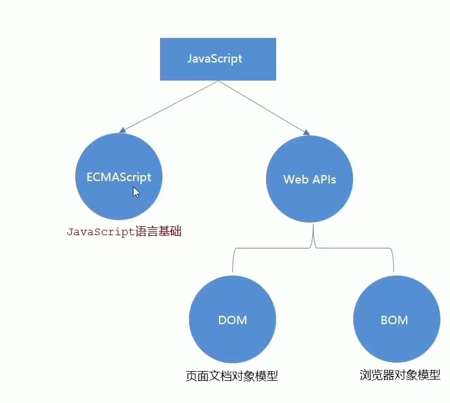

[**JavaScrip权威网站:**](https://developer.mozilla.org/zh-CN/)

[前端开发导航](https://webjike.com/web.html#row-1)

#### 1.1 引入方式

+ 内部JavaScript
  + 直接写在HTML文件里，用\<script>标签包住
  + 规范：\<script>标签在\</body>上方,
  + 注意事项：
+ 外部JavaScript
  + 代码写在以.js结尾的文件中
  + 语法：通过script标签，引入HTML页面中
  + 注意事项：
+ 内联JavaScript
  + 代码写在标签内部
  + 语法：此处了解，后面的Vue框架会用到这个模式

#### 1.2 注释和结束符

**注释**

+ 单行注释
  + 符号：//  (
  + 快捷键：Ctrl + /
+ 块注释
  + 符号：/**/  
  + 快捷键： shift + alt + a

#### 1.3 结束符

**结束符**

+ 作用：使用英文的;代表结束

#### 1.4 输入和输出

+ 输出语法

  + `document.write('要输出的内容')`
    + 作用：向body内输出标签
    + 注意：如果输出的是标签，也会被解构成页面的元素
  + `alert('要弹出的内容')`
    + 作用：页面弹出警告框
  + `console.log('控制台打印')`
    + 作用：控制台输出语法，程序员调试使用

+ 输入语法

  + `prompt('请输入你的内容')`
    + 作用：显示一个对话框，包含一条文字信息，用来提示用户输入文字
    + 展示：<br>

  #### 1.5 字面量

  在计算机科学中，字面量（literal）是在计算机中描述 事/物

  + 数字字面量
    + 数字1000
  + 字符字面量
    + `字符串字面量`
  + 数组字面量
    + []
  + 对象字面量
    + {}

### 2. 变量

#### 2.1 变量的概念和作用

变量是用于存储信息的"容器"。

[变量（菜鸟）](https://www.runoob.com/js/js-variables.html)

#### 2.2 声明复制的几种写法

+ 变量的声明

  + ~~~javascript
    let age
    ~~~

+ 变量的赋值

  + ~~~javascript
    age = 18
    let age = 18
    ~~~

+ 更新变量

  + ~~~javascript
    let age =18 //不允许多次声明一个变量
    age = 19
    ~~~

+ 声明多个变量

  + ~~~javascript
    let age = 18 , uname = "张三"//建议分开声明
    ~~~

+ 交换变量

  + ~~~javascript
    let num = 10
    let num2 = 20
    let tem
    tem = num
    num = num2
    num = tem
    ~~~

  + 


#### 2.3 变量的本质

+ 内存：存储数据的地方，相当于一个空间

+ 变量的本质：是程序在内存中申请用来存放数据的小空间
+ 示例图：


#### 2.4 变量的命名规则与规范

1. 规则：必须遵守，不遵守报错（类比是法律层面）
   1. 不能用关键字
   2. 只能用下划线，字母，数字，$组成，且不能是数字开头
   3. 字母严格区分大小写
2. 规范：建议，不遵守不会报错，但不符合业内通识（类比是道德层面）
   1. 起名要有意义
   2. 遵守小驼峰命名法
      1. 第一个单词小写，后面的单词首字母大写。例如：userName

输入姓名的案例

**let和var区别**

+ 

#### 2.5 变量的拓展

数组的基本使用

#### 2.1 声明

+ 变量的声明

  + ~~~javascript
    let age
    ~~~

+ 变量的赋值

  + ~~~javascript
    age = 18
    let age = 18
    ~~~

+ 更新变量

  + ~~~javascript
    let age =18 //不允许多次声明一个变量
    age = 19
    ~~~

+ 声明多个变量

  + ~~~javascript
    let age = 18 , uname = "张三"//建议分开声明
    ~~~

+ 交换变量

#### 2.2 赋值

#### 2.3 关键字

#### 2.4 变量命名规则

### 3.常量

[常量](https://www.w3school.com.cn/js/js_const.asp)

+ 概念：使用const声明的变量称为“常量”
+ 使用场景：当某个变量永远不变时，就可以使用
+ 命名规则：和变量一致
+ 注意：不允许赋值，生命是必须初始化

**ECMAScript 2015**

ES2015 引入了两个重要的 JavaScript 新关键词：`let` 和 `const`。

通过 `const` 定义的变量与 `let` 变量类似，但不能重新赋值：

### 实例

```
const PI = 3.141592653589793;
PI = 3.14;      // 会出错
PI = PI + 10;   // 也会出错
```

### 4.数据类型

[JavaScript 数据类型](https://www.w3school.com.cn/js/js_datatypes.asp)

[JavaScript 运算符](https://www.w3school.com.cn/js/js_operators.asp)

+ 基本数据类型
  + number 数字型
  + string 字符串型
  + boolean 布尔型
  + undefined 未定义型
  + null 空类型
+ 引用数据类型
  + object 对象

**JavaScript 算数运算符**

算数运算符用于对数字执行算数运算：

| 运算符 | 描述         |
| :----- | :----------- |
| +      | 加法         |
| -      | 减法         |
| *      | 乘法         |
| /      | 除法         |
| %      | 取模（余数） |
| ++     | 递加         |
| --     | 递减         |

**注释：**[JS 算数](https://www.w3school.com.cn/js/js_arithmetic.asp)这一章对算数运算符进行了完整描述。

#### 4.1 数值类型

#### 4.2 字符串类型

#### 4.3 布尔类型

#### 4.4 undefined

### 5.类型转换

#### 5.1隐式转换

某些运算符被执行时，系统内部自动将数据类型进行转换，这种转换称为隐式转换

+ 规则：
  + \+号两边只要有字符串，就会变成字符串
  + 除了\+以外的运算符 比如- * /都会把数据转换成数据类型
+ 缺点：
  + 数据转换类型不明确，要考经验
+ 小技巧
  + +号作为正好解析符可以转换为数字型
  + 任何数字相加结果都是字符串

#### 5.2 显示转换

+ Number（数据）
  + 转换成数字类型
  + 如果字符串内容里有非数字，转换失败结果为NaN（Not a Number）即不是一个数字
  + NaN也是number类型的数据，代表并非数据
+ parseInt(数据)
  + 只保留整数
+ parseFloat(数据)
  + 可以保留小数

### 6. 算术运算符

### 案例

### 1.JS简介


**书写位置**

+ 内部
  + 
+ 外部
  + 代码写在以.js结尾的文件中
+ 内联
  + 写在标签内部

+ + 

### 1.3 结束符：; (可写可不写)

### 1.4 输入输出语法

+ 输出

  + ~~~javascript
    document.write("HELLO WORLD")//跳过页面渲染先被执行
    prompt()//跳过页面渲染先被执行
    ~~~

+ 输入

  + ~~~javascript
    alert("")
    console.log("控制打印台")
    ~~~

**字面量**（literal）

+ 

### 2. 变量


### 3. 常量

### 4. 数据类型

### 5. 数据类型的转换

### 6. 算术运算符

## day 02-03

### 1. 运算符

[JavaScript 运算符](https://www.w3school.com.cn/js/js_operators.asp)

+ 赋值运算符

  + 赋值运算符向 JavaScript 变量赋值。

    | 运算符 | 例子   | 等同于    |
    | :----- | :----- | :-------- |
    | =      | x = y  | x = y     |
    | +=     | x += y | x = x + y |
    | -=     | x -= y | x = x - y |
    | *=     | x *= y | x = x * y |
    | /=     | x /= y | x = x / y |
    | %=     | x %= y | x = x % y |

    加法赋值运算符（`+=`）向变量添加一个值。

    赋值

    ```
    var x = 7;
    x += 8; 
    ```

+ 一元运算符

  + | 运算符 | 描述 |
    | :----- | :--- |
    | ++     | 递加 |
    | --     | 递减 |

+ 比较运算符

  + | 运算符 | 描述           |
    | :----- | :------------- |
    | ==     | 等于           |
    | ===    | 等值等型       |
    | !=     | 不相等         |
    | !==    | 不等值或不等型 |
    | >      | 大于           |
    | <      | 小于           |
    | >=     | 大于或等于     |
    | <=     | 小于或等于     |
    | ?      | 三元运算符     |

    **注释：**[JS 比较](https://www.w3school.com.cn/js/js_comparisons.asp)这一章中完整描述了比较运算符。

+ 逻辑运算符

  + | 运算符 | 描述   |
    | :----- | :----- |
    | &&     | 逻辑与 |
    | \|\|   | 逻辑或 |
    | !      | 逻辑非 |

    **注释：**[JS 比较](https://www.w3school.com.cn/js/js_comparisons.asp)这一章中完整描述了逻辑运算符。

+ 运算符优先级

  + [JavaScript 运算符优先级](https://www.w3school.com.cn/js/js_precedence.asp)
  + 
  + 一元运算符里面的逻辑非优先级很高

### 2. 语句

[ECMAScript 迭代语句](https://www.w3school.com.cn/js/pro_js_statements_iterative.asp)

[Array---MWD](https://developer.mozilla.org/zh-CN/docs/Web/JavaScript/Reference/Global_Objects/Array)

[JavaScript Array 对象---菜鸟](https://www.runoob.com/jsref/jsref-obj-array.html)

#### 2.1 表达式和语句

+ 表达式和语句

  + 表达式可以被求值，会计算出一个结果
  + 语句不一定有值

+ 分支语句

  + 三大流程控制语句

    + 顺序结构

    + 分支语句

      + If分支语句

        + ~~~javascript
          if(条件){ //单分支
              	满足条件要执行
          }
          if(条件){ //双分支
              	满足条件要执行
          }else{
              不满足条件执行的代码
          }
          if(条件){ //多分支语句
              	满足条件要执行
          }else if{
              满足条件执行的代码
          }else if{
              满足条件执行的代码
          }else {
              不满足条件执行的代码
          }
          ~~~

        + 三元运算符

          + 使用场景：其实是if双分支更简单的写法，可以用三元表达式

          + 符号：?与：配合使用

          + ~~~ 
            3 > 5 ? 3 : 5
            if(3 < 5){
            	alert('真的')
            }else{
            	alert('假的')
            }
            ~~~

        + switch语句

          + 找到小括号里数据全等的case值。并执行里面对应的代码

          + 若没有全等===的则执行default里的代码

          + ~~~javascript
            switch(数据){
                case 值1:
                    代码1
                    break
                case 值2:
                    代码2
                    break
                case 值3:
                    代码3
                    break
                default:
                    代码n
                    break
                    
            }
            ~~~

          + 注意：

            + switch case语句一般用于等值判断，不适合于区间判断
            + switch case一般需要配合break关键字使用 没有break会造成case穿透

+ 循环语句

  + 断点调试

  + while循环（当不明确循环循环次数）

    + 具备的三要素

      + 变量起始值
      + 终止条件
      + 变量变化量

    + ~~~javascript
      while(循环条件){
            要重复执行的代码（循环体）
            }
      ~~~

    + 退出循环

      + break:退出循环
      + continue：结束本次循环，继续下一次循环

  + for循环(最好明确循环次数)

    + ~~~javascript
      for(变量起始值;终止条件；变量变化量){//嵌套循环
             for(变量起始值;终止条件；变量变化量){
              循环体
          } 
      }
      无限循环for(;;)
      ~~~

数组


#### 2.2 数组

[JavaScript Array 对象---数组属性---对象方法](https://www.runoob.com/jsref/jsref-obj-array.html)

+ 创建数组
+ 操作数组
  + 
  + 数组排序
    + 冒泡
    + sort:[Array.prototype.sort()](https://developer.mozilla.org/zh-CN/docs/Web/JavaScript/Reference/Global_Objects/Array/sort)

## day04

[JavaScript 作用域](https://www.runoob.com/js/js-scope.html)

#### 1.函数

+ 函数的使用

  + 和命名规则一致
  + 尽量小托峰式命名法
  + 前缀应该改为动词
  + 明明建议：常用动词约定
  + 

+ 函数传参--参数默认值

  + ~~~javascript
    function getSum(x = 0,y = 0){
        document.write(x + y)
    }
    getSum()
    ~~~

+ 函数返回值

  + 断点调试：进入函数内部看执行过程F 11

+ 函数细节

  + 

+ 作用域[JavaScript 作用域](https://www.runoob.com/js/js-scope.html)

  + 作用域是可访问变量的集合。
  + **如果内部变变量没有声明，直接赋值当全局变量看，强烈不推荐**
  + 

+ 匿名函数

  + 将匿名函数赋予一个变量值，通过变量名进行调用，称为函数表达式

  + ~~~javascript
    let fn = function(){//函数表达式（let必须先声明后使用）
        //函数体
    }
    函数只能在后面调用，具名函数则不同（可以写在任何位置）
    ~~~

  + 老写法：<br>

  + 新写法：<br>

  + 立即执行函数

    + 防止变量污染，多个立即执行函数之间用分号隔开

    + ~~~javascript
      (function(x,y){
          
      })(1,2);//括号(1,2)相当于调用函数
      (function(){})();//第一种写法
      （function(){}());//第二种写法
      ~~~

   **逻辑中断**

  + 逻辑运算符中的短路
    + 短路：只存在与&&和||中，当满足一定条件时会让右边的代码不执行、
    + 

  

  **转型为Boolean型**

  + 显示转换：
    + 1.Boolean（内容）
    + '',0,undefine,null,fales,NaN转换为布尔值后都是false，其余则为true
  + 隐式转换：
    + 

## day05

[JavaScript Array 对象---菜鸟](https://www.runoob.com/jsref/jsref-obj-array.html)

[Object---MWD](https://developer.mozilla.org/zh-CN/docs/Web/JavaScript/Reference/Global_Objects/Object)

+ 对象

  + **`Object`** 是 JavaScript 的一种[数据类型](https://developer.mozilla.org/zh-CN/docs/Web/JavaScript/Data_structures)。它用于存储各种键值集合和更复杂的实体。可以通过 [`Object()`](https://developer.mozilla.org/zh-CN/docs/Web/JavaScript/Reference/Global_Objects/Object/Object) 构造函数或者使用[对象字面量](https://developer.mozilla.org/zh-CN/docs/Web/JavaScript/Reference/Operators/Object_initializer)的方式创建对象。

+ 对象使用

  + 1.对象声明语法

    + 

  + 2.对象有属性和方法组成

    + 属性：信息或叫特征（名词）

      + 

    + 方法：功能或叫行为（动词）

      + 

    + ~~~javascript
      let 对象名 = {
          属性名：属性值，
          方法名：函数 
      }
      ~~~

  + 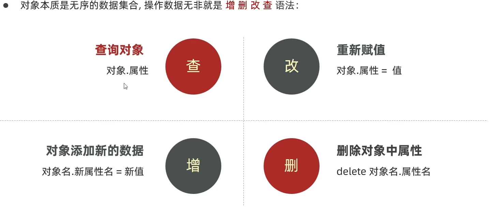

  + ~~~javascript
    console.log(obj['goods-name'])//法一
    console.log(obj.goods-name)//不行
    console.log(obj.goods)//法二
    ~~~

+ 遍历对象

  + 
  + for - in(很少去遍历数组)
    + 
  + for - in(去遍历对象）
    + 
  + 

+ 内置对象

  + 内置对象-Math[Math--MDN](https://developer.mozilla.org/zh-CN/docs/Web/JavaScript/Reference/Global_Objects/Math)
  + 

**ECMAScript 定义类或对象**

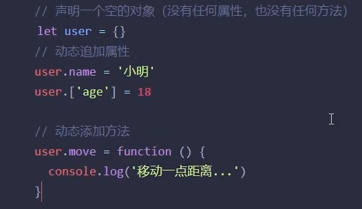

[ECMAScript 定义类或对象---W3school](https://www.w3school.com.cn/js/pro_js_object_defining.asp)

术语解释


可以帮助理解

+ 


# Web APIs 

## day01 (DOM-获取元素）

[Document---MDN](https://developer.mozilla.org/zh-CN/docs/Web/API/Document)

**声明变量**


### 1. Web API 基本认知

+ 作用和分类
  + 作用：就是使用JS去操作html和浏览器
  + 分类：DOM（文档对象模型），BOM（浏览器对象模型）
+ 什么是DOM
  + DOM：当网页被加载时，浏览器会创建页面的文档对象模型（Document Object Model）。
  + 通俗理解：DOM是浏览器提供的一套专门用来操作网页的功能
  + DOM作用
    + 开发网页特效和实现用户交互
+ DOM树
  + 将HTML文档以树状结构直观的表现出来，我们称之为文档树或DOM树
  + 描述网页内容关系的名词
  + 作用：文档树直观的体现了标签与标签之间的关系
  + 
+ DOM对象（重要）
  + DOM对象：浏览器会根据HTML标签生成的JS对象
    + 所有的标签属性都可以在这个对象上面找到
    + 修改这个对象的属性会自动映射到标签的身上
  + DOM的核心思想
    + 把网页内容当做对象来处理
  + document 对象
    + 是DOM里面提供的一个对象
    + 所以它提供的属性和方法都是用来访问和操作网页的
      + 例如：` document.write()`
    + 网页的所有内容都在document里面

### 2. 获取DOM对象

+ 根据CSS选择器来获取DOM元素[Document ---MDN](https://developer.mozilla.org/zh-CN/docs/Web/API/Document)

  + ~~~javascript
    document.querySelector('css选择器')//选择匹配的第一个元素
    document.querySelectorAll('css选择器')//选择匹配的所有的元素
    ~~~

### 3. 操作元素的内容

+ 对象.innerText属性
  + [`HTMLElement`](https://developer.mozilla.org/zh-CN/docs/Web/API/HTMLElement) 接口的 **`innerText`** 属性表示一个节点及其后代所渲染文本的内容。
  + [HTMLElement：innerText 属性](https://developer.mozilla.org/zh-CN/docs/Web/API/HTMLElement/innerText)
+ 对象.innerHTML
  + **`Element.innerHTML`** 属性设置或获取 HTML 语法表示的元素的后代。
  + [element.innerHTML](https://developer.mozilla.org/zh-CN/docs/Web/API/Element/innerHTML)

### 4. 操作元素的属性

+ 操作元素的常用属性

+ 操作元素样式属性

  + 

+ 操作表单元素属性

  + 通过style属性操作CSS

  + 

  + 

  + 操作类名（className）操作css

    + 如果需要修改的样式比较多，我们可以借助于css类名的形式

    + ~~~javascript
      元素.className = 'active'
      ~~~

  + 通过classList操作类控制CSS

    + [HTML DOM classList 属性---菜鸟](https://www.runoob.com/jsref/prop-element-classList.html)

    + 为了解决className容易覆盖以前的类名，我们通过classList方式追加和删除类名

    + ~~~javascript
      box.classList.add('box')
      box.classList.remove('box')
      box.classList.toggle('active')
      ~~~

  + 自定义属性 

    + [HTMLElement.dataset ---MDN](https://developer.mozilla.org/zh-CN/docs/Web/API/HTMLElement/dataset)
    + 

+ 定时器-间歇函数

  + 开启定时器[setInterval() ---MDN](https://developer.mozilla.org/zh-CN/docs/Web/API/setInterval)
  + 关闭定时器[`clearInterval()---MDN`](https://developer.mozilla.org/zh-CN/docs/Web/API/clearInterval) 来移除

## day02 (DOM-事件基础)

### 1.事件监听（绑定）

+ 语法：[EventTarget.addEventListener() --MDN](https://developer.mozilla.org/zh-CN/docs/Web/API/EventTarget/addEventListener)<br>

+ ~~~javascript
  box1.addEventListener('click',function(){
      box.style.display = 'none'
  })
  ~~~

+ 事件监听三要素

  + 

+ 事件监听-事件监听版本

  + DOM L0

    + ~~~javascript
      事件源.on事件 = function(){
          
      }
      btn.onclick = function(){
          
      }
      ~~~

    + DOM L2

      + ~~~javascript
        事件源.addEventListener(事件,事件处理函数)
        ~~~

    + 区别：

      + on方式会被覆盖，addEventListener方式可绑定多次，拥有事件更多特性，推荐使用

    + 发展史：

      + 

### 2.事件类型

+ 	
+ 鼠标触发
  + [元素：click 事件---MDN](https://developer.mozilla.org/zh-CN/docs/Web/API/Element/click_event)
  + [Element：mouseenter 事件---MDN](https://developer.mozilla.org/zh-CN/docs/Web/API/Element/mouseenter_event)
+ 表单获得光标
  +  
  +  
+ 键盘触发
  +  
  +  
+ 表单输入触发
  + 

### 3.事件对象

1. **JavaScript中的事件对象（Event Object）是在事件发生时自动创建的对象，它包含与该事件相关的属性和方法。事件对象提供了对事件的详细描述和访问。**

   事件对象可以通过事件处理程序函数的参数进行访问。在DOM中，常用的事件对象参数通常命名为`event`、`e`或`evt`，可以根据个人习惯选择名称。下面是一些常见的事件对象属性和方法：

   1. `event.target`：获取触发事件的元素。

   2. `event.type`：获取事件类型（如"click"、"keypress"等）。

   3. `event.preventDefault()`：取消事件的默认行为。

   4. `event.stopPropagation()`：停止事件在DOM树中的传播。

   5. `event.clientX`和`event.clientY`：获取鼠标事件发生时的鼠标指针相对于浏览器窗口的水平和垂直坐标。

   6. `event.keyCode`：获取键盘事件中按下的按键的键码。

   7. `event.target.value`：获取表单元素的值（例如input元素的值）。

   8. `event.preventDefault()`：取消事件的默认行为。

   这只是事件对象的一小部分属性和方法的示例，具体取决于事件的类型和上下文。通过使用事件对象，您可以实现对特定事件的处理、访问事件发生时的相关信息，并执行适当的操作和逻辑。

2. **获取事件对象**

   当处理事件时，有几个常用的事件对象属性能够提供有关事件的重要信息。以下是这些属性的解释和示例代码：

   1. `type`属性：表示事件的类型。例如，"click"表示点击事件，"keydown"表示按键事件等。

   ```javascript
   element.addEventListener('click', function(event) {
     console.log(event.type); // 输出：click
   });
   ```

   2. `target`属性：表示触发事件的元素。可以是任何 HTML 元素。

   ```javascript
   element.addEventListener('click', function(event) {
     console.log(event.target); // 输出：触发点击事件的元素
   });
   ```

   3. `currentTarget`属性：表示当前正在处理事件的元素，也就是绑定事件的元素。

   ```javascript
   element.addEventListener('click', function(event) {
     console.log(event.currentTarget); // 输出：绑定事件的元素
   });
   ```

   4. `clientX`和`clientY`属性：表示鼠标指针在触发事件时的水平和垂直坐标。

   ```javascript
   element.addEventListener('mousemove', function(event) {
     console.log(event.clientX, event.clientY); // 输出：鼠标指针的坐标
   });
   ```

   5. `keyCode`或`key`属性：表示按下的键的代码或键名。在键盘事件中非常有用。

   ```javascript
   document.addEventListener('keydown', function(event) {
     console.log(event.keyCode); // 按下的键的代码
     console.log(event.key); // 按下的键的名称
   });
   ```

   这些是处理事件时常用的一些事件对象属性。通过访问这些属性，你可以获取有关事件的重要信息，并根据需要执行相应的操作。

### 4.环境对象

`this` 是 JavaScript 中的关键字，代表当前执行代码的上下文对象，它的值取决于代码的执行方式和上下文。

下面通过几种常见的使用场景来详细解释 `this` 的用法：

1. 全局作用域中的 `this`：
   在全局作用域中使用 `this`，它指向全局对象（在浏览器环境中通常是 `window` 对象）。

```javascript
console.log(this); // 在浏览器中输出: Window
```

2. 函数中的 `this`：
   在函数中使用 `this`，它的值可以根据函数的调用方式不同而变化。

  a. 在函数中，如果函数被对象的方法调用，那么 `this` 指向调用该方法的对象。

```javascript
const obj = {
  name: 'Alice',
  sayHello: function() {
    console.log('Hello, ' + this.name);
  }
};

obj.sayHello(); // 输出: Hello, Alice
```

  b. 如果函数作为普通函数被调用，那么 `this` 指向全局对象（在浏览器环境中通常是 `window` 对象）。

```javascript
function sayHello() {
  console.log('Hello, ' + this.name);
}

const name = 'Alice';
sayHello(); // 输出: Hello, Alice
```

3. 构造函数中的 `this`：
   当使用 `new` 关键字调用构造函数创建一个对象时，构造函数内部的 `this` 指向新创建的对象。

```javascript
function Person(name) {
  this.name = name;
}

const person = new Person('Alice');
console.log(person.name); // 输出: Alice
```

4. 显式绑定 `this`：
   JavaScript 提供了一些方法来显式地指定函数中 `this` 的值，如 `call`、`apply` 和 `bind`。

```javascript
function sayHello() {
  console.log('Hello, ' + this.name);
}

const obj = {
  name: 'Alice'
};

sayHello.call(obj); // 输出: Hello, Alice
```

以上是 `this` 的一些常见用法和示例。请注意，`this` 的值取决于代码的执行上下文，不同的上下文可能会使 `this` 指向不同的对象。因此，在使用 `this` 时需根据具体情况判断其指向的对象。

环境对象

1. 目标：能够分析函数运行在不同环境中this所指的对象
2. 环境对象：指的是函数内部特殊的变量this，它代表着当前函数运行时所处的环境
3. 作用：弄清楚this的指代，可以让我们代表更简介
   1. 函数的调用方式不同，this指代的对象也不同
   2. 【谁调用，this就是谁】是判断this指向的粗略规则
   3. 直接调用函数，其实相当于是window.函数,所以this指代window

### 5.回调函数

**回调函数是指将函数作为参数传递给另一个函数，并且在某个特定事件发生或特定条件满足时被调用执行的函数。**

在许多编程语言中，回调函数通常用于处理异步操作。当我们需要执行一个耗时的操作（比如读取文件、发送网络请求等），通常不能阻塞程序的执行，因此我们可以将一个回调函数传递给这个操作，当操作完成时，将调用回调函数来处理操作的结果。

下面是一个 JavaScript 的回调函数示例，展示了如何使用回调函数的操作：

```javascript
//1. 同步回调函数： 在同步回调函数中，回调函数会立即执行，并且会阻塞程序的执行，直到回调函数执行完成。
function syncCallback(callback) {
  console.log('同步回调函数开始执行');
  callback(); // 调用回调函数
  console.log('同步回调函数执行完成');
}

function callbackFunc() {
  console.log('这是回调函数');
}

syncCallback(callbackFunc);
/*在上述例子中，我们定义了一个同步的回调函数 syncCallback，它在执行过程中立即调用了回调函数 callbackFunc，然后继续执行剩余的代码。因为回调函数是同步的，所以它会阻塞程序的执行，并按照顺序执行打印出相应的信息。*/

//2. 异步回调函数： 在异步回调函数中，回调函数会在某个特定事件发生或特定条件满足时执行，而不是立即执行。
function fetchData(url, callback) {
  // 模拟异步操作，比如发送 HTTP 请求
  setTimeout(() => {
    const data = "这是从服务器获取的数据";
    callback(data); // 回调函数在操作完成后被调用，并将数据作为参数传递给回调函数
  }, 2000); // 假设操作耗时 2 秒
}

function processData(data) {
  console.log("处理数据：" + data);
}

fetchData("https://example.com/api/data", processData);
/*在上面的例子中，`fetchData` 函数接受一个 URL 和一个回调函数作为参数。它模拟了一个异步操作，延迟了 2 秒后返回一个数据。当操作完成后，回调函数 `processData` 被调用，并将获取到的数据作为参数传递给它。`processData` 函数将数据打印到控制台。
通过使用回调函数，我们可以在异步操作完成后执行相应的逻辑。这种方式可以避免阻塞程序的执行，提高代码的效率和响应性。回调函数还可以实现更多复杂的功能，比如事件处理、错误处理等。
*需要注意的是，回调函数的编写需要考虑错误处理和回调地狱等问题，因此在现代编程中，常常使用 Promise、async/await 等较为高级的异步编程模式来取代传统的回调函数。*/


const button = document.querySelector('#myButton');

function handleClick() {
  console.log('按钮被点击了');
}

button.addEventListener('click', handleClick, { once: true });

```

~~~javascript
addEventListener 方法的语法如下：
element.addEventListener(event, callback, options);
下面是一个示例，演示 addEventListener 方法的用法：
const button = document.querySelector('#myButton');

function handleClick() {
  console.log('按钮被点击了');
}

button.addEventListener('click', handleClick, { once: true });
~~~


## day03 (DOM-事件进阶)

### 1.事件流

#### 1.事件流与两个阶段的说明

1. 

#### 2.事件捕获

1. 在父子关系中，事件流同样适用。当一个具有父子关系的元素触发了事件时，事件会从父元素向下传播到子元素，这个过程被称为事件捕获阶段，然后再从子元素向上冒泡回到父元素，这个过程被称为事件冒泡阶段。

   为了演示父子关系中的事件流应用，我们可以使用如下的HTML和JavaScript代码：

   HTML部分：

   ```html
   <div id="parentDiv">
     <button id="childButton">点击我</button>
   </div>
   ```

   JavaScript部分：

   ```javascript
   // 获取父元素和子元素
   const parentDiv = document.getElementById("parentDiv");
   const childButton = document.getElementById("childButton");
   
   // 添加点击事件监听器（捕获阶段）第三个参数设置为true则代表捕获时触发
   parentDiv.addEventListener("click", function(event) {
     console.log("点击了父元素");
   }, true);
   
   // 添加点击事件监听器（冒泡阶段）第三个参数默认设置为是false
   parentDiv.addEventListener("click", function(event) {
     console.log("父元素冒泡阶段");
   });
   
   // 添加点击事件监听器
   childButton.addEventListener("click", function(event) {
     console.log("点击了子元素");
   });
   ```

   在上述代码中，我们为父元素和子元素分别添加了点击事件监听器。需要注意的是，在父元素的事件监听器中，我们通过设置第三个参数为`true`来启用事件捕获阶段。

   当点击子元素按钮时，控制台会依次输出以下内容：

   1. "点击了父元素"（捕获阶段）：事件从父元素向下传播到子元素。
   2. "点击了子元素"：子元素按钮的点击事件被触发。
   3. "父元素冒泡阶段"：事件从子元素向上冒泡回到父元素。

   通过事件流的应用，可以在父子关系中灵活地处理事件。根据需要，您可以选择在事件捕获阶段或事件冒泡阶段对事件进行处理，以实现特定的交互逻辑。

2. 

#### 3.事件冒泡

+ 事件冒泡（Event Bubbling）是指当一个元素触发某个事件时，不仅会调用该元素上绑定的对应事件处理程序，还会逐级向上调用其父元素的相同事件处理程序，一直到根元素。

  在 HTML 中，元素通常嵌套在其他元素内部形成层次结构。当在子元素上触发事件时，事件将向上传播到父元素，然后向更高层级的父元素继续传播，直到最顶层的根元素或者有绑定相应事件的处理程序的元素。这种自底向上的传播过程就是事件冒泡。

  事件冒泡机制的好处是可以在父元素上仅绑定一个事件处理程序，而不需要为每个子元素都绑定相同的事件处理程序。这样可以简化代码，并且实现事件的委托和动态处理。

  例如，当点击一个按钮时，如果按钮嵌套在多个层级的父元素中，通过事件冒泡，可以依次触发每个父元素上绑定的点击事件处理程序，实现统一的操作逻辑。

  事件冒泡是浏览器的默认行为，但有时可能需要阻止事件冒泡。在事件处理程序中使用 `event.stopPropagation()` 可以停止事件的继续传播，即阻止事件冒泡。

  总结一下，事件冒泡是指事件从触发的元素自底向上传播到父元素直至根元素的过程，它是一种在层次结构中处理事件的机制。

+ 当一个元素触发事件时，通过代码可以演示事件冒泡的过程。以下是一个简单的示例：

HTML代码：

```html
<div id="outer">
  <div id="inner">
    <button id="button">Click me</button>
  </div>
</div>
```

JavaScript代码：

```javascript
const outer = document.getElementById('outer');
const inner = document.getElementById('inner');
const button = document.getElementById('button');

button.addEventListener('click', function(event) {
  alert('Button clicked!');
  // event.stopPropagation(); // 阻止事件冒泡
});

inner.addEventListener('click', function(event) {
  alert('Inner div clicked!');
});

outer.addEventListener('click', function(event) {
  alert('Outer div clicked!');
});
```

在上面的代码中，当点击按钮（id为"button"）时，会先触发按钮的点击事件处理程序，弹出一个包含 "Button clicked!" 的警告框。然后，事件冒泡继续将事件传递给父元素，即内部div元素（id为"inner"），触发内部div的点击事件处理程序，弹出一个包含 "Inner div clicked!" 的警告框。最后，事件冒泡继续将事件传递给外部div元素（id为"outer"），触发外部div的点击事件处理程序，弹出一个包含 "Outer div clicked!" 的警告框。

如果在按钮的点击事件处理程序中添加了 `event.stopPropagation()`，则会阻止事件冒泡，即不会继续传递给父元素。在这种情况下，只有按钮的点击事件处理程序会执行，警告框将只显示 "Button clicked!"。如果注释掉 `event.stopPropagation()`，则按钮的点击事件处理程序执行后，还会触发内部div的点击事件处理程序和外部div的点击事件处理程序，警告框会显示 "Button clicked!"、"Inner div clicked!" 和 "Outer div clicked!"。

这个示例展示了事件冒泡的过程以及如何使用 `event.stopPropagation()` 阻止事件冒泡。你可以在浏览器的开发者工具控制台中运行代码并查看结果。

#### 4.阻止冒泡

+ 

+ 当需要阻止事件冒泡时，可以使用 `event.stopPropagation()` 方法。这个方法会阻止事件继续向上层元素传播，使得事件只在当前元素上触发执行。

  以下是一个示例代码，详细解释了如何使用 `event.stopPropagation()` 阻止事件冒泡：

  HTML 代码：	

```html
<div id="parent">
  <div id="child">
    <button id="btn">Click me</button>
  </div>
</div>
```

JavaScript 代码：

```javascript
// 获取元素
const parent = document.querySelector('#parent');
const child = document.querySelector('#child');
const btn = document.querySelector('#btn');

// 绑定点击事件处理程序
parent.addEventListener('click', function(event) {
  console.log('Parent clicked');
});

child.addEventListener('click', function(event) {
  console.log('Child clicked');
  // 阻止事件冒泡
  event.stopPropagation();
});

btn.addEventListener('click', function(event) {
  console.log('Button clicked');
});
```

在上述代码中，我们通过 `addEventListener` 方法给父元素 `parent`、子元素 `child` 和按钮 `btn` 绑定了点击事件处理程序。

当点击按钮时，事件将依次触发父元素、子元素和按钮上的点击事件处理程序。但是，由于在子元素的点击事件处理程序中调用了 `event.stopPropagation()` 方法，这将阻止事件继续向上层元素传播。

因此，当点击按钮时，只会执行按钮的点击事件处理程序，而不会触发父元素和子元素的点击事件处理程序。

需要注意的是，`event.stopPropagation()` 方法只会阻止事件在 DOM 树上冒泡传播，但不会阻止事件在当前元素上的默认行为。如果还需要阻止当前元素上的默认行为，可以搭配使用 `event.preventDefault()` 方法。

##### 阻止默认行为

要阻止默认行为，可以使用JavaScript中的`preventDefault()`方法。这个方法用于取消事件的默认行为，例如点击链接时的页面跳转，提交表单时的页面刷新等。下面是一个示例：

HTML代码：

```
<a href="https://example.com" id="link">点击我</a>
```

JavaScript代码：

```javascript
// 获取链接元素
const link = document.getElementById('link');

// 添加点击事件监听器
link.addEventListener('click', function(event) {
  // 阻止默认行为
  event.preventDefault();

  // 在此处可以添加自定义的操作
  console.log('链接被点击了，但默认行为被阻止了！');
});
```

在上述示例中，当用户点击链接时，事件触发处理程序会调用`preventDefault()`方法阻止默认行为。这样，点击链接时，页面不会跳转到指定的URL，而是执行自定义的操作（例如在控制台打印一条消息）。

请注意，`preventDefault()`方法只能在事件处理程序中使用，并且只能应用于特定事件（如点击、提交等）。如果希望在全局范围内阻止默认行为，可以在适当的位置使用其他方法，例如在表单的`onsubmit`事件中返回`false`来阻止表单提交时的页面刷新。

#### 5.解绑事件

当你需要解绑一个事件时，你可以使用JavaScript中的`removeEventListener`方法。这个方法可以从一个元素中移除之前绑定的事件处理函数。下面是一个示例代码：

```javascript
// 获取按钮元素
const button = document.getElementById('myButton');

// 创建一个事件处理函数
function handleClick() {
  console.log('按钮被点击了！');
}

// 绑定点击事件
button.addEventListener('click', handleClick);

// 在需要解绑事件的地方调用removeEventListener方法
button.removeEventListener('click', handleClick);
```

在这个示例中，我们首先获取一个按钮元素，然后创建一个名为`handleClick`的事件处理函数。接下来，我们使用`addEventListener`方法将点击事件绑定到按钮上，并传入`handleClick`作为事件处理函数。

最后，我们可以通过调用`removeEventListener`方法来解绑事件，并传入相同的事件类型（'click'）和事件处理函数（`handleClick`）。

需要注意的是，解绑事件时，传入的事件处理函数必须与绑定事件时使用的函数是同一个函数，否则事件将无法正确解绑。

**`mouseover`和`mouseenter`是两个JS事件区别**

1. **`mouseover`和`mouseenter`是两个JS事件，用于处理鼠标指针进入和离开元素的情况。**

   **`mouseover`事件在鼠标指针进入元素的任意后代元素时触发，而`mouseenter`事件只在鼠标指针进入元素本身时触发。这就是它们的主要区别。**

   下面是结合代码的详细解释：

   ```html
   <div id="myDiv" style="width: 200px; height: 200px; background-color: red;"></div>
   ```

   ```javascript
   const myDiv = document.getElementById('myDiv');
   
   myDiv.addEventListener('mouseover', function(event) {
     console.log('mouseover');
   });
   
   myDiv.addEventListener('mouseenter', function(event) {
     console.log('mouseenter');
   });
   
   myDiv.addEventListener('mouseleave', function(event) {
     console.log('mouseleave');
   });
   ```

   在上面的代码中，我们创建了一个红色的`div`元素，并在其上添加了`mouseover`、`mouseenter`和`mouseleave`事件的监听器。

   当鼠标指针进入该元素时，`mouseover`事件会在控制台打印出`mouseover`。当鼠标指针离开该元素时，`mouseleave`事件会在控制台打印出`mouseleave`。

   但是，注意到当鼠标指针进入元素的子元素时（算离开父亲元素），`mouseover`事件会再次触发（子元素没有事件但是父元素有，冒泡阶段再次触发事件），而`mouseenter`事件不会再次触发。这就是它们的主要区别。

   综上所述，`mouseover`事件在鼠标指针进入元素的任意后代元素时触发，而`mouseenter`事件只在鼠标指针进入元素本身时触发。

2. **为什么mouseover会在鼠标指针进入元素或元素的子元素时连续触发多次**

   `mouseover` 事件在鼠标指针进入元素或元素的子元素时连续触发多次的原因是事件冒泡的机制。

   事件冒泡是指当一个特定的事件在嵌套的元素上触发时，该事件会从触发元素开始一直冒泡到父元素，直至	文档根元素。当鼠标指针进入了元素的子元素时，由于子元素也是父元素的一部分，所以会触发这个事件，	并且事件会冒泡到父元素上。

   这就造成了在进入元素的子元素时，`mouseover` 事件会连续触发多次的情况。每次鼠标指针穿过一个子元	素，`mouseover` 事件都会在该子元素上触发一次，并进一步向父元素传递，直到整个事件冒泡到达父元素。

   为了避免这种连续触发的情况，可以使用 `mouseenter` 事件。`mouseenter` 事件不会在进入元素的子元素	时触发，所以不会出现连续触发的情况。

3. **在传统的事件注册中，通常使用`on`前缀来指定事件处理函数，例如`onclick`、`onkeyup`等。而在监听事件注册中，则使用`addEventListener`或类似的方法来注册事件监听器。**

   **以下是传统`on`注册和监听事件注册的主要区别：**

   1. 多个处理函数的绑定方式：

      - 传统`on`注册：在一个元素上只能绑定一个处理函数，如果需要绑定多个处理函数，则需要将多个函数串联在一起，或者通过全局变量或闭包来实现多个处理逻辑。

      ```javascript
      button.onclick = function1;
      button.onclick = function2; // 会覆盖之前的处理函数
      ```

      - 监听事件注册：通过`addEventListener`方法绑定的事件处理函数可以同时存在多个，并且不会相互覆盖。

      ```javascript
      button.addEventListener('click', function1);
      button.addEventListener('click', function2); // 同时绑定两个处理函数
      ```

   2. 处理函数的执行顺序：

      - 传统`on`注册：采用传统的`on`注册方式，后绑定的处理函数会覆盖先绑定的处理函数，因此后绑定的处理函数会优先执行。

      - 监听事件注册：利用`addEventListener`方法，绑定的处理函数会按照添加顺序执行，不会相互覆盖。

   3. 事件冒泡和捕获：

      - 传统`on`注册：传统的`on`注册方式，只支持事件冒泡阶段执行事件处理函数。

      ```javascript
      // 事件冒泡阶段
      button.onclick = function(event) {
        // 处理事件的逻辑
      };
      ```

      - 监听事件注册：利用`addEventListener`方法，可以选择在事件冒泡阶段或事件捕获阶段执行事件处理函数。

      ```javascript
      // 事件冒泡阶段
      button.addEventListener('click', function(event) {
        // 处理事件的逻辑
      });
      
      // 事件捕获阶段
      button.addEventListener('click', function(event) {
        // 处理事件的逻辑
      }, true);
      ```

   总的来说，监听事件注册通常更为灵活，可以并存多个处理函数，并且可以在事件捕获阶段或事件冒泡阶段执行。传统`on`注册虽然简单直接，但受限于单一处理函数和执行顺序的特点。因此，推荐使用监听事件注册，特别是在复杂的应用场景或需要精确控制事件流程时。

### 2.事件委托

当我们想要在一个包含多个子元素的父级元素上处理它们的点击事件时，可以使用事件委托来简化代码和管理事件。下面是一个使用JavaScript来实现事件委托的示例代码：

HTML:

```html
<div id="parent">
  <button class="btn">Button 1</button>
  <button class="btn">Button 2</button>
  <button class="btn">Button 3</button>
</div>
```

JavaScript:

```javascript
// 获取父级元素
const parent = document.getElementById('parent');

// 父级元素上绑定事件处理器
parent.addEventListener('click', function(event) {
  // 检查事件的目标元素是否为按钮
  if(event.target.classList.contains('btn'))//条件也可以换成event.target.tagName ==='BUTTON'
  {
    // 执行按钮点击的处理逻辑
    console.log('Button clicked:', event.target.textContent);
  }
});
```

在上述代码中，我们首先获取父级元素`parent`，然后使用`addEventListener`方法在父级元素上添加点击事件的监听器。当点击事件发生时，事件对象作为参数传递给事件处理函数。

**`event.target` 包含了触发事件的元素的相关信息。它返回一个表示事件目标的对象，该对象包含以下常用属性：**

1. `event.target.tagName`：返回触发事件的元素的标签名，如 `"DIV"`、`"BUTTON"` 等。
2. `event.target.id`：返回触发事件的元素的 id 属性值。
3. `event.target.className`：返回触发事件的元素的类名（class）字符串。如果元素有多个类名，它们将以空格分隔。
4. `event.target.value`：通常在表单元素中使用，返回触发事件的元素的值，如输入框中的文本、单选按钮的选中值等。
5. `event.target.checked`：通常用于复选框或单选按钮，表示触发事件的元素是否被选中。返回布尔值。
6. `event.target.href`：返回触发事件的链接元素（`<a>`）的 href 属性值。
7. `event.target.src`：返回触发事件的图像元素（``）的 src 属性值。

除了上述属性，`event.target` 对象还可以使用其他方法和属性，具体取决于元素类型和事件的类型。

需要注意的是，`event.target` 是事件发生时的目标元素，而不是事件绑定的元素。在事件冒泡过程中，事件会从目标元素向上冒泡到更高级别的节点，可以使用 `event.currentTarget` 来获取事件绑定的元素。

`event.target.classList.contains('btn')` 是一个条件语句，用于检查 `event.target` 所代表的元素是否具有名为 `'btn'` 的类。这个条件语句返回一个布尔值，如果元素拥有该类，则返回 `true`，否则返回 `false`。

在事件委托的示例中，我们使用该条件语句来判断事件的目标元素是否为按钮元素。如果目标元素拥有 `'btn'` 类，则说明点击事件发生在按钮上，我们可以执行相应的处理逻辑。如果目标元素不是按钮，则说明点击事件发生在其他地方，我们可以无视这个事件。

这种方式可以避免在每个子元素上都添加事件监听器，而是在父元素上代理处理。通过利用事件冒泡的机制，只需要在父元素上添加一个事件监听器，然后根据事件的目标元素来判断具体是哪个子元素触发了事件，从而实现事件委托的效果。这样的好处是可以减少代码量并提高性能，尤其在需要监听多个子元素的情况下特别有用。

通过使用事件委托，我们只需要在父级元素上添加一个事件监听器，并通过目标元素的判断来处理不同的子元素事件，从而避免了为每个子元素单独添加事件监听器的繁琐操作。

#### **利用自定义属性实现事件委托**

使用自定义属性可以实现事件委托，即将事件处理程序添加到父元素，而不是直接添加到每个子元素上。接下来我将给出一个示例来演示如何使用自定义属性实现事件委托：

HTML 代码：

```
<ul id="list">
  <li data-action="item-click">Item 1</li>
  <li data-action="item-click">Item 2</li>
  <li data-action="item-click">Item 3</li>
</ul>
```

JavaScript 代码：

```javascript
// 获取父元素
const list = document.getElementById('list');

// 添加事件监听器到父元素上
list.addEventListener('click', function(event) {
  // 检查触发事件的元素是否有自定义属性 data-action
  if (event.target.dataset.action === 'item-click') {
    // 可以根据具体需求执行相应的操作
    console.log('Item clicked:', event.target.textContent);
  }
});
```

在上述示例中，父元素 `<ul>` 具有一个自定义属性 `data-action`，而子元素 `<li>` 中所有具有相同的自定义属性值的元素共享一个事件处理程序。当用户点击子元素时，事件会冒泡到父元素，并通过检查触发事件的元素的自定义属性值，确定要执行的操作。

通过这种方式，我们可以轻松地实现事件委托，减少了为每个子元素都绑定事件处理程序的工作量，并且提高了代码的效率。

### 3.**其它事件**

#### 1.页面加载事件

页面加载事件是指当网页及其所有相关资源（例如图像、样式表、脚本等）都已经下载并准备就绪时触发的事件。在JavaScript中，我们可以使用`window`对象上的`load`事件来监听页面加载完成的时机。

下面是一个示例，演示如何使用`window.addEventListener`来监听页面加载事件：

```javascript
window.addEventListener('load', function() {
  // 在这里编写需要在页面加载完成后执行的代码
  console.log('页面已加载完成！');
});
```

在上述示例中，我们将`load`事件添加到`window`对象上的事件监听器中。当整个页面及其相关资源都加载完毕后，事件处理程序将被调用，并在控制台中打印出消息'页面已加载完成！'。

通过监听页面加载事件，我们可以确保在所有资源都加载完成后执行特定的操作。这对于需要等待页面完全加载后才能访问或修改DOM元素、执行特定的初始化操作等情况非常有用。

##### 1.window.addEventListener

**`window.addEventListener`是JavaScript中用于在浏览器窗口上添加事件监听器的方法。它允许我们捕捉各种窗口级别的事件，例如页面加载、窗口调整大小、滚动等。**

语法：

```javascript
window.addEventListener(event, listener, options);
```

参数说明：

- `event`：要监听的事件类型，例如`load`、`resize`、`scroll`等。
- `listener`：事件发生时要执行的函数，也称为事件处理程序。
- `options`(可选)：一个布尔值或包含事件处理的其他选项的对象。常用的选项有`capture`和`once`，分别表示事件在捕获阶段触发和只触发一次。

下面是一个示例，演示如何使用`window.addEventListener`来监听`load`事件，在页面加载完成后执行相应的操作：

```javascript
window.addEventListener('load', function() {
  // 在这里编写需要在页面加载完成后执行的代码
  
  // 例如，获取元素并修改其内容
  var element = document.getElementById('myElement');
  element.textContent = '页面加载完成！';
});
```

在上述示例中，我们将`load`事件添加到`window`对象上的事件监听器中。当整个页面及其所有外部资源（如图像、样式表等）都加载完毕后，事件处理程序将被调用并执行其中的代码。在这个示例中，我们使用`getElementById()`方法获取具有`myElement` id的元素，并将其内容修改为'页面加载完成！'。

除了`load`事件之外，还可以使用其他事件类型，例如`resize`事件、`scroll`事件等，以便在特定情况下执行相应的操作。

#### 2.元素滚动事件

页面滚动事件是指当用户在网页上进行滚动操作时触发的事件。在JavaScript中，可以使用`addEventListener`方法来监听页面滚动事件，具体的事件类型是`scroll`。

下面是一个简单的示例代码，演示如何监听页面滚动事件并执行相应的操作：

```javascript
window.addEventListener('scroll', function() {
  // 在这里编写处理页面滚动事件的代码
  // 可以根据需要执行一些操作，比如改变样式、加载新内容等
});
```

在事件处理程序中，你可以编写滚动事件的相关逻辑。一些常见的应用包括：

- 根据页面滚动位置调整元素的显示或隐藏
- 实现懒加载，当滚动到特定位置时加载更多内容
- 创建滚动动画效果
- 监听滚动位置，在特定位置触发特定的动作或事件

需要注意的是，由于滚动事件会频繁触发，因此在处理滚动事件时要考虑性能优化，避免过多的计算或DOM操作导致性能下降。可以使用节流或防抖等技术来控制事件处理的频率，以提高页面的响应性能。

希望以上信息对你有所帮助。如果有任何其他问题，请随时提问。

**在JavaScript中，`scroll`属性是用来获取或设置一个元素的滚动位置的属性。它只能应用于可滚动元素，比如具有固定高度和溢出内容的容器。**

`scroll`属性是一个对象，它包含了以下几个属性：

- `scrollLeft`：表示元素在水平方向上滚动的像素值。
- `scrollTop`：表示元素在垂直方向上滚动的像素值。
- `scrollWidth`：表示元素内容在不使用滚动条的情况下可见的宽度。
- `scrollHeight`：表示元素内容在不使用滚动条的情况下可见的高度。
- `clientWidth`：表示元素可见区域的宽度，不包括滚动条。
- `clientHeight`：表示元素可见区域的高度，不包括滚动条。

示例代码如下所示：

```javascript
var element = document.getElementById('myElement');

console.log(element.scrollLeft);      // 获取水平滚动位置
console.log(element.scrollTop);       // 获取垂直滚动位置
console.log(element.scrollWidth);     // 获取内容可见宽度
console.log(element.scrollHeight);    // 获取内容可见高度
console.log(element.clientWidth);     // 获取元素可见宽度
console.log(element.clientHeight);    // 获取元素可见高度

element.scrollLeft = 200;             // 设置水平滚动位置
element.scrollTop = 100;              // 设置垂直滚动位置（可读写）
```

通过访问`scroll`对象的属性，你可以获取到元素的滚动位置以及相关尺寸信息，并且还可以通过设置这些属性来改变元素的滚动位置。

希望以上信息对你有所帮助。如果还有其他问题，请随时提问。


##### 1.windows.scrollTo 与document.scrollTo的区别

`window.scrollTo()` 和 `document.scrollTo()` 方法都用于将浏览器窗口滚动到指定的位置，但它们之间有一些区别。

`window.scrollTo(x, y)` 方法滚动整个浏览器窗口的内容，其中 `x` 和 `y` 参数表示窗口中的水平和垂直滚动位置。这意味着它将同时滚动整个文档的内容，包括视口之外的部分。

`document.scrollTo(x, y)` 方法滚动的是文档中的特定元素的内容。其中 `x` 和 `y` 参数表示要滚动元素的水平和垂直滚动位置。这意味着它只滚动指定元素的内容，不会滚动整个窗口的内容。

下面是两种方法的示例用法：

```javascript
// 使用 window.scrollTo() 方法
window.scrollTo(0, 500);  // 滚动整个窗口到垂直位置500px处

// 使用 document.scrollTo() 方法
const element = document.getElementById('myElement');  // 获取待滚动的元素
element.scrollTo(0, 200);  // 滚动元素的内容到垂直位置200px处
```

总结来说，`window.scrollTo()` 用于滚动整个窗口的内容，而 `document.scrollTo()` 用于滚动指定元素的内容。你可以根据具体需求选择使用哪种方法。希望这能帮助解决你的疑问！如果还有其他问题，请随时提问。

#### 3.页面尺寸事件

页面尺寸事件指的是在浏览器中监测和响应页面尺寸变化的事件。常见的页面尺寸事件包括窗口大小改变和页面布局变化。

在前端开发中，您可以使用JavaScript来监听和处理这些页面尺寸事件。以下是几个常用的页面尺寸事件及其对应的JavaScript事件处理方法：

1. `resize` 事件：当浏览器窗口大小发生改变时触发。您可以使用以下代码示例来添加 `resize` 事件监听器：

```javascript
window.addEventListener('resize', function() {
  // 处理页面尺寸改变的逻辑
});
javascript复制代码
```

1. `DOMContentLoaded` 事件：当初始的 HTML 文档被完全加载和解析完成时触发。这个事件可以用来初始化页面布局和处理初始的页面尺寸。

```javascript
document.addEventListener('DOMContentLoaded', function() {
  // 初始化页面布局和处理初始的页面尺寸
});
javascript复制代码
```

1. `orientationchange` 事件：当设备的方向（横向或纵向）发生改变时触发。这个事件通常用于移动设备上的响应式布局。

```javascript
window.addEventListener('orientationchange', function() {
  // 处理设备方向改变的逻辑
});
javascript复制代码
```

在这些事件的处理函数中，您可以编写相关的逻辑来对页面尺寸变化做出相应的调整，比如重新渲染布局、适应不同的屏幕尺寸等。

需要注意的是，使用 `resize` 事件时要注意性能问题，因为该事件在窗口大小变化时会频繁触发。为了避免性能问题，可以使用 `debounce` 或 `throttle` 等技术来限制事件触发的频率。

##### 检测屏幕宽度

`clientWidth`是一个DOM元素的属性，可以用于获取元素的可见宽度（不包括边框和滚动条）。这个属性可以用于测量容器元素的宽度，并可以根据需要进行动态的布局。

要使用`clientWidth`属性，您需要首先获取对应的DOM元素，然后访问其`clientWidth`属性。以下是一个示例：

```javascript
var element = document.getElementById("myElement");
var elementWidth = element.clientWidth;
console.log("元素的可见宽度：" + elementWidth + "px");
```

在上面的示例中，我们假设您已经有一个ID为"myElement"的元素，并且通过`getElementById`方法获取了对应的DOM元素。然后，我们使用`clientWidth`属性获取该元素的可见宽度，并将其打印到控制台上。

请注意，`clientWidth`值是一个四舍五入的整数，并且不包括边框、填充和垂直滚动条（如果有的话）的宽度。如果您需要包括边框和滚动条的宽度，请考虑使用`offsetWidth`属性。

##### 获取宽高

要获取元素的尺寸属性，您可以使用JavaScript中的getComputedStyle方法或者直接读取元素的clientWidth和clientHeight属性。下面是使用这些方法的示例：

1. 使用getComputedStyle方法获取元素的尺寸属性：

```javascript
var element = document.querySelector('.element');
var computedStyle = window.getComputedStyle(element);
var width = computedStyle.getPropertyValue('width');
var height = computedStyle.getPropertyValue('height');

console.log('宽度：', width);
console.log('高度：', height);
```

2. 直接读取元素的clientWidth和clientHeight属性：

```javascript
var element = document.querySelector('.element');
var width = element.clientWidth;
var height = element.clientHeight;

console.log('宽度：', width);
console.log('高度：', height);
```

请注意，这些方法获取的尺寸属性是经过计算的实际尺寸，包括内边距和边框，但不包括外边距。如果您需要获取包括外边距的尺寸，可以使用offsetWidth和offsetHeight属性。

### 4.**元素尺寸与位置**

#### 1. offsetWidth和offsetHeight


offsetWidth和offsetHeight是DOM元素对象的属性，用于获取元素的尺寸。下面是关于offsetWidth和offsetHeight的解释：

1. offsetWidth：offsetWidth属性用于获取元素的总宽度，包括元素的内容宽度、内边距宽度和边框宽度。它是一个只读属性，返回一个整数值，单位为像素（px）。

2. offsetHeight：offsetHeight属性用于获取元素的总高度，包括元素的内容高度、内边距高度和边框高度。它也是一个只读属性，返回一个整数值，单位为像素（px）。

例如，如果有一个元素具有如下CSS样式：

```css
.element {
  width: 200px;
  height: 100px;
  padding: 10px;
  border: 1px solid black;
}
```

那么通过JavaScript可以获取该元素的offsetWidth和offsetHeight：

```javascript
var element = document.querySelector('.element');
console.log(element.offsetWidth);   // 输出：222 （200 + 2*1 + 2*10）
console.log(element.offsetHeight);  // 输出：122 （100 + 2*1 + 2*10）
```

需要注意的是，offsetWidth和offsetHeight属性获取的是元素的整体宽度和高度，包括边框和内边距，但不包括外边距和滚动条的宽度。如果需要获取元素的可见部分的宽度和高度，可以使用clientWidth和clientHeight属性。

#### 2.offsetLeft和offsetTop


offsetWidth和offsetHeight是DOM元素对象的属性，用于获取元素的尺寸。下面是关于offsetWidth和offsetHeight的解释：

1. offsetWidth：offsetWidth属性用于获取元素的总宽度，包括元素的内容宽度、内边距宽度和边框宽度。它是一个只读属性，返回一个整数值，单位为像素（px）。

2. offsetHeight：offsetHeight属性用于获取元素的总高度，包括元素的内容高度、内边距高度和边框高度。它也是一个只读属性，返回一个整数值，单位为像素（px）。

例如，如果有一个元素具有如下CSS样式：

```css
.element {
  width: 200px;
  height: 100px;
  padding: 10px;
  border: 1px solid black;
}
```

那么通过JavaScript可以获取该元素的offsetWidth和offsetHeight：

```javascript
var element = document.querySelector('.element');
console.log(element.offsetWidth);   // 输出：222 （200 + 2*1 + 2*10）
console.log(element.offsetHeight);  // 输出：122 （100 + 2*1 + 2*10）
```

需要注意的是，offsetWidth和offsetHeight属性获取的是元素的整体宽度和高度，包括边框和内边距，但不包括外边距和滚动条的宽度。如果需要获取元素的可见部分的宽度和高度，可以使用clientWidth和clientHeight属性。

`element.getBoundingClientRect()` 是一个 JavaScript 方法，用于获取元素相对于视口的位置和尺寸信息。

该方法返回一个 DOMRect 对象，其中包含了以下属性：

- `x`：元素左边界相对于视口的 x 坐标。
- `y`：元素上边界相对于视口的 y 坐标。
- `width`：元素的宽度。
- `height`：元素的高度。
- `top`：元素上边界相对于视口顶部的距离。
- `right`：元素右边界相对于视口左边的距离。
- `bottom`：元素下边界相对于视口顶部的距离。
- `left`：元素左边界相对于视口左边的距离。

这些属性的值都是相对于视口的坐标和尺寸信息，即浏览器窗口的可见部分。

#### 3.getBoundingClientRect()


你可以使用 `element.getBoundingClientRect()` 方法来获取某个元素的位置和尺寸信息，从而进行一些基于它们的计算或操作。例如，你可以使用这些值来判断元素是否在可视区域内，或者计算元素之间的相对位置关系。

以下是一个示例，展示如何使用 `element.getBoundingClientRect()` 方法获取元素的位置和尺寸信息：

```javascript
const element = document.getElementById('my-element');
const rect = element.getBoundingClientRect();

console.log(rect.x);        // 元素左边界相对于视口的 x 坐标
console.log(rect.y);        // 元素上边界相对于视口的 y 坐标
console.log(rect.width);    // 元素的宽度
console.log(rect.height);   // 元素的高度
console.log(rect.top);      // 元素上边界相对于视口顶部的距离
console.log(rect.right);    // 元素右边界相对于视口左边的距离
console.log(rect.bottom);   // 元素下边界相对于视口顶部的距离
console.log(rect.left);     // 元素左边界相对于视口左边的距离
```

请注意，这些坐标和尺寸值都是相对于视口的，并且可能会受到页面缩放、滚动等因素的影响。

补充信息


### 5.**综合案例**

+ 电梯导航  

## day04 (DOM-节点操作)

### 1.日期对象

#### 1.1实例化

1.掌握时间对象，可以让网页显示日期

目标：能够实例化日期对象

实例化日期对象是指通过特定的代码创建一个表示日期和时间的数据结构。在JavaScript中，我们可以使用内置的 `Date` 对象来实现这一点。日期对象能够管理、处理和操作与日期和时间相关的数据。

在JavaScript中，有几种方式可以实例化日期对象。下面我们将结合代码详细解释这些方式：

1. 使用 `new Date()` 构造函数创建当前日期对象：

   ```javascript
   const currentDate = new Date();
   console.log(currentDate);
   ```

   在这个示例中，我们通过 `new Date()` 构造函数创建了一个日期对象，没有传递任何参数。这样创建的日期对象代表的是当前的日期和时间。

2. 使用特定的日期字符串创建日期对象：

   ```javascript
   const specificDate = new Date("2023-07-03T08:30:00");
   console.log(specificDate);
   ```

   在这个示例中，我们传递一个特定格式的日期字符串作为参数给 `new Date()` 构造函数。这样创建的日期对象代表的是指定的日期和时间。

3. 使用一组年、月、日的参数创建日期对象：

   ```javascript
   const specificDate2 = new Date(2023, 6, 3);
   console.log(specificDate2);
   ```

   在这个示例中，我们传递了一组整数参数给 `new Date()` 构造函数，分别表示年、月、日。月份从0开始计数，因此6代表7月。这样创建的日期对象代表的是指定年月日的日期，时间部分默认为午夜。

4. 使用一组年、月、日、时、分、秒的参数创建日期对象：

   ```javascript
   const specificDate3 = new Date(2023, 6, 3, 8, 30, 0);
   console.log(specificDate3);
   ```

   在这个示例中，我们传递了一组整数参数给 `new Date()` 构造函数，分别表示年、月、日、时、分、秒。这样创建的日期对象代表的是指定年月日时分秒的日期和时间。

通过实例化日期对象，我们可以使用日期对象提供的方法和属性来操作和处理日期和时间。例如，可以获取特定的日期组成部分（年、月、日、时、分、秒、毫秒）、比较两个日期、进行日期计算等等。这些操作可以帮助我们处理日期和时间相关的任务和需求。

#### 2.2日期对象属性和方法

日期对象（Date object）是 JavaScript 中用来处理日期和时间的内置对象。它提供了许多与日期和时间相关的方法和属性，可以进行日期的创建、获取和修改等操作。

要创建一个日期对象，你可以使用 `new Date()` 构造函数，可以不带参数创建一个当前日期时间的对象，也可以传入特定的日期参数来创建一个指定日期时间的对象。以下是一些常见的方式来创建日期对象：

```javascript
// 创建当前日期时间对象
const currentDate = new Date();

// 根据特定日期时间创建日期对象
const specificDate = new Date("2023-07-03");
const specificDateTime = new Date("2023-07-03T08:30:00");
const specificDateTimeWithTimezone = new Date("2023-07-03T08:30:00+07:00");
```

一旦你创建了一个日期对象，你可以使用一些方法和属性来获取和修改日期的各个部分。以下是一些常用的日期对象的方法和属性：

- `getFullYear()`：获取年份（四位数）。
- `getMonth()`：获取月份，返回值范围为 0（一月）到 11（十二月）。
- `getDate()`：获取日期（月中的某一天）。
- `getDay()`：获取星期几，返回值范围为 0（周日）到 6（周六）。
- `getHours()`：获取小时。
- `getMinutes()`：获取分钟。
- `getSeconds()`：获取秒数。
- `getMilliseconds()`：获取毫秒数。
- `setFullYear(year)`：设置年份。
- `setMonth(month)`：设置月份，参数范围为 0（一月）到 11（十二月）。
- `setDate(date)`：设置日期（月中的某一天）。
- `setHours(hours)`：设置小时。
- `setMinutes(minutes)`：设置分钟。
- `setSeconds(seconds)`：设置秒数。
- `setMilliseconds(milliseconds)`：设置毫秒数。

以下是一些使用日期对象的示例：

```javascript
const date = new Date();

console.log(date.getFullYear());    // 获取当前年份
console.log(date.getMonth());       // 获取当前月份（0-11）
console.log(date.getDate());        // 获取当前日期（1-31）
console.log(date.getDay());         // 获取当前星期几（0-6）
console.log(date.getHours());       // 获取当前小时（0-23）
console.log(date.getMinutes());     // 获取当前分钟（0-59）
console.log(date.getSeconds());     // 获取当前秒数（0-59）
console.log(date.getMilliseconds());// 获取当前毫秒数

date.setFullYear(2022);             // 设置年份为 2022
date.setMonth(6);                   // 设置月份为 7（七月）
date.setDate(15);                   // 设置日期为 15
date.setHours(12);                  // 设置小时为 12
date.setMinutes(30);                // 设置分钟为 30
date.setSeconds(0);                 // 设置秒数为 0
date.setMilliseconds(0);            // 设置毫秒数为 0

console.log(date);                  // 输出修改后的日期对象
```

日期对象还提供了其他一些方法，如格式化日期、计算日期间的差异、解析字符串为日期等。你可以根据需要使用这些方法来处理和操作日期。

**当涉及到时间字符串的本地化处理时，可以使用以下方法：**

当涉及到时间字符串的本地化处理时，可以使用以下方法：

1. `toLocaleDateString()`: 将日期对象转换为表示日期的本地化字符串。该方法会根据当前地区的语言规则，将日期格式化为适合该地区使用的格式。例如：`new Date().toLocaleDateString()` 可以返回像 "2023/7/4" 或者 "4/7/2023" 这样的日期字符串，具体格式取决于当前地区的设置。
2. `toLocaleTimeString()`: 将日期对象转换为表示时间的本地化字符串。该方法会根据当前地区的语言规则，将时间格式化为适合该地区使用的格式。例如：`new Date().toLocaleTimeString()` 可以返回像 "下午2:30:45" 或者 "14:30:45" 这样的时间字符串，具体格式也取决于当前地区的设置。
3. `toLocaleString()`: 将日期对象转换为表示日期和时间的本地化字符串。该方法会根据当前地区的语言规则，将日期和时间格式化为适合该地区使用的格式。例如：`new Date().toLocaleString()` 可以返回像 "2023/7/4 2:30:45 PM" 或者 "4/7/2023 14:30:45" 这样的日期和时间字符串，格式也取决于当前地区的设置。
   注意，以上方法都是基于浏览器的默认语言和地区设置进行本地化处理的。如果需要指定特定的语言和地区进行本地化处理，可以使用 `toLocaleDateString()`、`toLocaleTimeString()` 和 `toLocaleString()` 方法的第二个参数，例如：

```javascript
const options = { locale: 'fr-FR' }; // 使用法语-法国地区进行本地化处理
new Date().toLocaleDateString(options); // 返回法国格式的日期字符串
new Date().toLocaleTimeString(options); // 返回法国格式的时间字符串
new Date().toLocaleString(options); // 返回法国格式的日期和时间字符串
```

这样可以确保将日期和时间字符串正确地本地化为所需的语言和地区格式。

#### 2.3.时间戳


当涉及到处理时间和日期时，时间戳是一种常用的表示方式。时间戳是指自1970年1月1日以来经过的秒数或毫秒数。它是一个数字值，代表了一个特定时刻的精确时间。

在代码中，可以使用以下方法来获取当前的时间戳：

```javascript
// 获取当前的时间戳（单位为毫秒）
const timestamp = Date.now();
console.log(timestamp);
```

上述代码使用了`Date.now()`方法来获取当前时间的毫秒级时间戳。`Date.now()`方法返回从UTC 1970年1月1日零时开始计算的毫秒数。通过将这个时间戳保存在变量`timestamp`中，我们可以在后续的代码中使用它进行各种操作。

例如，可以使用时间戳执行以下操作：

1. 将时间戳转换为日期对象：

```javascript
const timestamp = 1625311078381;
const date = new Date(timestamp);
console.log(date);
```

这将把时间戳转换为日期对象，使你可以更方便地访问和操作日期，并将其转换为不同的格式。

2. 将时间戳转换为本地化的日期字符串：

```javascript
const timestamp = 1625311078381;
const date = new Date(timestamp);
const localizedDateString = date.toLocaleDateString();
console.log(localizedDateString);
```

这将使用本地化的方式将日期对象转换为字符串，以显示当前地区的日期格式。

3. 将时间戳格式化为自定义的日期和时间字符串：

```javascript
const timestamp = 1625311078381;
const date = new Date(timestamp);
const formattedDateTime = date.toLocaleString('en-US', { weekday: 'long', year: 'numeric', month: 'long', day: 'numeric', hour: 'numeric', minute: 'numeric', second: 'numeric' });
console.log(formattedDateTime);
```

这将根据指定的格式将日期对象转换为字符串。在上述代码中，我们使用了`toLocaleString()`方法和`options`参数来指定所需的日期和时间的格式。例如，"en-US"表示使用英语作为语言，`{ weekday: 'long', year: 'numeric', month: 'long', day: 'numeric', hour: 'numeric', minute: 'numeric', second: 'numeric' }`表示日期和时间应显示为长格式（如 Monday、July 3, 2023 4:05:30 PM）。

通过结合时间戳和相应的方法，你可以在代码中灵活处理和操作时间和日期。这样，你就可以根据自己的需求获取和展示所需的时间格式。

**获取时间戳的方式**


在JavaScript中，有几种方法可以获取时间戳。下面是一些常用的方法及其代码示例的解释：

1. 使用`Date.now()`方法获取当前的毫秒级时间戳：

```javascript
const timestamp = Date.now();
console.log(timestamp);
```

这段代码将返回当前的毫秒级时间戳，并将其打印到控制台。

2. 使用`new Date().getTime()`方法获取当前的毫秒级时间戳：

```javascript
const timestamp = new Date().getTime();
console.log(timestamp);
```

这段代码创建一个新的`Date`对象，然后调用`getTime()`方法以获取该对象表示的时间的毫秒级时间戳。

3. 使用`new Date().valueOf()`方法获取当前的毫秒级时间戳：

```javascript
const timestamp = new Date().valueOf();
console.log(timestamp);
```

这段代码创建一个新的`Date`对象，然后调用`valueOf()`方法以获取该对象表示的时间的毫秒级时间戳。

4. 使用`Math.floor(new Date().getTime() / 1000)`方法获取当前的秒级时间戳：

```javascript
const timestamp = Math.floor(new Date().getTime() / 1000);
console.log(timestamp);
```

这段代码创建一个新的`Date`对象，然后使用`getTime()`方法获取该对象表示的时间的毫秒级时间戳，并将其除以1000以转换为秒级时间戳。

这些方法中，第一种和第二种方法比较常用。它们都会返回当前的毫秒级时间戳，但是使用方式略有不同。你可以根据自己的需求选择适合的方法来获取时间戳。

#### 倒计时案例

### 2.节点操作

#### 2.1DOM节点

****

在DOM（文档对象模型）中，存在多种不同类型的节点，每个节点类型都代表了文档中的一种元素或元素的属性。下面是一些常见的DOM节点类型：

1. 元素节点（Element Node）：代表HTML元素，如`<div>`、`<p>`、`<span>`等。
2. 文本节点（Text Node）：代表元素节点的文本内容。
3. 属性节点（Attribute Node）：代表元素节点的属性，如`class`、`id`等。
4. 注释节点（Comment Node）：代表HTML文档中的注释部分，以`<!-- -->`包裹。
5. 文档节点（Document Node）：代表整个文档对象，即整个HTML文档。
6. 文档类型节点（Document Type Node）：代表文档类型声明，即`<!DOCTYPE>`。

这些节点类型通过DOM API可以相互访问和操作，以实现对文档的增删改查操作。例如，使用`document.getElementById()`可以获取元素节点，使用`node.childNodes`可以获取子节点列表，使用`node.textContent`可以获取文本节点的内容，等等。

以下是一个示例，演示如何以代码形式获取元素节点和文本节点：

```html
<!DOCTYPE html>
<html>
<body>
  <div id="myDiv">Hello <span>world</span>!</div>

  <script>
    // 获取元素节点
    const divNode = document.getElementById('myDiv');
    console.log(divNode.nodeName); // 输出元素节点的标签名称

    // 获取文本节点
    const textNode = divNode.firstChild;
    console.log(textNode.nodeValue); // 输出文本节点的内容
  </script>
</body>
</html>
```

在这个示例中，我们通过`getElementById()`方法获取`<div>`元素节点，并使用`firstChild`属性获取该元素节点的第一个子节点，即文本节点。通过`nodeName`属性和`nodeValue`属性分别获取节点的名称和内容。

#### 2.2查找节点

+ 获取父子节点

  + 获取父节点和子节点是在前端开发中常用的操作。你可以使用JavaScript来实现这些功能。

    获取父节点：

    ```javascript
    var childNode = document.getElementById("childElementId");
    var parentNode = childNode.parentNode;
    ```

    通过`getElementById`或其他选择器方法获取到子节点后，使用`parentNode`属性可以获得其父节点。

    获取子节点：

    ```javascript
    var parentNode = document.getElementById("parentElementId");
    var childNodes = parentNode.childNodes;
    ```

    通过`getElementById`或其他选择器方法获取到父节点后，使用`childNodes`属性可以获得其所有子节点。这将返回一个包含所有子节点的NodeList对象。

    如果你只想获取元素节点（忽略文本节点、注释节点等），可以使用`children`属性：

    ```javascript
    var parentNode = document.getElementById("parentElementId");
    var childElements = parentNode.children;
    ```

    `children`属性将返回一个包含所有元素子节点的HTMLCollection对象。

    请确保替换`childElementId`和`parentElementId`为实际元素的ID和父节点的ID。

+ 子节点查找

  + 

  + 

  + **使用`childNodes`属性来获取元素的所有子节点**。这个属性返回一个NodeList对象，包含了元素的所有子节点，包括文本节点、元素节点和注释节点等。以下是获取子节点的代码示例：

    ```javascript
    var parentElement = document.getElementById("parentElementId");
    var childNodes = parentElement.childNodes;
    javascript复制代码
    ```

    在上述代码中，`parentElement`是你要获取子节点的父元素（可以使用元素的ID作为参数）。`childNodes`属性会返回一个NodeList对象，其中包含了`parentElement`的所有子节点。

    接下来，你可以使用循环遍历`childNodes`来执行针对每个子节点的操作。以下是一个简单的例子，遍历并输出每个子节点的文本内容：

    ```javascript
    for (var i = 0; i < childNodes.length; i++) {
      var childNode = childNodes[i];
      if (childNode.nodeType === 1) { // 如果子节点是元素节点
        console.log(childNode.textContent);
      }
    }
    javascript复制代码
    ```

    在上述代码中，`for`循环迭代遍历`childNodes`，并将当前子节点赋值给变量`childNode`。`nodeType`属性用于判断节点的类型，其中`1`表示元素节点。因此，使用条件语句来过滤出元素节点，然后输出其文本内容。

    使用这种方式，你可以遍历子节点并执行任何你想要的操作。无论是修改样式、添加事件监听器还是获取属性等，都可以在循环内部进行。

  + **`children`属性是DOM中元素节点的一个属性**，它返回一个HTMLCollection对象，包含了元素的所有子元素节点。

    与`childNodes`属性不同，`children`属性只会返回元素节点，而不会包含文本节点、注释节点或其他类型的节点。因此，使用`children`属性可以更方便地获取一个元素的子元素节点。

    以下是使用`children`属性获取子元素节点的示例代码：

    ```javascript
    var parentElement = document.getElementById("parentElementId");
    var childElements = parentElement.children;
    javascript复制代码
    ```

    在上述代码中，`parentElement`是你要获取子元素节点的父元素（可以使用元素的ID作为参数）。`children`属性会返回一个HTMLCollection对象，其中包含了`parentElement`的所有子元素节点。

    你可以使用索引来访问特定的子元素节点，就像访问数组中的元素一样：

    ```javascript
    var firstChild = childElements[0]; // 获取第一个子元素节点
    var secondChild = childElements[1]; // 获取第二个子元素节点
    javascript复制代码
    ```

    此外，你还可以使用`length`属性获取子元素节点的数量：

    ```javascript
    var numChildren = childElements.length; // 获取子元素节点的数量
    javascript复制代码
    ```

    使用`children`属性可以更方便地操作和遍历元素的子元素节点。

+ 兄弟节点查找

  + **previousElementSibling 和 nextElementSibling** 是 JavaScript 的 DOM API 中用于访问同一个父级元素下的兄弟元素节点的属性。它们可以以单个元素节点的形式返回一个父级元素的前一个和后一个兄弟元素节点。

    下面是一个示例代码，演示如何使用 previousElementSibling 和 nextElementSibling 来访问父级元素的兄弟元素节点：

    ```html
    <!DOCTYPE html>
    <html>
    <body>
      <div id="parent">
        <span>兄弟元素节点 1</span>
        <span>兄弟元素节点 2</span>
        <span>兄弟元素节点 3</span>
        <span>兄弟元素节点 4</span>
        <span>兄弟元素节点 5</span>
      </div>
    
      <script>
        // 获取父级元素
        var parentElement = document.getElementById("parent");
    
        // 获取第一个子元素节点
        var firstChild = parentElement.firstElementChild;
    
        // 访问第一个子元素节点的后一个兄弟元素节点
        var nextSibling = firstChild.nextElementSibling;
        console.log("后一个兄弟元素节点：" + nextSibling.textContent);
    
        // 访问后一个兄弟元素节点的前一个兄弟元素节点
        var previousSibling = nextSibling.previousElementSibling;
        console.log("前一个兄弟元素节点：" + previousSibling.textContent);
      </script>
    </body>
    </html>
    ```

    在上述示例中，我们首先通过`document.getElementById`获取了父级元素，然后使用`parentElement.firstElementChild`获取了该父级元素的第一个子元素节点。接下来，我们使用`nextElementSibling`属性访问了第一个子元素节点的后一个兄弟元素节点，并通过`previousElementSibling`属性访问了后一个兄弟元素节点的前一个兄弟元素节点。最后，我们使用`textContent`属性获取了兄弟元素节点的文本内容，并通过`console.log`将其输出到控制台。

    需要注意的是，`previousElementSibling`和`nextElementSibling`属性仅返回元素节点，而不会返回其他类型的节点，因此在使用时无需进行类型判断。

以下是 JavaScript 中获取节点的方法：

1. 通过元素 ID 属性获取单个节点：getElementById()。
2. 通过元素的标签名获取节点数组：getElementsByTagName()。
3. 通过元素的 name 属性获取节点数组：getElementsByName()。
4. 查找当前节点的父节点：parentNode。
5. 查找当前节点内的所有子节点，包含文本节点、元素节点、属性节点和注释节点：childNodes。
6. 查找当前节点内的所有子元素节点：children。
7. 查找当前节点的第一个子元素节点：firstElementChild。
8. 查找当前节点的最后一个子元素节点：lastElementChild。

以下是一个 JavaScript 代码示例，演示如何查找节点并操作它们：

```javascript
// 通过 ID 查找节点
var node1 = document.getElementById("myDiv");

// 通过标签名查找节点数组
var node2 = document.getElementsByTagName("p");

// 通过 name 属性查找节点数组
var node3 = document.getElementsByName("myName");

// 查找当前节点的父节点
var parent = node1.parentNode;

// 查找当前节点内的所有子节点，包含文本节点、元素节点、属性节点和注释节点
var childNodes = node1.childNodes;

// 查找当前节点内的所有子元素节点
var children = node1.children;

// 查找当前节点的第一个子元素节点
var firstChild = node1.firstElementChild;

// 查找当前节点的最后一个子元素节点
var lastChild = node1.lastElementChild;

// 修改元素的文本内容
node1.innerHTML = "Hello World!";

// 修改元素的样式属性
node1.style.color = "red";

// 添加新的子元素节点
var newElement = document.createElement("p");
newElement.innerHTML = "This is a new paragraph.";
node1.appendChild(newElement);

// 删除子元素节点
node1.removeChild(node1.lastElementChild);
```

这些方法都是通过 DOM（文档对象模型）来实现的，DOM 是一种用于 HTML 和 XML 文档的 API（应用程序编程接口），它将整个页面表示为一个树形结构，每个 HTML 元素都是树形结构中的一个节点。这些方法可以帮助您在 JavaScript 中轻松地操作 DOM 树。如果您需要更详细的解释和代码示例。

+ **previousSibling 和 nextSibling 与previousElementSibling和nextElementSibling的区别**

  + 在DOM中，节点对象有两对成员，分别是`previousSibling`和`nextSibling`，以及`previousElementSibling`和`nextElementSibling`。它们之间的区别在于：

    1. `previousSibling`和`nextSibling`是节点对象的成员，它们返回的是节点对象，而不是元素对象。

    2. `previousElementSibling`和`nextElementSibling`是元素对象的成员，它们返回的是元素对象，而不是节点对象。

    下面是一段示例代码，结合代码来找出其中的不同解释：

    ```html
    <div id="parent">
        <h1>标题</h1>
        <p>段落1</p>
        <p>段落2</p>
        <span>文本1</span>
        <span>文本2</span>
    </div>
    ```

    针对上面的示例代码，我们使用JavaScript来访问这些属性，并输出结果：

    ```javascript
    const parent = document.getElementById("parent");
    const firstChild = parent.firstChild;
    const lastChild = parent.lastChild;
    
    console.log(firstChild.previousSibling); // 输出: #text
    console.log(firstChild.previousElementSibling); // 输出: null
    
    console.log(lastChild.nextSibling); // 输出: null
    console.log(lastChild.nextElementSibling); // 输出: null
    ```

    从上述代码输出结果可以看出：

    - `firstChild`节点对象的`previousSibling`属性返回值是一个文本节点`#text`，该节点是第一个子节点`<h1>`之前的空白文本节点。

    - `firstChild`节点对象的`previousElementSibling`属性返回值是`null`，因为`<h1>`元素节点之前没有其他的元素节点。

    - `lastChild`节点对象的`nextSibling`属性返回值是`null`，因为它是最后一个子节点。

    - `lastChild`节点对象的`nextElementSibling`属性返回值也是`null`，因为它是最后一个元素节点。

    综上所述，`previousSibling`和`nextSibling`返回的是节点对象，可以包括元素节点、文本节点以及注释节点等；而`previousElementSibling`和`nextElementSibling`返回的是元素对象，只包括元素节点。

#### 2.3增加节点

##### 创建节点

**在 JavaScript 中，你可以使用 `document.createElement()` 方法来创建一个新的 HTML 元素节点。**下面是一个示例代码，演示如何使用 JavaScript 创建一个 `div` 元素节点，并将其添加到文档中：

```javascript
// 创建 div 元素节点
var div = document.createElement("div");

// 设置 div 元素的属性
div.id = "myDiv";
div.className = "container";

// 创建文本节点
var textNode = document.createTextNode("Hello, World!");

// 将文本节点添加到 div 元素中
div.appendChild(textNode);

// 将 div 元素添加到文档中的 body 元素中
document.body.appendChild(div);
```

这段代码会创建一个新的 `div` 元素节点，给它设置一个 `id` 属性为 "myDiv"，一个 `class` 属性为 "container"，然后创建一个文本节点，并将其添加到这个 `div` 元素中。最后，将这个 `div` 元素添加到文档中的 `body` 元素中，你可以根据需要创建任何类型的 HTML 元素节点，并添加到文档中的任何位置。

##### 追加节点

**在 JavaScript 中，我们可以使用以下方法来创建节点并将其追加到其他节点中：**

1. 创建要追加的新节点：

```javascript
var newElement = document.createElement("div");
```

2. 可选：为新节点设置属性、文本内容或样式等：

```javascript
newElement.id = "myNewElement";
newElement.innerHTML = "This is a new element";
newElement.style.color = "red";
```

3. 找到要将新节点附加到的现有节点：

```javascript
var parentElement = document.getElementById("parent");
```

4. 将新节点追加到父节点中：

```javascript
parentElement.appendChild(newElement);
```

下面是一个完整的示例代码，展示了如何创建一个新的 `div` 元素节点，并将其追加到具有特定 `id` 的现有父节点中：

```javascript
// 创建新节点
var newElement = document.createElement("div");

// 设置新节点的属性、内容等
newElement.id = "myNewElement";
newElement.innerHTML = "This is a new element";
newElement.style.color = "red";

// 找到要附加到的父节点
var parentElement = document.getElementById("parent");

// 将新节点追加到父节点中
parentElement.appendChild(newElement);
```

请替换 `div#parent` 选择器中的 `"parent"` 为你要将新节点追加到的实际父节点的 `id` 或其他选择器。

`parentElement.insertBefore()` 方法用于向父元素中插入一个子元素，并指定插入位置。它接受两个参数：插入的子元素和参考元素（指定插入位置的元素）。

下面是 `parentElement.insertBefore()` 方法的语法：

```javascript
parentElement.insertBefore(newElement, referenceElement);//(插入位置，放到那个元素前面)
```

- `newElement`: 要插入的新元素，即要添加到父元素中的子元素。
- `referenceElement`: 参考元素，即指定插入位置的元素。新元素将插入到参考元素之前。

以下是一个示例，说明如何使用 `parentElement.insertBefore()` 方法：

```javascript
// 获取父元素
var parentElement = document.getElementById("parentElement");

// 创建要插入的子元素
var newElement = document.createElement("div");
newElement.innerHTML = "新的子元素";

// 获取参考元素
var referenceElement = document.getElementById("referenceElement");

// 将子元素插入到父元素中参考元素之前
parentElement.insertBefore(newElement, referenceElement);
```

在上述示例中，`parentElement` 是要插入新元素的父元素，`newElement` 是要插入的新子元素，`referenceElement` 是参考元素，即确定插入位置的元素。

通过调用 `parentElement.insertBefore(newElement, referenceElement)`，新元素将被插入到父元素中参考元素之前。

请注意，在实际使用时，您需要根据实际情况选择适当的父元素和参考元素，并根据需要创建和定位新元素。

希望这可以帮助您更好地理解 `parentElement.insertBefore()` 方法的使用。如果您有任何其他问题，请随时提出。

##### 克隆节点

要克隆一个节点，可以使用 `cloneNode()` 方法。这个方法会创建调用它的节点的一个精确副本。`cloneNode()` 方法接受一个布尔类型的参数，用来指定是否同时克隆节点及其所有后代节点的内容。

以下是使用 `cloneNode()` 方法克隆节点的示例：

```javascript
// 获取要克隆的节点
var originalNode = document.getElementById("originalNode");

// 克隆节点（只复制节点本身，不包括后代节点的内容）
var clonedNode = originalNode.cloneNode(false);

// 将克隆的节点插入到文档中
document.body.appendChild(clonedNode);
```

在上述示例中，`originalNode` 是要克隆的原始节点。通过调用 `originalNode.cloneNode(false)`，我们克隆了节点并创建了一个副本。传递 `false` 参数表示只克隆节点本身，而不复制后代节点的内容。

最后，我们使用 `appendChild()` 方法将克隆的节点插入到文档中，这里选择了将其添加到 `<body>` 元素中。

如果要克隆节点及其所有后代节点的内容，可以将 `cloneNode()` 方法的参数设置为 `true`：

```javascript
// 获取要克隆的节点
var originalNode = document.getElementById("originalNode");

// 克隆节点（同时复制节点及其后代节点的内容）
var clonedNode = originalNode.cloneNode(true);

// 将克隆的节点插入到文档中
document.body.appendChild(clonedNode);
```

在这个示例中，我们将 `cloneNode()` 方法的参数设置为 `true`，从而克隆了节点及其所有后代节点的内容。

请注意，克隆节点可能会带有相同的 `id` 属性，这可能导致在文档中出现多个具有相同 `id` 的元素，这是不推荐的。如果需要，您可以通过修改节点的属性和内容来区分它们。

希望这可以帮助您克隆节点。如果您有任何其他问题，请随时提问。

#### 2.4删除节点


如果您想要使用DOM操作删除元素，可以使用以下方法：

1. 使用`remove()`方法：这是一种现代浏览器中常用的方法，可以直接删除元素。

```javascript
var element = document.getElementById("element-id");
element.remove();
```

上面的代码会删除具有指定id的元素。

2. 使用`removeChild()`方法：这是一种较早的方法，在更古老的浏览器版本中仍然使用。它需要通过父元素来删除子元素。

```javascript
var parentElement = document.getElementById("parent-element-id");
var childElement = document.getElementById("child-element-id");
parentElement.removeChild(childElement);
```

上面的代码会从指定的父元素中删除指定的子元素。

需要注意的是，使用这两种方法删除元素时，被删除的元素及其所有后代元素都将被彻底移除。

希望这可以帮助您进行DOM操作中的元素删除。

### 3.M端事件 


M端（移动端）事件是指在移动设备上触发的事件。由于移动设备具有不同的交互方式和触摸屏幕的能力，所以在编写移动端应用或网页时，常常需要使用特定的事件来响应用户的触摸和手势操作。

以下是一些常见的M端事件：

1. touchstart：手指触摸屏幕时触发的事件。
2. touchmove：手指在屏幕上滑动时触发的事件。
3. touchend：手指从屏幕上离开时触发的事件。
4. touchcancel：触摸事件被取消时触发的事件，例如突然来电或弹出系统通知等情况。
5. tap：手指触摸并迅速离开屏幕时触发的事件，类似于点击事件。
6. swipe：手指在屏幕上滑动一定距离后触发的事件，包括swipeleft（向左滑动）和swiperight（向右滑动）等。
7. pinch：手指在屏幕上进行捏合或放大手势时触发的事件。

要使用这些事件，您可以使用JavaScript来编写事件处理程序，例如：

```javascript
document.addEventListener('touchstart', function(event) {
  // 处理触摸开始事件
});

document.addEventListener('tap', function(event) {
  // 处理点击事件
});

document.addEventListener('swipeleft', function(event) {
  // 处理向左滑动事件
});
```

请注意，这些事件需要在移动设备上才能正确触发，因此在开发和测试过程中，最好使用模拟器或实际的移动设备进行测试。

希望这能帮助您处理移动端事件。如果您有其他问题，请随时提问。

### 4.JS插件

中文插件

以下是一些常用的有中文支持的JS插件网址，供您参考：

- [Vite](https://cn.vitejs.dev/plugins/)：一个现代化的 JavaScript 构建工具，提供了一组简单的 API，可帮助您轻松地构建现代化的 Web 应用程序。
- [Swiper](https://swiper.com.cn/)：一个现代化的 JavaScript 轮播图插件，提供了一组简单的 API，可帮助您轻松地创建各种类型的轮播图。

- [Sortable.js](http://www.sortablejs.com/)：一个现代化的 JavaScript 拖放排序列表插件，提供了一组简单的 API，可帮助您轻松地创建各种类型的拖放排序列表。
- [Bootstrap](https://v3.bootcss.com/javascript/)：一个现代化的 JavaScript UI 框架，提供了一组简单的 API，可帮助您轻松地创建各种类型的 Web 应用程序。
- [DataTables](https://www.datatables.net/)：一个现代化的 JavaScript 表格插件，提供了一组简单的 API，可帮助您轻松地创建各种类型的表格。

希望这些网址能够对您有所帮助！

源: 与必应的对话， 2023/7/4
(1) javascript 常用插件库_js插件库_释怀_的博客-CSDN博客. https://bing.com/search?q=%e5%b8%b8%e7%94%a8%e7%9a%84%e4%b8%ad%e6%96%87JS%e6%8f%92%e4%bb%b6.
(2) Sortable.js中文网. http://www.sortablejs.com/.
(3) JavaScript 插件 · Bootstrap v3 中文文档 | Bootstrap 中文网. https://v3.bootcss.com/javascript/.
(4) 60+ 个前端常用插件库合集 - 知乎 - 知乎专栏. https://zhuanlan.zhihu.com/p/401555269.

希望这些网址能够对您有所帮助！

源: 与必应的对话， 2023/7/4
(1) 插件 | Vite 官方中文文档. https://cn.vitejs.dev/plugins/.
(2) 2022 年 9 个最佳 JavaScript IDE 和代码编辑器 - 掘金. https://juejin.cn/post/7030259331773775879.
(3) Swiper中文网-轮播图幻灯片js插件,H5页面前端开发. https://swiper.com.cn/.

以下是一些常用的JS插件网址，供您参考：

- [Ramda](https://ramdajs.com/)：一个实用的 JavaScript 实用工具库，提供了一组简单的工具函数，可帮助您轻松地编写函数式代码。
- [Lodash](https://lodash.com/)：一个现代化的 JavaScript 实用工具库，提供了一组简单的工具函数，可帮助您轻松地编写更高效、更可读、更可维护的 JavaScript 代码。
- [Moment](https://momentjs.com/)：一个轻量级的 JavaScript 日期库，提供了一组简单的 API，可帮助您轻松地处理日期和时间。
- [Highlight.js](https://highlightjs.org/)：一个现代化的 JavaScript 语法高亮库，提供了一组简单的 API，可帮助您轻松地将代码块高亮显示。
- [D3](https://d3js.org/)：一个现代化的 JavaScript 数据可视化库，提供了一组简单的 API，可帮助您轻松地创建各种类型的数据可视化。
- [Three.js](https://threejs.org/)：一个现代化的 JavaScript 3D 图形库，提供了一组简单的 API，可帮助您轻松地创建各种类型的 3D 图形。
- [Voca](https://vocajs.com/)：一个实用的 JavaScript 字符串工具库，提供了一组简单的工具函数，可帮助您轻松地处理字符串。
- [Immutable.js](https://immutable-js.github.io/immutable-js/)：一个实用的 JavaScript 不可变数据结构库，提供了一组简单的 API，可帮助您轻松地创建不可变数据结构。

希望这些网址能够对您有所帮助！
(1) 有哪些必看的js库？ - 知乎 - 知乎专栏. https://bing.com/search?q=%e5%a5%bd%e7%94%a8%e7%9a%84JS%e6%8f%92%e4%bb%b6.
(2) 10种JavaScript开发者必备的VS Code插件 - 知乎 - 知乎专栏. https://zhuanlan.zhihu.com/p/50705478.
(3) 一些好用的js插件_script.js插件_好姑娘向暖而生的博客-CSDN博客. https://blog.csdn.net/u010572412/article/details/79555625.
(4) 60+ 个前端常用插件库合集 - 知乎 - 知乎专栏. https://zhuanlan.zhihu.com/p/401555269.
(5) 值得H5前端学习的60个JS插件(含DEMO演示) - CSDN博客. https://blog.csdn.net/weixin_42200954/article/details/124216884.
(6) 2022 年 9 个最佳 JavaScript IDE 和代码编辑器 - 掘金. https://juejin.cn/post/7030259331773775879.

### 综合案例

+ 学生信息表

## day05 (BOM-操作浏览器)

## 1.windows对象

+ 目标学习window；对象的常见属性，知道各个BOM对象的功能含义
+ 

### 1.BOM（浏览器对象模型）

 


+ window对象是一个全聚德对象，也可以说是JS里面的顶级对象
+ 像document、alert()、console.log()这些都是window的属性，基本BOM的属性和方法都是window的。
+ 所有通过var定义在全局作用域中的变量、函数都会变成window对象的属性和方法
+ window对象下的属性和方法调用的时候可以省略windows

**BOM（Browser Object Model）指的是浏览器对象模型，它提供了 JavaScript 与浏览器进行交互的接口。BOM 不是标准的一部分，而是由浏览器厂商根据自己的实现来定义的，所以不同的浏览器在 BOM 的实现上可能有所不同。**

下面是一些常见的 BOM 对象：

1. Window 对象：Window 对象代表浏览器窗口，它是 BOM 的顶层对象。通过 Window 对象，可以操作浏览，进行页面的导航、打开新窗口，获取用户的屏幕信息等。

2. Document 对象：Document 对象代表 HTML 页面，它是 BOM 中的一部分，也是 DOM（Document Object Model）的一部分。通过 Document 对象，可以获取和操作 HTML 页面的各个元素，修改页面的结构和样式，处理页面上的事件等。

3. Navigator 对象：Navigator 对象包含了有关浏览器的信息，如浏览器的名称、版本、操作系统等。通过 Navigator 对象，可以根据浏览器的能力进行特定的操作，如判断浏览器是否支持某些功能或特性。

4. Location 对象：Location 对象表示当前页面的 URL 信息。通过 Location 对象，可以获取和修改当前页面的 URL，进行页面的跳转、刷新等操作。

5. Screen 对象：Screen 对象代表用户的屏幕信息，如屏幕的宽度、高度，像素密度等。通过 Screen 对象，可以针对屏幕信息进行布局和调整。

除了以上列举的对象，还有其他一些 BOM 对象，如 History 对象（用于管理浏览器的历史记录）、XMLHttpRequest 对象（用于发送异步 HTTP 请求）等。

这些 BOM 对象提供了丰富的功能和方法，使开发者能够更好地控制和交互浏览器。通过操作 BOM 对象，可以实现浏览器的导航、页面的交互、与服务器的通信等各种功能。

**在访问 `window` 对象中的属性时，可以省略 `window` 关键字来减少冗余,**在浏览器环境中，`window` 对象是全局对象，它包含了许多属性和方法。。以下是一些常见的属性和方法，可以省略 `window` 关键字进行访问：

- `document`：文档对象，可以使用 `document` 直接访问，例如 `document.getElementById()`。
- `location`：URL 信息对象，可以使用 `location` 直接访问，例如 `location.href`。
- `localStorage`：本地存储对象，可以使用 `localStorage` 直接访问，例如 `localStorage.setItem()`。
- `sessionStorage`：会话存储对象，可以使用 `sessionStorage` 直接访问，例如 `sessionStorage.getItem()`。
- `navigator`：浏览器信息对象，可以使用 `navigator` 直接访问，例如 `navigator.userAgent`。
- `setTimeout`：延迟执行函数的方法，可以使用 `setTimeout()` 直接调用。
- `setInterval`：循环执行函数的方法，可以使用 `setInterval()` 直接调用。

不过，为了代码的可读性和兼容性，建议在访问全局对象的属性时添加 `window` 关键字，尤其是在非浏览器环境中运行代码时。


在浏览器环境中，`window` 对象是全局对象，它的属性是可变的。因此，为了保持一致性，通常使用 `var` 来声明 `window` 对象的属性。

`var` 关键字声明的变量是函数作用域或全局作用域的变量，它的作用域可以跨越多个**块级作用域**。由于 `window` 对象的属性是全局的，所以使用 `var` 关键字声明的变量可以直接作为 `window` 对象的属性使用。

相反，`const` 关键字声明的变量是块级作用域的常量，它的作用域限制在当前块内部。在全局环境中使用 `const` 关键字声明变量，这些变量不会成为 `window` 对象的属性，而是局限于当前作用域。

**在JavaScript中，使用`var`关键字声明的变量会成为全局作用域的属性，也就是`window`对象的属性。然而，如果想要使用`const`或`let`关键字声明`window`对象的属性，是不合法的。**

在JavaScript中，`var`关键字用于声明变量，并将其添加到当前的作用域链中。当使用`var`声明的变量在全局作用域中时，它实际上成为了`window`对象的属性。

例如，以下代码将使用`var`关键字声明一个全局变量`foo`，相当于给`window`对象添加了一个名为`foo`的属性：

```javascript
var foo = 'Hello';

console.log(window.foo); // 输出 'Hello'
```

然而，`const`和`let`关键字是ES6引入的新特性，用于声明块级作用域的变量。它们只在当前作用域内有效，不会成为全局作用域的属性。因此，使用`const`或`let`关键字声明`window`对象的属性是非法的。

例如，以下代码尝试使用`const`关键字声明一个`window`对象的属性，但会导致语法错误：

```javascript
const bar = 'World';
window.bar = bar; // 语法错误
```

总结起来，使用`var`关键字可以声明`window`对象的属性，但使用`const`或`let`关键字声明`window`对象的属性是不允许的。

**块级作用域**

在计算机编程中，块级作用域是指由一对大括号（`{}`）包围的代码块所创建的作用域。在块级作用域中声明的变量只在该作用域内部可见，超出该作用域的范围无法访问。

在许多编程语言中都支持块级作用域的概念，比如JavaScript、Java、C++等。下面以JavaScript为例，来说明块级作用域的用法。

在ES6之前，JavaScript只有函数作用域和全局作用域，没有块级作用域。也就是说，使用`var`关键字声明的变量作用域是在最接近的函数或全局作用域内。

但是，在ES6中引入了`let`和`const`关键字，它们可以用来在代码块中创建块级作用域。

例如：

```javascript
function exampleFunction() {
  if (true) {
    // 这是一个块级作用域
    let blockVariable = 'Inside block';
    console.log(blockVariable); // 输出: Inside block
  }

  // 在块级作用域之外无法访问 blockVariable
  console.log(blockVariable); // 报错: blockVariable is not defined
}

exampleFunction();
```

在上面的示例中，我们使用`let`关键字在if语句的内部创建了一个块级作用域。在该作用域中声明的`blockVariable`变量仅在该作用域内部可见，并且超出该作用域的范围无法访问。

需要注意的是，在块级作用域中使用`const`声明的变量是一个常量，它的值在声明后不能被修改。

总结起来，块级作用域可以让我们在代码中更好地控制变量的作用范围，避免变量冲突和意外修改。使用`let`和`const`关键字可以创建块级作用域，并在需要的时候合理地使用它们，提高代码的可读性和健壮性。

### 2.定时器-延时函数


延时函数（setTimeout）和间隔函数（setInterval）是用于实现定时任务的 JavaScript 函数，它们之间有以下区别时机：

   - setTimeout的延迟时间后，执行一次回调函数。
   - setInterval：在指定的时间间隔内，重复执行回调函数。

2. 执行次数：
   - setTimeout：只执行一次回调函数。
   - setInterval：会重复多次执行回调函数，直到被取消或页面被关闭。

3. 取消方法：
   - setTimeout：可以使用 clearTimeout 函数取消延时函数的执行。
   - setInterval：可以使用 clearInterval 函数取消间隔函数的执行。

4. 延时时间与间隔时间的关系：
   - setTimeout：下后延时指定的时间后执行。
     -函数在指定的受当前回调函数执行时间的影响。

借助延时函数和间隔函数，你可以按照自周期性的操作，比如定时性的动画效果。

需要注意的是，当使用延时函数和间隔函数时，合理选择延时时间和间隔时间非常重要，以避免过长或过短的延时/间隔导致不良的用户体验或性能问题。

### 3.JS执行函数


执行栈（Execution Stack）和任务队列（Task Queue）是 JavaScript 引擎中两个关键的概念，用于管理代码的执行顺序。

1.执行栈：

- 执行栈是一个基于堆栈数据结构的栈，用于存储执行中的函数调用和变量。
- 当执行 JavaScript 代码时，会创建一个全局执行上下文（Global Execution Context）并将其推入执行栈。
- 在执行过程中，如果遇到函数调用，会创建一个新的函数执行上下文，并将其推入执行栈。
- 函数执行完成后，会将函数执行上下文从执行栈中弹出。
- 执行栈遵循**先进后出（Last-In-First-Out）**[^先进后出]的原则，即最后进入执行栈的函数最先执行完毕。

2.任务队列：

- 任务队列是用于存储异步任务（如事件处理函数、定时器回调等）的队列。
- 当异步任务完成时，会将其对应的回调函数放入任务队列中。
- 任务队列中的任务会按照顺序排队等待执行。
- 当执行栈为空时（即所有同步任务执行完毕），事件循环会将任务队列中的任务依次移入执行栈并执行。

3.事件循环（Event Loop）：

- 事件循环是 JavaScript 引擎用于管理执行栈和任务队列的机制。
- 它不断地从任务队列中取出一个任务放入执行栈中执行，直到执行栈为空。
- 当执行栈为空且任务队列也为空时，事件循环会进入休眠状态，等待新的任务被推入任务队列。
- 当有新的任务进入任务队列时，事件循环会被唤醒，并将任务移到执行栈中执行。

因此，执行栈负责同步任务的执行顺序，而任务队列则负责存储异步任务的回调函数，并在适当的时机将其推入执行栈执行，这样实现了 JavaScript 的非阻塞、异步执行特性。

**执行栈中不仅包含同步任务，还包含异步任务的回调函数。**

执行栈（Execution Stack）主要用于管理同步任务的执行过程，按照先进后出的原则执行函数调用和变量的创建和销毁。同步任务会直接在执行栈中执行，执行完毕后再执行下一个任务。

但是，JavaScript 中也存在异步任务，例如定时器回调、事件处理函数、网络请求等。这些异步任务会被委托给相应的浏览器或 Node.js 的 API 来执行，并在**任务完成**[^异步任务完成]后将其回调函数[^2]放入任务队列（Task Queue）中。在 JavaScript 引擎空闲时，事件循环（Event Loop）会将任务队列中的任务依次移入执行栈中执行。

所以，执行栈中不仅包含同步任务，还会处理异步任务的回调函数，以实现 JavaScript 的异步执行能力。

[^异步任务完成]: 1.任务完成指的是异步任务的执行已经完成，即执行异步操作的过程已经结束。<br>    在任务完成后，为了通知 JavaScript 引擎可以执行相应的回调函数，会将该回调函数放入任务队列中。<br>    举个例子来说，如果有一个定时器任务，设定在1秒后执行一个回调函数，那么当1秒过去之后，定时器任务就会被认为是完成了，回调函数会被放入任务队列中待执行。同样地，如果有一个网络请求任务，当网络请求返回结果后，请求任务就会被认为是完成了，相应的**回调函数也会被放入任务队列中**。任务完成后，回调函数会在适当的时机被 JavaScript 引擎执行，具体的时机取决于事件循环的机制和 JavaScript 引擎当前的执行状态。
[^先进后出]: 1. 执行栈（call stack）是一种用于管理函数调用和执行顺序的数据结构，它采用一种先进后出（Last-In-First-Out, LIFO）的原则。<br>2. 这是因为每当函数被调用，它会将自身的执行上下文（包括函数的参数、局部变量、返回地址等信息）压入执行栈的顶部，形成一个新的执行上下文。而当函数执行完毕，它会将自身的执行上下文从执行栈中弹出，将控制权交给上一个调用者。<br>3. 这种先进后出的机制确保了函数调用的执行顺序符合我们通常的期望：先执行最后调用的函数，然后是倒数第二个调用的函数，以此类推，直到最先被调用的函数。<br>

**通过一个简单的代码示例来详细解释为什么执行栈是先进后出的。**

考虑以下 JavaScript 代码：

```javascript
function foo() {
    console.log("Hello");
    bar();
    console.log("World");
}

function bar() {
    console.log("Bonjour");
}

foo();
```

当我们执行 `foo()` 函数时，以下是代码执行的详细步骤：

1. `foo()` 被调用，将其执行上下文压入执行栈中。
2. `foo()` 函数的第一行代码 `console.log("Hello");` 被执行，输出 "Hello"。
3. `bar()` 函数被调用，将其执行上下文压入执行栈中。
4. `bar()` 函数的第一行代码 `console.log("Bonjour");` 被执行，输出 "Bonjour"。
5. `bar()` 函数执行完毕，将其执行上下文从执行栈中弹出。
6. `foo()` 函数的第二行代码 `console.log("World");` 被执行，输出 "World"。
7. `foo()` 函数执行完毕，将其执行上下文从执行栈中弹出。

现在让我们来看看执行栈中的情况：

```
Empty
---------

foo()   // foo() 函数的执行上下文
---------

foo()   // foo() 函数的执行上下文
bar()   // bar() 函数的执行上下文
---------

foo()   // foo() 函数的执行上下文
```

如上所示，执行栈中的执行上下文是按照函数调用的顺序被压入和弹出的。当一个函数被调用时，它的执行上下文被推到执行栈的顶部。当函数执行完毕时，它的执行上下文被从执行栈中弹出。

这个先进后出的过程保证了函数调用的执行顺序：最后被调用的函数首先执行，然后是倒数第二个被调用的函数，以此类推，直到最先被调用的函数。

因此，通过执行栈的先进后出的机制，JavaScript 引擎可以正确地管理函数调用和执行顺序。这种机制适用于大多数编程语言中的函数调用栈的实现。

在执行 `foo()` 函数时，输出的结果应该是：

```
Hello
Bonjour
World
复制代码
```

让我们通过代码逐行解析来理解为什么会输出这样的结果：

1. `foo()` 函数的第一行代码是 `console.log("Hello");`，因此首先会输出 "Hello"。
2. 在 `foo()` 函数中，下一行代码是 `bar();`，该语句调用了 `barbar()` 函数的第一行代码是 `console.log("Bonjour");`，因此会输出 "Bonjour"。
3. 在 `bar()` 函数执行完毕后，控制权回到 `foo()` 函数，并继续执行剩余的代码。
4. `foo()` 函数的最后一行代码是 `console.log("World");`，因此会输出 "World"。

因此，根据代码的执行逻辑，输出的结果是 "Hello"，"Bonjour"，"World"。

### 4.Location对象


`location` 对象是 JavaScript 中的一个内置对象，它提供了当前窗口或文档的 URL 信息和与 URL 相关的方法。使用 `location` 对象，您可以获取和修改当前页面的 URL、跳转到其他页面以及检查 URL 上的各个部分。

下面是一些常用的 `location` 对象的属性和方法：

- `location.href`: [^实现跳转]获取或设置完整的 URL，包括协议、域名、路径和查询参数。
- `location.protocol`: 获取或设置协议部分（`http://` 或 `https://`）。
- `location.host`: 获取或设置主机名（域名加端口号）。
- `location.hostname`: 获取或设置主机名（不包括端口号）。
- `location.port`: 获取或设置端口号。
- `location.pathname`: 获取或设置路径部分。
- `location.search`: 获取或设置查询参数部分（以 `?` 开头）。
- `location.hash`: 获取或设置 URL 中的锚点部分（以 `#` 开头）。
- `location.reload()`: 重新加载当前页面。
- `location.assign(url)`: 跳转到指定的 URL。
- `location.replace(url)`: 使用新的 URL 替换当前页面。

例如，您可以使用如下方式获取当前页面的 URL：

```javascript
console.log(location.href);
```

或者使用如下方式将页面跳转到指定的 URL：

```javascript
location.assign("https://www.example.com");
```

这只是 `location` 对象的一小部分功能。使用 `location` 对象，您可以对 URL 进行各种操作和检查，以满足您的需求。

[^实现跳转]: 要使用 `href` 实现页面跳转，可以使用以下代码：

```javascript
// 在当前窗口中打开新的 URL
location.href = "https://www.example.com";
// 在新的标签页中打开新的 URL
window.open("https://www.example.com", "_blank");
```

在这个例子中，`location.href` 被赋予新的 URL，这将导致浏览器加载并显示新的页面。如果要在新的标签页中打开URL，可以使用 `window.open()` 方法，并将第二个参数设置为 "_blank"。

请注意，当您使用 `location.href` 跳转到新的 URL 时，浏览器将加载并显示新的页面，当前页面的 JavaScript 代码执行将停止。如果您希望在当前页面执行其他操作，可以考虑使用 AJAX 或在新的标签页中打开 URL。

### 5.navigator对象


**Navigator 是浏览器对象的一部分，它提供了有关浏览器的信息和功能。以下是一些常用的 Navigator 属性和方法：**

属性：

- `navigator.userAgent`：返回包含用户代理字符串的字符串，表示浏览器标识。
- `navigator.appVersion`：返回一个包含当前浏览器版本的字符串。
- `navigator.platform`：返回当前浏览器运行的操作系统平台。
- `navigator.cookieEnabled`：返回一个布尔值，表示浏览器是否启用了 cookie。
- `navigator.language`：返回当前浏览器的首选语言。

方法：

- `navigator.geolocation.getCurrentPosition()`：获取当前设备的地理位置信息。
- `navigator.mediaDevices.getUserMedia()`：请求访问设备的媒体资源，如摄像头和麦克风。
- `navigator.sendBeacon()`：向服务器发送一个异步的、HTTP POST 请求，用于发送少量数据，适合于在页面卸载前发送统计信息等用途。
- `navigator.vibrate()`：使设备振动。

这只是一些常用属性和方法的例子。Navigator 对象还有其他属性和方法，具体取决于浏览器的支持和实现。您可以通过在浏览器的控制台中输入 `console.log(navigator)` 来查看完整的 Navigator 对象及其属性和方法。

**立即执行函数**（Immediately Invoked Function Expression，IIFE）的一种常见写法。除了上述写法，以下是几种常见的立即执行函数的写法：

1. (function() { // 函数体 })();

2. (function() { // 函数体 }());

3. !function() { // 函数体 }();

4. +function() { // 函数体 }();

5. -function() { // 函数体 }();

6. void function() { // 函数体 }();

7. 全面的立即执行函数写法：

   1. 基本写法：

   ```javascript
   (function() {
     // 函数体
   })();
   ```

   2. 添加函数参数：

   ```javascript
   (function(name) {
     console.log('Hello, ' + name);
   })('John');
   ```

   3. 函数表达式后立即调用：

   ```javascript
   (function() {
     // 函数体
   }());
   ```

   4. 使用逻辑非运算符 "!":

   ```javascript
   !function() {
     // 函数体
   }();
   ```

   5. 使用一元加号运算符 "+":

   ```javascript
   +(function() {
     // 函数体
   })();
   ```

   6. 使用箭头函数：

   ```javascript
   (() => {
     // 函数体
   })();
   ```

   7. 使用模板字面量（Template literals）：

   ```javascript
   `${function() {
     // 函数体
   }()}`;
   ```

   这些都是常见的立即执行函数写法，您可以根据个人喜好选择使用其中的任何一种。

   希望这次提供的更全面的写法能够满足您的需求。如果还有任何疑问，请随时提问。

这些写法都可以用来创建立即执行的函数，它们的共同特点是将函数定义包裹在括号或操作符中，然后在末尾加上括号，以立即执行函数体。这样可以创建一个函数作用域，避免变量污染全局命名空间。 注意：对于立即执行函数的写法，可以根据个人喜好选择任何一种。括号、操作符、以及`void`运算符在这里的作用只是为了在语法上使代码符合要求，对函数的执行没有实际影响。

### 6.histroy对象

`history`对象提供了许多有用的属性和方法，用于管理和操作浏览器的历史记录。下面是一些常用的属性和方法：

属性：

1. `history.length`：返回当前会话历史中的页面数量。

方法：

1. `history.back()`：加载历史列表中的前一个 URL，相当于用户点击浏览器的后退按钮。
2. `history.forward()`：加载历史列表中的下一个 URL，相当于用户点击浏览器的前进按钮。
3. `history.go(n)`：根据当前位置在历史记录中导航到指定的页面。`n`可为正数表示向前导航，负数表示向后导航。
4. `history.pushState(state, title, url)`：将新的状态和 URL 添加到历史记录中，但不会导致页面加载。
5. `history.replaceState(state, title, url)`：替换当前历史状态的 URL 地址，但不会添加新的历史记录。

这些方法可以用于在 JavaScript 中控制浏览器的历史记录，实现无刷新页面切换、前进后退导航等功能。请注意，由于安全原因，对`history`对象的修改受到限制，在大多数浏览器中只能在同一个域名下进行操作。

## 2.本地存储（重点）


JavaScript 提供了几种本地存储的方式，包括：

1. **LocalStorage：**LocalStorage 对象用于在用户的浏览器中存储键值对数据。这些数据在浏览器关闭后也会被保留下来，。存储在localStorage中的数据是持久化的，即使关闭浏览器也不会丢失。下次打开网页时可以继续访问。

   使用方法：

   ```javascript
   localStorage.setItem(key, value); // 存储数据，如果存在数据则是增
   localStorage.getItem(key); // 获取数据
   localStorage.removeItem(key); // 移除指定数据
   localStorage.clear(); // 清空所有数据
   ```

2. **SessionStorage：**SessionStorage 对象用于在用户的浏览器中存储会话级别的键值对数据。这些数据只在当前会话期间有效，当浏览器标签关闭后会被删除。

   使用方法与 LocalStorage 类似：

   ```javascript
   sessionStorage.setItem(key, value);
   sessionStorage.getItem(key);
   sessionStorage.removeItem(key);
   sessionStorage.clear();
   ```

3. Cookies：Cookies 是一种在用户浏览器中存储小型文本数据的机制。Cookies 可以被设置为具有过期时间的持久存储，也可以设置为会话级的临时存储。

   使用方法：

   ```javascript
   document.cookie = "key=value; expires=..."; // 存储数据
   let value = document.cookie; // 获取所有 cookies
   ```

对于选择哪种本地存储方式，可以根据具体需求来决定。如果需要存储较大量的数据，LocalStorage 或 SessionStorage 可能更适合；如果需要与服务器进行交互，Cookies 可能注意安全性和隐私性，不应将敏感信息存储在客户端本地存储中。

本地存储（Local Storage）通常用于在网页浏览器中存储和检索数据。虽然初级的本地存储只能存储字符串类型的数据，但是可以通过将**复杂的对象和数据转换为字符串**，然后存储和读取这些字符串来实现存储复杂对象和数据的目的。

常用的方法包括使用 JSON（JavaScript Object Notation）对复杂对象进行序列化和反序列化。通过将对象转换为 JSON 字符串，然后存储该字符串，可以将对象保存到本地存储中。当需要使用该对象时，可以从本地存储中读取 JSON 字符串，然后将其解析为对象。

例如，以下是使用 JavaScript 的方法将对象转换为 JSON 字符串，并将其存储到本地存储中的示例：

```javascript
//杂对象
var person = {
  name: "John",
  age: 30,
  hobbies: ["reading", "coding", "playing"],
};

// 将对象转换为 JSON 字符串
var jsonString = JSON.stringify(person);

// 将 JSON 字符串存储到本地存储中
localStorage.setItem("person", jsonString);
javascript复制代码
```

接下来，可以使用以下方法从本地存储中检索并解析存储的 JSON 字符串：

```javascript
// 从本地存储中检索 JSON 字符串
var jsonString = localStorage.getItem("person");

// 将 JSON 字符串解析为对象
var person = JSON.parse(jsonString);

// 可以访问存储的对象的属性
console.log(person.name); // 输出: "John"
console.log(person.age); // 输出: 30
console.log(person.hobbies); // 输出: ["reading", "coding", "playing"]
javascript复制代码
```

通过以上方法，您可以将复杂对象和数据存储到本地存储中，并在需要时进行检索和使用。

## 综合案例

学生就业统计表

+ **map方法**

  + `map()` 方法的参数是一个回调函数，该回调函数可以接受三个参数：当前元素、当前索引和原始数组。这个回调函数在遍历数组时会对每个元素都执行一次。

    回调函数的具体参数如下：

    1. 当前元素 (element)：表示当前正在被处理的元素。
    2. 当前索引 (index)：表示当前元素在数组中的索引位置。
    3. 原始数组 (array)：表示正在被遍历的原始数组本身。

    需要注意的是，在 `map()` 方法中，只有回调函数是必需参数，而且通常我们只需要使用到第一个参数（当前元素）。如果没有使用到其他参数，可以省略它们。

    以下是一个示例演示如何使用 `map()` 方法的回调函数及其参数：

    ```javascript
    const numbers = [1, 2, 3, 4, 5];
    
    const doubledNumbers = numbers.map((num, index, array) => {
      console.log("当前元素：" + num);
      console.log("当前索引：" + index);
      console.log("原始数组：" + array);
      
      return num * 2;
    });
    
    console.log(doubledNumbers);
    ```

    在这个示例中，我们首先定义了一个名为 `numbers` 的数组，其中包含一些数字。然后调用 `map()` 方法，并传入一个回调函数作为参数。在回调函数中，我们使用了三个参数 `num`、`index` 和 `array`，并打印了它们的值。最后，我们返回每个元素的两倍，并将结果存储在 `doubledNumbers` 数组中。

    当我们执行这段代码时，会逐个遍历原始数组中的元素。每次处理一个元素时，回调函数都会被调用，并传入当前元素的值、当前索引和原始数组。然后，在控制台上打印了参数的值。

    最终的输出结果为：

    ```
    当前元素：1
    当前索引：0
    原始数组：1,2,3,4,5
    
    当前元素：2
    当前索引：1
    原始数组：1,2,3,4,5
    
    当前元素：3
    当前索引：2
    原始数组：1,2,3,4,5
    
    当前元素：4
    当前索引：3
    原始数组：1,2,3,4,5
    
    当前元素：5
    当前索引：4
    原始数组：1,2,3,4,5
    ```

    接着，打印出经过加倍操作的结果 `[2, 4, 6, 8, 10]`。这就是 `map()` 方法的运行结果。

+ **join方法**

  + `join()` 方法是用于将数组中的所有元素连接成一个字符串。它可以接受一个可选的参数，作为连接字符串使用，默认情况下使用逗号作为连接符。

    `join()` 方法的参数如下：

    1. 连接字符串（可选）：指定要在数组元素之间使用的字符串作为分隔符。如果省略该参数，则默认使用逗号作为分隔符。

    以下是一个示例演示如何使用 `join()` 方法及其参数：

    ```javascript
    const fruits = ["apple", "banana", "orange"];
    
    const joinedString = fruits.join(", ");
    
    console.log(joinedString);
    ```

    在这个示例中，我们定义了一个名为 `fruits` 的数组，其中包含一些水果名称。然后，我们调用了 `join()` 方法，并传入一个字符串 `", "` 作为参数。这表示使用逗号和空格作为水果名称之间的分隔符。

    当我们执行这段代码时，`join()` 方法会将数组中的所有元素连接起来，并使用指定的分隔符分割它们。最终的输出结果为：

    ```
    apple, banana, orange
    ```

    注意到水果名称之间使用了逗号和空格作为分隔符。

    如果不提供参数给 `join()` 方法，它将默认使用逗号作为分隔符。例如：

    ```javascript
    const fruits = ["apple", "banana", "orange"];
    
    const joinedString = fruits.join();
    
    console.log(joinedString);
    ```

    在这个示例中，我们没有给 `join()` 方法传递任何参数。因此，它将使用默认的逗号作为分隔符。最终的输出结果为：

    ```
    apple,banana,orange
    ```

    注意到水果名称之间没有空格，而是直接使用逗号进行分隔。

    使用 `join()` 方法，你可以将数组中的元素连接成一个字符串，并指定自定义的分隔符。这对于生成CSV文件、构建URL参数等情况非常有用。

+ map + join

  以下是使用`join()`和`map()`方法来完整展示渲染页面的代码：

  HTML 结构：

  ```html
  <!DOCTYPE html>
  <html>
  <body>
    <ul id="product-list"></ul>
  
    <script src="your-script.js"></script>
  </body>
  </html>
  ```

  JavaScript 代码（your-script.js 文件）：

  ```javascript
  // 商品名称数组
  const products = ['苹果', '香蕉', '橙子', '西瓜'];
  
  // 获取用于展示商品列表的 UL 元素
  const productList = document.getElementById('product-list');
  
  // 渲染商品列表
  function renderProductList() {
    // 使用 map() 方法生成商品列表项的 HTML 数组
    const productItems = products.map((product) => {
      return `<li>${product}</li>`;
    });
  
    // 将生成的 HTML 数组通过 join() 方法转换为字符串
    const html = productItems.join('');
  
    // 将最终的 HTML 字符串插入到 UL 列表中
    productList.innerHTML = html;
  }
  
  // 页面加载后渲染商品列表
  window.onload = function() {
    renderProductList();
  };
  ```

  在这个示例中，我们定义了一个商品名称数组`products`和用于展示商品列表的`<ul>`元素。

  然后，我们定义了一个名为`renderProductList()`的函数，该函数用于渲染商品列表。在函数内部，我们使用`map()`方法遍历商品名称数组`products`，并返回一个商品列表项的 HTML 数组。

  接下来，我们使用`join()`方法将 HTML 数组转换为一个字符串，其中各个商品列表项之间没有额外的分隔符。

  最后，我们将生成的 HTML 字符串通过`innerHTML`属性插入到`<ul>`元素中，以完成商品列表的渲染。

  在页面加载完成时（`window.onload`事件触发时），我们调用`renderProductList()`函数来渲染商品列表。

  请注意，需将 JavaScript 代码保存在一个单独的文件（例如名为`your-script.js`）中，并通过`<script src="your-script.js"></script>`方式包含在 HTML 文件中。

  希望这次提供的示例能够满足您的需求，如果还有任何问题，请随时追问。

## day06 (正则表达式)

### 1.正则表达式

#### 1.介绍


#### 2.语法

在JavaScript中，正则表达式对象具有以下常用的方法：

1.`exec()`: 用于在字符串中执行正则表达式匹配，并返回一个数组或 null。数组包含匹配的结果信息。

```javascript
const pattern = /abc/;
const text = "xyzabc123";

const result = pattern.exec(text);
console.log(result);  // 输出: ["abc"]
```

2.`test()`: 用于测试字符串是否与正则表达式匹配，返回一个布尔值。

```javascript
const pattern = /abc/;
const text = "xyzabc123";

const isMatched = pattern.test(text);
console.log(isMatched);  // 输出: true
```

3.match()`: 在字符串中检索与正则表达式匹配的结果，并将其作为数组返回。

```javascript
const pattern = /abc/;
const text = "xyzabc123";

const matches = text.match(pattern);
console.log(matches);  // 输出: ["abc"]
```

4.`search()`: 返回字符串中首次匹配正则表达式的位置索引，如果没有匹配，则返回 -1。

```javascript
const pattern = /abc/;
const text = "xyzabc123";

const index = text.search(pattern);
console.log(index);  // 输出: 3
```

5.`replace()`: 替换字符串中的匹配项为指定的文本，并返回替换后的新字符串。

```javascript
const pattern = /abc/;
const text = "xyzabc123";
const newText = text.replace(pattern, "def");
console.log(newText);  // 输出: "xyzdef123"
```

以上是正则表达式对象的一些常用方法。这些方法可以帮助你在字符串中执行正则匹配、测试、替换等操作。根据具体需求，选择适合的方法来使用正则表达式。

以上是正则表达式对象的一些常用方法。这些方法可以帮助你在字符串中执行正则匹配、测试、替换等操作。根据具体需求，选择适合的方法来使用正则表达式。 

#### 3.元字符


在正则表达式中，元字符是具有特殊意义的字符，用于匹配规则、边界和特定类型的字符。以下是常见的元字符分类：

1. **数字和字母**：
   - `\d`：匹配任意数字字符。
   - `\D`：匹配任意非数字字符。
   - `\w`：匹配任意字母、数字或下划线字符。
   - `\W`：匹配任意非字母、非数字和非下划线字符。
   - `\s`：匹配任意空白字符（包括空格、制表符、换行符等）。
   - `\S`：匹配任意非空白字符。

2. **边界匹配**：
   - `^`：匹配字符串的开头（或行的开头，在多行模式下）。
   - `$`：匹配字符串的结尾（或行的结尾，在多行模式下）。
   - `\b`：匹配单词的边界。
   - `\B`：匹配非单词的边界。

3. **重复字符**：
   - `*`：匹配前一个字符零次或多次。
   - `+`：匹配前一个字符一次或多次。
   - `?`：匹配前一个字符零次或一次。
   - `{n}`：匹配前一个字符恰好 n 次。
   - `{n,}`：匹配前一个字符至少 n 次。
   - `{n,m}`：匹配前一个字符至少 n 次且不超过 m 次。

4. **特殊字符**：
   - `.`：匹配任意字符（除了换行符）。
   - `[ ]`：定义字符类，匹配其中任意一个字符。
   - `[^ ]`：定义反向字符类，匹配除了指定字符之外的任意字符。
   - `|`：用于分隔多个模式选择，匹配其中任意一种模式。

5. **转义字符**：
   - `\`：用于转义下一个字符，使其失去特殊意义。

以上是常见的元字符分类，它们在正则表达式中具有重要的作用。当使用这些元字符时，需要根据需求进行适当的组合和转义，以构建出满足匹配规则的模式。

请注意，由于我的知识截止日期为2021年9月1日，所以我提供的信息可能不包括最新的正则表达式元字符。如果你有其他关于正则表达式的问题或需要更详细的解释，请告诉我。

##### 1.边界符

在正则表达式中，边界符可以用来匹配字符串的边界或特定位置。以下是常见的边界符：

1. `^`：匹配输入字符串的开始位置。
   示例：

   ```javascript
   const regex = /^abc/; // 匹配以 "abc" 开头的字符串
   console.log(regex.test("abcdef")); // true
   console.log(regex.test("xyzabc")); // false
   ```

2. `$`：匹配输入字符串的结束位置。
   示例：

   ```javascript
   const regex = /xyz$/; // 匹配以 "xyz" 结尾的字符串
   console.log(regex.test("abcdefxyz")); // true
   console.log(regex.test("xyz123")); // true
   console.log(regex.test("xyz\n")); // false，因为换行符不能被匹配
   ```

3. `\b`：匹配一个单词边界，即字母、数字或下划线前后没有其他字母、数字或下划线。
   示例：

   ```javascript
   const regex = /\bhello\b/; // 匹配独立的单词 "hello"
   console.log(regex.test("say hello to the world")); // true
   console.log(regex.test("saying hello")); // false，因为 "hello" 前后有其他字符
   ```

4. `\B`：匹配非单词边界，即前后存在其他字母、数字或下划线的位置。
   示例：

   ```javascript
   const regex = /\Borld\B/; // 匹配不包含在单词中的 "orld"
   console.log(regex.test("hello world")); // true
   console.log(regex.test("worldwide")); // false，因为 "orld" 前后没有非单词边界
   ```

这些边界符可以用于对字符串的特定位置进行匹配，通过在正则表达式中使用它们，可以更加精确地控制匹配的条件。

+ 完全匹配

  + 要确保字符串完全匹配某个模式，可以使用正则表达式的边界符 `^` 和 `$`。 

    - `^` 表示匹配字符串的开始位置。
    - `$` 表示匹配字符串的结束位置。

    在组合使用 `^` 和 `$` 时，它们可以限制正则表达式的匹配范围，确保只匹配与模式完全一致的字符串。

    例如，假设我们要匹配一个由数字组成的四位字符串：

    ```javascript
    const regex = /^\d{4}$/;
    
    console.log(regex.test("1234")); // true，和模式完全一致的四位数字字符串
    console.log(regex.test("12")); // false，长度不符合要求的字符串
    console.log(regex.test("abcd")); // false，包含非数字字符的字符串
    ```

    在上面的例子中，正则表达式 `/^\d{4}$/` 匹配以四个数字开头并且以四个数字结尾的字符串，确保了字符串完全匹配四位数字的模式。

    您可以根据需要修改模式来匹配不同的情况。如果还有其他问题，请随时提问。

##### 2.量词

元字符量词用于指定模式中某个元字符的匹配次数。以下是一些常用的元字符量词：

1. `*`：零次或多次匹配前面的元字符。
   - 例如，`a*` 匹配零个或多个连续的 "a"。
   - `ca*t` 可以匹配 "ct"、"cat"、"caat"、"caaat" 等字符串。

2. `+`：一次或多次匹配前面的元字符。
   - 例如，`a+` 匹配一个或多个连续的 "a"。
   - `ca+t` 可以匹配 "cat"、"caat"、"caaat" 等字符串，但不匹配 "ct"。

3. `?`：零次或一次匹配前面的元字符。
   - 例如，`colou?r` 可以匹配 "color" 或 "colour"。

4. `{n}`：匹配前面的元字符恰好出现 n 次。
   - 例如，`a{3}` 只能匹配 "aaa"。

5. `{n,}`：匹配前面的元字符至少出现 n 次。
   - 例如，`a{2,}` 匹配两个或更多连续的 "a"。

6. `{n,m}`：匹配前面的元字符至少出现 n 次，最多出现 m 次。
   - 例如，`a{2,4}` 匹配两个到四个连续的 "a"。

请注意，元字符量词通常和其他元字符一起使用，构成完整的正则表达式模式。例如，`a+`、`ca*t`、`[A-Z]{2,5}` 等。

这只是元字符量词的一些常见示例，还有其他更复杂和灵活的用法。如果您有特定的匹配需求，请提供更详细的信息，我会找到适合您的答案。

+ 代码解释

  + 当使用代码进行正则表达式匹配时，元字符量词可以通过特定的语法结构指定元字符的匹配次数。以下是使用 JavaScript 代码示例来解释元字符量词的用法：

    ```javascript
    const pattern1 = /a*/;
    console.log(pattern1.test(""));       // true，空字符串，因为 a* 匹配零个或多个 "a"
    console.log(pattern1.test("a"));      // true，一个 "a"
    console.log(pattern1.test("aa"));     // true，两个连续的 "a"
    console.log(pattern1.test("aaa"));    // true，三个连续的 "a"
    console.log(pattern1.test("b"));      // false，没有 "a" 出现
    
    const pattern2 = /ca*t/;
    console.log(pattern2.test("ct"));     // true，c 后面紧跟一个 "t"
    console.log(pattern2.test("cat"));    // true，c 后面紧跟零个或多个 "a"，然后是 "t"
    console.log(pattern2.test("caat"));   // true，c 后面紧跟两个 "a"，然后是 "t"
    console.log(pattern2.test("caaat"));  // true，c 后面紧跟三个 "a"，然后是 "t"
    console.log(pattern2.test("cbt"));    // false，没有符合模式的匹配
    
    const pattern3 = /colou?r/;
    console.log(pattern3.test("color"));  // true，optional "u"
    console.log(pattern3.test("colour")); // true，optional "u"
    console.log(pattern3.test("colr"));   // false，没有符合模式的匹配
    
    const pattern4 = /a{3}/;
    console.log(pattern4.test("aaa"));    // true，三个连续的 "a"
    console.log(pattern4.test("aa"));     // false，不满足出现三次的要求
    console.log(pattern4.test("aaaa"));   // false，不满足出现三次的要求
    
    const pattern5 = /a{2,}/;
    console.log(pattern5.test("a"));      // false，不满足出现两次或更多次的要求
    console.log(pattern5.test("aa"));     // true，至少出现两次的 "a"
    console.log(pattern5.test("aaa"));    // true，至少出现两次的 "a"
    console.log(pattern5.test("aaaa"));   // true，出现四次的 "a"
    
    const pattern6 = /a{2,4}/;
    console.log(pattern6.test("a"));      // false，不满足出现两到四次的要求
    console.log(pattern6.test("aa"));     // true，出现两次的 "a"
    console.log(pattern6.test("aaa"));    // true，出现三次的 "a"
    console.log(pattern6.test("aaaa"));   // true，出现四次的 "a"
    console.log(pattern6.test("aaaaa"));  // false，不满足最多出现四次的要求
    ```

    通过编写正则表达式模式并使用 `test()` 函数进行匹配测试，我们可以观察到不同元字符量词对字符串的匹配结果。这些代码示例帮助解释了元字符量词的用法和匹配规则。

    请注意，这只是 JavaScript 中使用正则表达式的一种示例。其他编程语言也有

##### 3.字符类

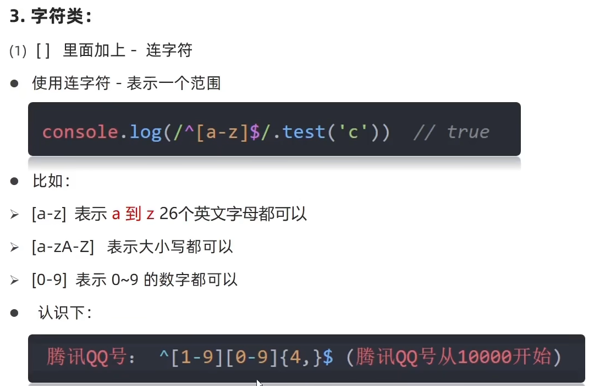

以下是一些常见的元字符字符类，并通过JS代码进行解释：

1. `[ ]`：定义一个字符类，匹配其中的任何一个字符。

   ```javascript
   var pattern = /[aeiou]/;
   var text = 'Hello, world!';
   var result = text.match(pattern);
   console.log(result);  // Output: ['e', 'o', 'o']
   ```

   上述代码中的正则表达式`/[aeiou]/`匹配字符串中的任何一个元音字母。

2. `[^ ]`：定义一个反向字符类，匹配除了指定字符之外的任何字符。

   ```javascript
   var pattern = /[^aeiou]/;
   var text = 'Hello, world!';
   var result = text.match(pattern);
   console.log(result);  // Output: ['H', 'l', 'l', ',', ' ', 'w', 'r', 'l', 'd', '!']
   ```

   上述代码中的正则表达式`/[^aeiou]/`匹配字符串中的任何一个非元音字母。

3. `-`：在字符类中使用，表示一个范围。

   ```javascript
   var pattern = /[a-z]/;
   var text = 'Hello, world!';
   var result = text.match(pattern);
   console.log(result);  // Output: ['e']
   ```

   上述代码中的正则表达式`/[a-z]/`匹配字符串中的任何一个小写字母。

4. `\`：用于转义字符，将元字符字符类中的特殊字符（如 `[ ] - \ ^`）当作普通字符进行匹配。

   ```javascript
   var pattern = /\./;
   var text = 'The price is $2.99.';
   var result = text.match(pattern);
   console.log(result);  // Output: ['.']
   ```

   上述代码中的正则表达式`/\./`匹配字符串中的实际点字符。

这些元字符字符类是正则表达式中非常有用的工具，可帮助我们更灵活地定义匹配模式。通过组合使用不同的元字符字符类和其他正则表达式元字符，可以实现更复杂的匹配需求。

+ 字符类预定义

#### 4.修饰符

以下是一些常见的字符类修饰符，并结合JS代码进行解释：

1. `g`：全局修饰符，匹配目标字符串中所有符合规则的结果。

   ```javascript
   var pattern = /\d/g;
   var text = 'The answer is 42.';
   var result = text.match(pattern);
   console.log(result);  // Output: ['4', '2']
   ```

   上述代码中的正则表达式`/\d/g`使用全局修饰符`g`，可以匹配字符串中所有的数字字符。

2. `i`：不区分大小写的修饰符，忽略目标字符串中字符的大小写差异。

   ```javascript
   var pattern = /hello/i;
   var text = 'Hello, world!';
   var result = text.match(pattern);
   console.log(result);  // Output: ['Hello']
   ```

   上述代码中的正则表达式`/hello/i`使用忽略大小写的修饰符`i`，可以匹配字符串中的"hello"无论是大写还是小写形式。

3. `m`：多行修饰符，允许在目标字符串中进行多行匹配。

   ```javascript
   var pattern = /^hello/m;
   var text = 'Hello, world!\nHello, everyone!';
   var result = text.match(pattern);
   console.log(result);  // Output: ['Hello']
   ```

   上述代码中的正则表达式`/^hello/m`使用多行修饰符`m`，使得以"hello"开头的匹配可以在每行中进行。

4. `s`（ES2021）：单行修饰符，使`.`元字符可以匹配包括换行符在内的任何字符。

   ```javascript
   var pattern = /hello.sir/s;
   var text = 'Hello,\nsir!';
   var result = text.match(pattern);
   console.log(result);  // Output: ['Hello,\nsir']
   ```

   上述代码中的正则表达式`/hello.sir/s`使用单行修饰符`s`，使得`.`可以匹配包括换行符在内的任何字符。

这些字符类修饰符可以通过在正则表达式后面添加相应的字符来改变匹配规则。全局修饰符`g`、不区分大小写的修饰符`i`和多行修饰符`m`是较为常用的修饰符，而单行修饰符`s`是ES2021引入的新特性。修饰符的使用可以增强正则表达式的功能和灵活性。

**字符串的`replace`方法用于替换字符串中符合指定规则的部分**。它接受两个参数：第一个参数是要查找和替换的内容，可以是一个字符串或正则表达式；第二个参数是替换后的内容，可以是一个字符串或函数。

如果第一个参数是一个字符串，`replace`方法只会替换第一次出现的匹配项：

```javascript
var str = 'Hello, world!';
var newStr = str.replace('Hello', 'Hi');
console.log(newStr);  // Output: 'Hi, world!'
```

如果第一个参数是一个正则表达式，并且没有使用全局修饰符`g`，`replace`方法也只会替换第一次出现的匹配项：

```javascript
var str = 'Hello, hello!';
var newStr = str.replace(/hello/, 'Hi');
console.log(newStr);  // Output: 'Hello, Hi!'
```

如果要替换所有匹配项，可以使用全局修饰符`g`：

```javascript
var str = 'Hello, hello!';
var newStr = str.replace(/hello/g, 'Hi');
console.log(newStr);  // Output: 'Hello, Hi!'
```

除了字符串作为替换内容，还可以使用函数来动态生成替换结果：

```javascript
var str = 'Hello, world!';
var newStr = str.replace(/(\w+)/, function(matched, word) {
  return word.toUpperCase();
});
console.log(newStr);  // Output: 'HELLO, world!'
```

上述代码中的函数接受两个参数：`matched`表示匹配到的字符串，`word`表示正则表达式中的捕获组（用小括号括起来的部分）。函数返回的内容将被用作替换后的结果。

需要注意的是，`replace`方法不会改变原始字符串，而是返回一个新的替换后的字符串。如果想要修改原始字符串，可以将结果赋值给原始字符串变量。

### 2.综合案例

+ 新用户注册
+ 新用户登录

#### 3.阶段案例

## day07 (实战)

+ 放大镜

  + 鼠标事件具有捕捉阶段（Capture Phase）和冒泡阶段（Bubble Phase）。以下是上述鼠标事件触发的事件流程以及捕捉和冒泡阶段的说明：

    1. click（鼠标点击事件）：
       - 捕捉阶段：无
       - 冒泡阶段：mousedown - mouseup - click

    2. dblclick（鼠标双击事件）：
       - 捕捉阶段：无
       - 冒泡阶段：mousedown - mouseup - click - mousedown - mouseup - click - dblclick

    3. mousedown（鼠标按下事件）：
       - 捕捉阶段：mousedown
       - 冒泡阶段：无

    4. mouseup（鼠标释放事件）：
       - 捕捉阶段：mouseup
       - 冒泡阶段：无

    5. mousemove（鼠标移动事件）：
       - 捕捉阶段：mousemove
       - 冒泡阶段：无

    6. mouseover（鼠标经过事件）：
       - 捕捉阶段：无
       - 冒泡阶段：mouseenter - mouseover

    7. mouseout（鼠标离开事件）：
       - 捕捉阶段：无
       - 冒泡阶段：mouseout - mouseleave

    8. mouseenter（鼠标进入事件）：
       - 捕捉阶段：mouseenter
       - 冒泡阶段：无

    9. mouseleave（鼠标离开事件）：
       - 捕捉阶段：mouseleave
       - 冒泡阶段：无

    10. contextmenu（上下文菜单事件）：
        - 捕捉阶段：无
        - 冒泡阶段：contextmenu

    请注意，捕捉阶段和冒泡阶段可能不适用于所有浏览器，并且取决于具体的开发环境和实现方式。某些事件可能只在其中一个阶段触发，或者根本不触发任何阶段。事件的冒泡行为也可以通过JavaScript代码进行控制和修改。

    + **鼠标经过事件（mouseover）和鼠标进入事件（mouseenter）在触发条件和行为上有一些区别：**

      1. 触发条件：
         - 鼠标经过事件（mouseover）：当鼠标光标从元素外部移动到元素内部时触发。
         - 鼠标进入事件（mouseenter）：当鼠标光标进入元素时触发，不论是从元素外部还是子元素进入。

      2. 冒泡行为：
         - 鼠标经过事件（mouseover）：在冒泡阶段依次触发元素的父元素直至根节点。
         - 鼠标进入事件（mouseenter）：不会随冒泡事件向上传播，只在当前元素上触发。

      3. 连续触发：
         - 鼠标经过事件（mouseover）：当鼠标在元素内部移动时连续触发，每次移动都会触发一次事件。
         - 鼠标进入事件（mouseenter）：在鼠标进入元素后，不会在元素内部移动期间重复触发，只在进入时触发一次。

      总结而言，鼠标经过事件适用于需要在鼠标进入元素并在元素内部移动时进行反应的场景，而鼠标进入事件适用于只在鼠标进入元素时执行一次操作的场景，并且不会受到鼠标在元素内部移动的影响。

# JavaScript进阶

## day01-作用域&解构&箭头函数

### 1.作用域（[Scope](https://developer.mozilla.org/zh-CN/docs/Glossary/Scope)）

+ 作用域是指在程序中定义变量时，这些变量可被访问的范围或上下文。它规定了代码中变量的可见性和访问性。

+ JavaScript作用域分为：
  + 局部作用域
  + 全局作用域
  + 函数作用域
+ 此外，用 [`let`](https://developer.mozilla.org/zh-CN/docs/Web/JavaScript/Reference/Statements/let) 或 [`const`](https://developer.mozilla.org/zh-CN/docs/Web/JavaScript/Reference/Statements/const) 声明的变量属于额外的作用域：
  + 块级作用域：用一对花括号（一个[代码块](https://developer.mozilla.org/zh-CN/docs/Web/JavaScript/Reference/Statements/block)）创建出来的作用域

#### 1.局部作用域

##### 1.函数作用域


函数作用域是指在 JavaScript 中，每个函数都会创建一个独立的作用域，在该函数内声明的变量和函数只能在该作用域内访问。

当我们在 JavaScript 中定义一个函数时，就会创建一个新的函数作用域。在这个作用域内部，我们可以声明变量和函数，并且这些变量和函数仅在该作用域内可见。

函数作用域具有以下特点：

1. 变量声明：在函数作用域内部使用 `var`、`let` 或 `const` 关键字声明的变量具有函数级别的作用域，即它们只在当前函数作用域内有效。
2. 函数声明：在函数作用域内部声明的函数可以在整个函数作用域内被访问，包括在函数声明之前。

下面是一个示例代码，说明了函数作用域的概念：

```javascript
function outer() {
  var x = 10; // 变量 x 在 outer 函数作用域中声明

  function inner() {
    var y = 5; // 变量 y 在 inner 函数作用域中声明
    console.log(x + y); // 可以访问外部的变量 x
  }

  inner(); // 调用 inner 函数
}

outer(); // 输出结果：15
```

在此示例中，`x` 在 `outer` 函数作用域中声明，而 `y` 在 `inner` 函数作用域中声明。`inner` 函数可以访问外部函数作用域中的变量 `x`，因此在调用 `inner` 函数时，可以正确地打印出 `x + y` 的结果。

总结起来，函数作用域是指每个函数创建的独立作用域，在其中声明的变量和函数只能在该作用域内访问。通过函数作用域，我们可以控制变量的可见性和封装代码，提高代码的模块化和可维护性。

##### 2.块作用域


块作用域是指由一对花括号（`{}`）括起来的代码块内部所创建的独立作用域。在块作用域中声明的变量和函数只在当前代码块内部有效，超出该代码块的范围就无法访问。

在ES6之前，JavaScript中只有全局作用域和函数作用域，并没有块级作用域。这意味着使用`var`关键字声明的变量在整个函数内部都是可见的，而不仅仅是在声明它的代码块内部。

ES6引入了`let`和`const`关键字，它们具有块级作用域的特性，可以在代码块中创建独立的作用域。下面是一个示例代码：

```javascript
function foo() {
  if (true) {
    let x = 10;
    const y = 20;
    console.log(x); // 输出结果：10
    console.log(y); // 输出结果：20
  }

  console.log(x); // 报错：ReferenceError: x is not defined
  console.log(y); // 报错：ReferenceError: y is not defined
}

foo();
```

在这个示例中，我们在`if`代码块内部使用`let`和`const`关键字声明了变量`x`和常量`y`。由于它们是在`if`代码块内部声明的，因此它们的作用域仅限于该代码块内部。在`if`代码块外部，我们无法访问到这些变量。

通过使用块作用域，我们可以避免命名冲突和变量泄露的问题，并且能够更好地控制变量的可见性和生命周期。块作用域使得代码更加模块化、安全，并且减少了不必要的全局变量污染。

总结：块作用域是由一对花括号（`{}`）括起来的代码块内部所创建的独立作用域。ES6引入了`let`和`const`关键字，使得在代码块内部可以创建独立的块级作用域。块作用域可以提高代码的模块性

#### 2.全局作用域


全局作用域是指在整个程序中可访问的变量和函数的作用域。它是程序中最外层的作用域，包括了所有其他作用域。在全局作用域中声明的变量和函数可以被程序中的任何代码访问。

下面通过一个示例代码来解释全局作用域的概念：

```javascript
var globalVariable = 'I am in the global scope';

function foo() {
  console.log(globalVariable); // 可以在函数中访问全局变量
}

foo(); // 输出结果：I am in the global scope
console.log(globalVariable); // 输出结果：I am in the global scope
```

在这个示例中，我们在全局作用域中声明了一个变量 `globalVariable` 并赋予它字符串值。然后定义了一个名为 `foo` 的函数，在函数内部可以直接访问全局变量 `globalVariable` 并输出它的值。最后，在全局作用域外部也能访问到全局变量，并将其值输出到控制台。

全局作用域是 JavaScript 程序中的最大作用域，它不依赖于任何其他作用域。因此，在任何地方都可以直接访问全局变量和函数。

需要注意的是，过度依赖全局作用域可能导致命名冲突和代码可读性降低的问题。为了避免这些问题，现代的 JavaScript 开发中更倾向于使用块级作用域或模块化的方式来管理变量和函数的作用域。这样可以减少对全局作用域的依赖，提高代码的封装性和可维护性。

#### 3.作用域链


+ 概念及其代码示例

  + 作用域链是在 JavaScript 中用于解析变量和函数作用域的机制。当访问一个变量或调用一个函数时，JavaScript 引擎会根据作用域链来确定该变量或函数在当前执行环境中的可见性和访问顺序。

    作用域链是由多个执行上下文（execution context）的变量对象（variable object）组成的。每个执行上下文都有一个与之关联的变量对象，它包含了在该执行上下文中声明的变量和函数。

    下面通过一个示例代码来解释作用域链的概念：

    ```javascript
    function outer() {
      var outerVariable = 'I am in the outer scope';
    
      function inner() {
        var innerVariable = 'I am in the inner scope';
    
        console.log(innerVariable); // 可以在内部函数中直接访问内部变量
        console.log(outerVariable); // 可以在内部函数中通过作用域链访问外部变量
      }
    
      inner(); // 输出结果：I am in the inner scope   I am in the outer scope
    }
    
    outer();
    ```

    在这个示例中，我们有两个嵌套的函数 `outer` 和 `inner`。在 `outer` 函数中声明了一个变量 `outerVariable`，在 `inner` 函数中声明了一个变量 `innerVariable`。在 `inner` 函数内部，我们可以直接访问到内部变量 `innerVariable`，同时也可以通过作用域链访问到外部函数中的变量 `outerVariable`。JavaScript 引擎会根据作用域链从内向外查找，以解析变量的访问。

    作用域链是通过定义函数时确定的，它在函数定义时就被创建，并且包含了函数定义时所在的作用域。所以当内部函数访问外部函数的变量时，它实际上是通过作用域链找到对应的变量对象并进行访问。

    需要注意的是，作用域链的顶端始终是全局作用域，也就是全局执行上下文的变量对象。这意味着在 JavaScript 中可以在嵌套的函数里访问到全局作用域中的变量。但反过来，在全局作用域中无法直接访问内部函数的变量，因为它们的作用域链没有对应的内部作用域。

+ 作用域链的本质

  + 作用域链的本质是一个指向变量对象的指针列表。它是在函数创建时就确定，并且与函数定义的位置和所在的作用域密切相关。

    当定义一个函数时，JavaScript 引擎会创建一个新的执行上下文，并将该函数的代码以及与之关联的作用域链保存起来。作用域链是由多个变量对象组成的，每个变量对象代表了一个作用域（全局作用域或函数作用域）。

    在 JavaScript 中，每个函数都有自己的作用域链。作用域链的生成过程可以简化为以下几个步骤：

    1. 创建函数对象：当定义一个函数时，会创建一个与之关联的函数对象。
    2. 创建变量对象：在函数被调用前，会创建一个与之关联的变量对象，用于存储函数内部声明的变量和函数。
    3. 设置作用域链：将函数的变量对象添加到作用域链的头部，并将外部环境的变量对象依次添加到作用域链的后面。

    通过作用域链，函数可以访问自身作用域内的变量和函数，以及外部作用域中的变量和函数。当在函数内部访问一个变量时，JavaScript 引擎会首先从当前作用域的变量对象开始查找，如果找不到，则会向上一级作用域的变量对象继续查找，直到找到对应的变量或抵达全局作用域。

    作用域链的本质可以看作是一个指向变量对象的链表，它连接了函数的各个作用域，并提供了变量访问的路径。通过作用域链，JavaScript 实现了词法作用域和变量查找的机制。

#### 4.JS垃圾回收机制


+ <span style='color:red;font-size:30px'>概念及其代码示例</span>

  + 垃圾回收是一种自动化的内存管理机制，用于检测和释放不再被程序使用的内存资源。在编程语言中，特别是像JavaScript这样的高级语言中，垃圾回收机制帮助开发人员摆脱手动管理内存的负担，提高了程序的健壮性和开发效率。

    垃圾回收机制通过检测不再被引用的对象来确定哪些内存可以被释放。当某个对象没有任何引用指向它时，它就变为无法访问的垃圾数据，这时垃圾回收机制就会将其标记为可回收，并在适当的时候进行内存回收操作。

    下面是一个简单的JavaScript代码示例，结合代码解释垃圾回收机制的概念：

    ```javascript
    function createGarbage() {
      var obj = {}; // 创建一个新的对象
      return obj;  // 返回该对象
    }
    
    function foo() {
      var unused = createGarbage(); // 调用createGarbage函数，将返回的对象赋值给unused变量
      // 这里可以继续使用unused对象
    } // 函数执行结束后，unused变量及其引用的对象都变为不可访问的垃圾数据
    
    foo(); // 调用foo函数
    
    // 在这个阶段，createGarbage函数内部创建的对象及其引用已经变为垃圾数据
    
    // 垃圾回收机制会在适当的时候自动释放这些不可访问的内存资源
    ```

    在上面的代码中，`createGarbage`函数创建了一个新的对象并返回它，在`foo`函数内部，将`createGarbage`函数的返回值赋值给了`unused`变量。当`foo`函数执行完毕后，`unused`变量及其引用的对象都不再被使用，成为垃圾数据。

    垃圾回收机制会在适当的时候检测到这些垃圾数据，并释放其占用的内存资源。通过自动管理内存，垃圾回收机制可以避免内存泄漏和内存溢出等问题，提高程序的性能和稳定性。

+ <span style='color:red;font-size:30px'>内存的生命周期</span>

  + 在JavaScript中，内存的生命周期可以分为以下几个阶段：

    1. 分配和创建：当我们声明变量或者创建对象时，需要为它们分配内存空间。这个过程通常是由JavaScript引擎自动完成的。对于基本数据类型（如数字、字符串），内存会直接在栈[^栈]上分配。而对于复杂的数据结构（如对象、数组），内存则会在堆[^堆]上进行分配。

    2. 使用和访问：一旦内存空间被分配并赋值给变量或对象，我们可以通过变量名或对象引用来访问和使用这些内存。我们可以读取和修改其中存储的数据。

    3. 不再引用：当我们不再需要某个变量或对象时，应该将其设置为null或让其超出作用域。这样做会使得对该内存的引用数为0，表示不再有任何引用指向该内存。

    4. 垃圾回收：一旦内存不再被引用，即成为不可访问的垃圾数据，JavaScript的垃圾回收机制将会运行。它会周期性地扫描内存中的对象，并标记那些仍然被引用的对象。同时，未被标记的对象将会被认为是垃圾，释放其占据的内存空间。

    5. 内存回收：经过垃圾回收标记的对象被确定为垃圾后，垃圾回收机制将对它们执行内存释放操作。这样就会将这些内存空间返回给系统，供其他变量和对象使用。

    注意，JavaScript的垃圾回收机制是自动进行的，开发人员无需手动管理内存。垃圾回收器负责检测不再需要的内存，并在适当的时候进行

    [^栈]: 栈（stack）是一种数据结构，用于管理函数的调用和执行过程。栈的工作原理是"先进后出"（Last-In-First-Out，LIFO）。在JavaScript中，栈主要有两个方面的应用：函数调用栈和变量作用域。<br><br>    1. 函数调用栈： 当代码执行到一个函数时，会将该函数的上下文（包括函数的参数、局部变量等信息）推入调用栈，并开始执行函数体内的代码。如果在函数体内调用了其他函数，那么这些函数的上下文也会被依次推入调用栈，形成一个嵌套的调用链。当函数执行完毕并返回结果时，它的上下文会从调用栈中弹出，控制权返回给调用者函数。<br><br>    2. 变量作用域： 在JavaScript中，每个函数都有自己的作用域。当函数被调用时，会创建一个新的作用域，并将其推入作用域栈。在函数执行过程中，变量在当前作用域中进行声明和访问。当函数执行完毕后，它的作用域将从作用域栈中弹出，变量将不再可访问。<br><br>    通过栈的机制，JavaScript实现了函数调用的层级管理和作用域的隔离。这使得函数可以嵌套调用，并且每个函数都可以有自己的独立作用域，避免了命名冲突和变量共享的问题。
    [^堆]: 在JavaScript中，堆（heap）是一种内存管理区域，用于存储动态分配的对象和复杂数据结构。与栈不同，堆中的内存分配不会随着函数的调用和执行而释放，而是由垃圾回收机制负责管理。以下是关于JavaScript堆的一些重要信息：<br><br>    1. 对象存储：JavaScript中的对象（Object）是在堆中存储的。对象可以通过构造函数、字面量表示法或对象字面量创建，并且可以有属性和方法。当创建一个对象时，JS引擎会在堆中分配一块足够大小的内存来存储该对象及其属性。<br><br>    2. 动态分配：堆内存的分配是动态的，意味着你可以随时创建和销毁对象。当你使用`new`关键字或者其他方式创建对象时，JS引擎会自动从堆中分配内存给新对象，并返回对该对象的引用。<br><br>    3. 引用传递：在JavaScript中，对象（包括数组和函数）在赋值和传递过程中都是通过引用进行操作。变量保存的是对象在堆中的引用地址，而不是对象本身的值或内容。这意味着多个变量可以指向同一个堆内存对象，对其中一个变量所做的修改将影响到其它变量。<br><br>    4. 垃圾回收：JavaScript拥有自动的垃圾回收机制，它会定期检查堆中的对象，并回收那些不再被引用的对象所占用的内存空间。垃圾回收器会标记和清除不可达的对象，并将其内存释放回可用内存池供后续的对象分配使用。<br><br>    使用堆可以方便地存储和管理动态分配的对象和数据结构，但也需要注意合理使用内存资源，避免过度创建大的对象或产生内存泄漏。为了优化性能和减少内存占用，可以尽量及时释放不再使用的对象的引用，让垃圾回收机制能够有效地回收内存。

+ <span style='color:red;font-size:30px'>浏览器垃圾回收算法</span>

  + 浏览器中的垃圾回收算法主要负责自动管理动态分配的内存，以便释放不再使用的对象并回收其占用的内存空间。下面是几种常见的浏览器垃圾回收算法：

    1. 标记-清除（Mark and Sweep）：这是最基本和常见的垃圾回收算法。它通过标记那些仍然被引用的对象，并清除未标记的对象来进行回收。垃圾回收器从根对象开始遍历整个对象图，将可达的对象进行标记，然后清除未标记的对象。这个算法能够回收循环引用的对象。
       1. 
       2. 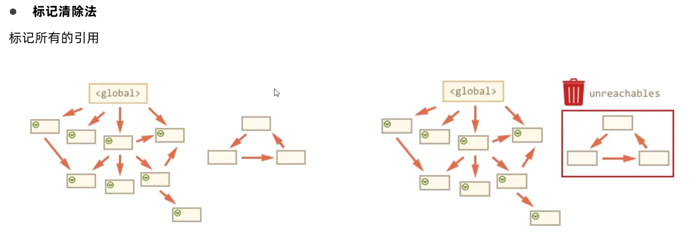
       3. 
    2. 引用计数（Reference Counting）：该算法维护一个计数器来记录每个对象被引用的次数。当一个对象被引用时，计数器加一；当对象的引用被移除时，计数器减一。当计数器为零时，表示该对象不再被引用，即可被回收。然而，引用计数算法<span style='color:red'>无法解决**循环引用**的问题</span>，会导致内存泄漏。
       1. 示例1<br>
          1. 首先指向堆里面的（被引用的数为1）
          2. 堆里面的被回收
       2. 示例二<br>
          1. 变量里面存的是地址
          2. person变量赋值为1
          3. 再将p赋值为空
       3. 循环引用
          1. 
          2. 代码如图所示<br>
          3. 
          4. 
    3. 标记-压缩（Mark and Compact）：该算法结合了标记-清除和压缩的思想。首先，垃圾回收器会进行标记过程，标记出仍然被引用的对象。然后，回收器会将所有存活的对象向一端移动，使它们连续排列，从而在垃圾回收过程中产生的内存碎片得到整理和压缩。
    4. 分代回收（Generational Collection）：该算法基于一个观察：大部分对象很快就会变得不可达。因此，它将堆中的对象分为不同的代（Generation），较新的对象放在一代，经过多次回收后依然存活的对象则逐渐升级到更老的代。这样可以针对不同代采用不同的回收策略，提高效率。

    需要注意的是，不同的浏览器厂商实现垃圾回收算法的方式可能有所差异。此外，现代浏览器的垃圾回收机制通常是动态的，会根据当前内存使用情况和执行环境进行相应的优化调整，以平衡性能和内存消耗。

#### 5.闭包


****

闭包（Closure）是指在函数内部创建的函数，它可以访问并持有其外部函数作用域中的变量、参数和其他函数。换句话说，闭包允许函数访问定义它们的函数体上下文中的变量。

在JavaScript中，当一个函数返回了一个内部函数，并且该内部函数引用了外部函数的变量时，就形成了闭包。闭包使得函数可以保留对其词法环境的引用，即使词法环境已经销毁，闭包仍然可以访问和操作外部函数的变量。

闭包的特点和用途包括：

1. 可以访问外部函数的变量：由于闭包引用了外部函数的变量，所以可以在闭包内部读取或修改这些变量，即使外部函数已经执行完毕。

2. 保持状态和数据私有性：利用闭包可以实现对变量的封装和隐藏，将一些变量和函数作为私有成员保存在闭包中，防止外部访问和修改。

3. 实现模块化和封装：通过使用闭包，可以创建模块化的代码结构，将相关的变量和函数封装在闭包中，避免全局命名冲突，并提供了更好的代码组织和管理方式。

需要注意的是，闭包会引起内存占用的增加，因为闭包中引用的变量无法被垃圾回收。在使用闭包时，需要注意避免内存泄漏，及时释放不再使用的资源。

以下是一个简单的示例，说明了如何创建和使用闭包：

```javascript
function outerFunction() {
  var outerVariable = 'I am from outer function';

  function innerFunction() {
    console.log(outerVariable);
  }

  return innerFunction;
}

var closure = outerFunction();
closure(); // 输出：'I am from outer function'
```

在上面的例子中，`innerFunction` 是在 `outerFunction` 内部定义的闭包。`innerFunction` 可以访问并打印 `outerVariable` 的值，尽管它已经超出了其作用域。通过调用 `outerFunction` 并将结果赋值给 `closure`，我们可以持有返回的闭包，并在需要时调用它。

+ <span style='color:red'>函数外部访问函数内部变量</span>

  + 

  + 以下是一个使用闭包实现的示例，展示了如何在函数外部访问函数内部变量：

    ```javascript
    function createCounter() {
      let count = 0;
    
      function increment() {
        count++;
        console.log(count);
      }
    
      return increment;
    }
    
    var counter = createCounter();// 它接收的是函数createCounter里面的increment函数
    //counter -> increment ->(使用count) ->(count未被回收) -> 应该回收而未被回收有内存泄漏风险
    counter(); // 输出：1
    counter(); // 输出：2
    counter(); // 输出：3
    ```

    在上面的例子中，`createCounter` 函数返回了一个内部函数 `increment`。这个内部函数可以访问并修改外部函数的变量 `count`。每次调用 `createCounter` 都会创建一个新的**闭包环境**，**其中包含一个独立的 `count` 变量(保留了对外部函数变量的引用,不再需要重新赋值)**。通过将 `createCounter` 的返回值赋给变量 `counter`，我们持有了闭包函数，并可以重复调用它来递增计数器的值。因为闭包中引用了 `count` 变量，在每次调用时都会保留该变量的状态。因此，每次调用 `counter` 都会打印出递增后的计数值。

    这个示例展示了闭包的一种常见用法，即创建私有状态并提供对其进行操作的接口。由于外部无法直接访问和修改闭包中的变量，所以可以实现对变量的封装和隐藏，确保数据的安全性与私有性。

+ 

+ ~~~javascript
  for (var i = 0; i < 3; i++) {
    (function(num) 
        {
      closures.push(
          function() {
        console.log(num);
      }
      );
    })(i);
  }
  ~~~

+ 闭包有内存泄露的风险

  + 当使用闭包时，内部函数持有外部函数的作用域变量的引用，这意味着相关变量无法被垃圾回收机制自动释放。如果闭包没有被正确地管理，就可能导致内存泄漏。

    一个常见的情况是，在循环中创建闭包。如果在循环中创建闭包，并且闭包中引用了循环内的变量，那么每次迭代都会创建一个新的闭包，而之前的闭包不会被释放。这样会导致内存占用不断增加，最终可能耗尽可用的内存资源。

    为避免闭包造成内存泄漏，可以采取以下措施：

    1. 及时释放闭包：在不需要使用闭包时，手动解除对闭包的引用。可以通过将引用置为 `null` 或结束作用域来实现。
    2. 减少闭包的作用范围：确保闭包只在必要的范围内存在，避免将不必要的变量引入闭包中。
    3. 使用事件委托或回调函数替代闭包：在一些场景中，可以考虑使用事件委托或传递回调函数来替代复杂的闭包结构。
    4. 使用模块化开发：将代码模块化，避免过多的全局变量和闭包的使用。

    正确地管理闭包是非常重要的，即使只是一个小小的内存泄漏也可能在长时间运行的应用程序中产生严重后果。因此，开发人员需要注意并采取预防措施来避免闭包导致的潜在问题。

  + 内存泄漏的常见场景之一是在循环中创建闭包。请看下面的代码示例：

    ```JavaScript
    javascript复制代码function createClosures() {
      var closures = [];
    
      for (var i = 0; i < 3; i++) {
        closures.push(function() {
          console.log(i);
        });
      }
    
      return closures;
    }
    
    // 创建闭包数组
    var closuresArray = createClosures();
    
    // 执行闭包数组中的每个闭包
    for (var j = 0; j < closuresArray.length; j++) {
      closuresArray[j]();
    }
    ```

    在这个例子中，通过循环创建了一个闭包数组 `closuresArray`，其中包含三个闭包。每个闭包都引用了循环变量 `i`。

    但是，由于闭包的延迟执行特性，当我们执行这些闭包时，它们所引用的 `i` 已经等于 3。无论选择哪个闭包执行，输出的结果都是 3。这是因为循环结束后，`i` 的值保持在最后一次迭代的结果上。这意味着创建闭包时捕获的 `i` 始终是同一个变量，在闭包执行时引用的都是同一个值。

    + **在 JavaScript 中，事件循环和异步执行的机制导致了console.log(i) 在循环结束后才被调用。**

      在 `createClosures()` 函数中，`for` 循环迭代创建了三个闭包，并将它们添加到一个数组中。每个闭包都引用了外部函数作用域中的变量 `i`。

      在这个过程中，闭包函数并没有立刻执行，而是被存储在数组中。当循环结束时，变量 `i` 的值已经变成了 3。

      在之后的代码中，通过遍历闭包数组并执行每个闭包来调用这些闭包函数。由于闭包内部仍然引用外部的变量 `i`，因此在闭包函数被执行时，会查找并输出当前的 `i` 值。

      而由于 JavaScript 是单线程的，它采用事件循环来处理任务队列中的事件。当循环结束后，事件循环开始处理任务队列中的事件，依次执行闭包函数，因此闭包中的 `console.log(i)` 被调用。

      所以，在循环结束后才会调用闭包中的 `console.log(i)` 是由于异步执行的机制，即闭包函数被存储起来并在事件循环阶段执行的原因。

    

  + 如果**我们需要在每个闭包中得到正确的值（0、1、2），可以使用立即执行函数表达式（Immediately Invoked Function Expression，IIFE）来创建闭包，并将当前的 `i` 值传递给闭包：**

    ```javascript
    javascript复制代码function createClosures() {
      var closures = [];
    
      for (var i = 0; i < 3; i++) {
        (function(num) {
          closures.push(function() {
            console.log(num);
          });
        })(i);
      }
    
      return closures;
    }
    
    // 创建闭包数组
    var closuresArray = createClosures();
    
    // 执行闭包数组中的每个闭包
    for (var j = 0; j < closuresArray.length; j++) {
      closuresArray[j]();
    }
    ```

    通过使用 IIFE 创建闭包，并传递当前的 `i` 值作为参数 `num`，每个闭包就能正确地引用相应的值。


#### 6.变量提升


变量提升是 JavaScript 中的一种特性，它使得在声明变量之前就能够访问到这个变量。

在 JavaScript 中，变量和函数的声明会被提升到当前作用域的顶部。这意味着可以在声明之前使用这些变量或函数，而不会导致引用错误。

对于变量的提升，JavaScript 的解释器会将变量声明提升到其作用域的顶部，但不会提升变量的赋值操作。所以在变量声明之前使用该变量时，其值会是 `undefined`。

例如，考虑以下代码：

```javascript
console.log(x); // undefined
var x = 5;
```

上述代码中，变量 `x` 的声明被提升到了作用域的顶部，但赋值操作并没有提升。因此，在`console.log(x)`之前，`x` 的值为 `undefined`。这是因为变量 `x` 在此时已经存在，但尚未被赋予具体的值。

相比之下，函数声明会被完整地提升到其作用域的顶部，包括函数的定义和赋值。

```javascript
foo(); // "Hello, world!"

function foo() {
  console.log("Hello, world!");
}
```

在上述代码中，调用 `foo()` 函数在函数定义之前。这是因为函数声明会被提升，所以我们可以在声明之前调用该函数。

值得注意的是，尽管变量和函数的声明会被提升，但变量赋值的操作并不会提升。因此，在使用变量之前，尽管可以访问到它们，但其值会是 `undefined`。为了避免产生错误或意外行为，建议在使用变量之前显式地进行声明和赋值操作。


### 2.函数进阶

#### 1.函数提升


函数提升是 JavaScript 中的一种特性，它使得在声明函数之前就能够访问和调用这个函数。

在 JavaScript 中，函数声明会被整体提升到当前作用域的顶部。这意味着可以在声明函数之前使用该函数，而不会导致引用错误。

例如，考虑以下代码：

```javascript
foo(); // "Hello, world!"

function foo() {
  console.log("Hello, world!");
}
```

上述代码中，在调用 `foo()` 函数之前就已经定义了 `foo()` 函数。这是因为函数声明会被提升，使得我们可以在声明之前调用该函数，而不会出现引用错误。

与变量提升不同，函数声明会被完整地提升，包括函数的定义和代码块。这就意味着即使函数体内有其他语句，也会被提升到函数外部的作用域。

需要注意的是，函数表达式（function expression）不具有提升的特性。只有函数声明（function declaration）才会被提升。

例如，下面的代码中，函数表达式是无法被提升的：

```javascript
bar(); // TypeError: bar is not a function

var bar = function() {
  console.log("Hello, world!");
};
```

在这个例子中，变量 `bar` 被提升了，但赋值操作并没有被提升。所以在调用 `bar()` 函数之前，`bar` 的值为 `undefined`，并且无法调用。

综上所述，函数提升是 JavaScript 中一种特性，它使得在声明函数之前就能够访问和调用这个函数，但需要注意变量的赋值操作不会被提升，而函数表达式也不具有提升的特性。为了避免产生错误或意外行为，建议在使用函数之前显式地进行声明和定义。

#### 2.函数参数


学习 JavaScript 中函数参数的路径可以按照以下步骤进行：

1. 了解基本概念：开始学习函数参数之前，先要了解什么是函数以及函数在编程中的作用。函数是一段可重复使用的代码块，可以接收输入（即参数）并产生输出。
2. 理解参数的定义和使用：学习如何在函数定义时声明参数，并在函数体内使用它们来执行相应的操作。了解如何给参数命名，并理解命名的规范和约定。
3. 掌握参数的类型和默认值：了解 JavaScript 中的函数参数可以有不同的类型，包括数字、字符串、布尔值、对象等。还要了解如何为参数设置默认值，使得在调用函数时如果没有传递相应的参数，就会使用默认值。
4. 学习参数的个数和顺序：了解函数定义中参数的个数和顺序需要与函数调用时传入的实际参数相匹配。学习如何处理参数的个数不确定或变化的情况，例如使用剩余参数和扩展运算符。
5. 理解参数传递的方式：学习 JavaScript 中函数参数的传递方式是按值传递，即将实际参数的值复制给形式参数。了解修改参数值对实际参数的影响，以及如何通过对象引用来模拟传递引用的效果。
6. 掌握参数的作用域：理解函数参数的作用域，即参数在函数内部的可见性和访问限制。了解在函数内部定义同名参数或使用外部变量与参数重名时的优先级和覆盖关系。
7. 学习高级参数概念：进一步探索高级的函数参数概念，如匿名函数作为参数、回调函数、箭头函数作为参数、柯里化（Currying）等。
8. 实践和练习：通过编写和解决各种问题的函数来实践和巩固对函数参数的理解

##### 1.动态参数


+ <span style='color:red;font-size:20px'>内置对象 `arguments` 来实现动态参数</span>

  + 除了使用动态参数语法（Rest parameters），还可以使用内置对象 `arguments` 来实现动态参数的功能。`arguments` 对象是一个类数组对象，包含传递给函数的所有参数。

    以下是使用 `arguments` 实现动态参数的代码示例：

    ```javascript
    function sum() {
      let total = 0;
      for (let i = 0; i < arguments.length; i++) {
        total += arguments[i];
      }
      return total;
    }
    
    console.log(sum(1, 2, 3)); // 输出 6
    console.log(sum(4, 5)); // 输出 9
    console.log(sum(6)); // 输出 6
    console.log(sum()); // 输出 0
    ```

    在上述代码中，函数 `sum` 没有使用动态参数语法，而是在函数体内使用了 `arguments` 对象来遍历接收到的参数。

    通过 `arguments.length` 获取传递给函数的参数数量，并通过索引 `arguments[i]` 获取每个参数的值。然后将这些参数值累加到 `total` 变量中。

    使用 `arguments` 对象实现动态参数的方式与使用动态参数语法效果相同，都能处理不定数量的参数。但需要注意的是，`arguments` 是一个类数组对象，不具备数组的所有方法和属性，因此在处理参数时可能需要转换成真正的数组或使用其他方法进行操作。

    需要注意的是，在严格模式下，无论是使用动态参数语法还是 `arguments`，都不允许修改函数参数的值。这可以避免对原始参数的意外更改。

+ <span style="color:red;font-size:20px">动态参数语法（Rest parameters）与内置对象 `arguments` 来实现动态参数的功能的区别</span>

  + 三个点（...）前缀用于定义函数的动态参数（Rest parameters），它允许以数组的形式接收不定数量的参数。这些参数会被打包成一个真正的数组，可以使用数组方法对其进行操作。

    内置对象 `arguments` 是一个类数组对象，在函数内部可用，它包含了所有传递给函数的参数。通过 `arguments` 对象，可以访问到传递的每个参数，并且可以以类似数组的方式进行遍历和访问参数的值。

    这两种方式实现动态参数功能的区别如下：

    1. 参数类型：使用动态参数语法可以将参数打包成一个真正的数组，方便使用数组方法对参数进行操作。而 `arguments` 是一个类数组对象，只能使用索引来访问参数，不能直接使用数组方法。

    2. 可读性：动态参数语法更直观明了，使用 `...` 语法表示参数是一个数组，代码更具可读性。而 `arguments` 的使用可能稍显繁琐，需要使用索引访问参数。

    3. 灵活性：动态参数可以与其他参数一起使用，可以在函数参数中定义静态参数和动态参数。而 `arguments` 对象无法直接与其他参数混合使用，需要通过遍历或转换为数组后操作。

    总的来说，动态参数语法更加现代化、简洁和易于理解，并且支持数组操作。而 `arguments` 对象则是一种更古老和通用的方式，可以在不支持动态参数语法的旧代码中使用。在新的 JavaScript 代码中，建议使用动态参数语法来处理不定数量的参数。


##### 2.剩余参数


<span style='color:red;font-size:20px'>剩余参数（Rest parameters）</span>

+ 剩余参数（Rest parameters）是指在函数定义时，使用三个点（...）前缀来表示可以接收不定数量的参数。这样的参数将会形成一个数组，可以通过遍历或其他数组操作来访问其中的每个值。

  下面是一段详细解释剩余参数概念的代码示例：

  ```javascript
  function sum(...numbers) {
    let total = 0;
    for (let number of numbers) {
      total += number;
    }
    return total;
  }
  
  console.log(sum(1, 2, 3)); // 输出 6
  console.log(sum(4, 5)); // 输出 9
  console.log(sum(6)); // 输出 6
  console.log(sum()); // 输出 0
  ```

  在上述代码中，函数 `sum` 使用了剩余参数 `...numbers` 来接收任意数量的参数。这些参数将会以数组的形式存储在 `numbers` 变量中。

  函数体内部使用了 `for...of` 循环遍历数组 `numbers`，并将每个数字累加到 `total` 变量中。最后，函数返回 `total` 的值。

  在函数调用时，可以传递任意数量的参数给 `sum` 函数。例如，`sum(1, 2, 3)` 的调用传入了三个参数，它们被打包成一个数组 `[1, 2, 3]`，在函数体内进行累加后返回结果 6。

  同样地，当传递不同数量的参数时，函数也能正常工作。例如，`sum(4, 5)` 的调用传入了两个参数 `[4, 5]`，结果为 9。当只传递一个参数 `sum(6)` 时，该参数会以数组形式 `[6]` 存储，并返回其本身的值 6。而不传递任何参数时 `sum()`，会得到初始值 0。

  动态参数非常灵活，可以让函数接受不同数量的参数，并在函数内部进行相应的处理。它使得函数具有更高的可扩展性和适应性。

  

##### 3.动态参数与剩余参数的区别

1. 语法符号不同：
   - 动态参数（Rest parameters）在函数声明中使用，以 `...` 开头的参数名称。例如：`function sum(...numbers) { ... }`
   - 剩余参数（Spread syntax）在函数调用或数组/对象展开中使用，以 `...` 开头的表达式。例如：`console.log(...numbers)` 或 `[...array]`

2. 位置不同：
   - 动态参数只能在函数参数列表的最后使用，用于捕获不定数量的参数并将其表示为数组。例如：`function sum(x, y, ...rest) { ... }`
   - 剩余参数可以在函数调用、数组字面量、对象字面量等处使用，用于将数组展开为多个独立的值或者传递多个参数。例如：`console.log(...numbers)` 或 `let newArray = [...array]`

3. 功能不同：
   - 动态参数主要用于函数声明中，用于接收任意数量的参数并将其表示为一个数组，允许对这些参数进行处理和操作。
   - 剩余参数主要用于函数调用、数组展开等地方，用于将数组展开为多个独立的值或者将多个参数传递给一个函数，方便地进行解构和组合操作。

总结一下，动态参数和剩余参数之间的区别主要在于它们的语法符号、使用位置和功能。动态参数是一种函数声明时用于接收不定数量参数的机制，剩余参数是一种使用扩展运算符将数组展开的语法，可用于函数调用时传递多个独立的值或者复制数组。

+ 动态参数与剩余参数的区别

  三个点（...）前缀用于定义函数的动态参数（Rest parameters），它允许以数组的形式接收不定数量的参数。这些参数会被打包成一个真正的数组，可以使用数组方法对其进行操作。

  `arguments` 是一个内置对象，在函数内部可用，它包含了所有传递给函数的参数。通过 `arguments` 对象，可以访问到传递的每个参数，并且可以以类似数组的方式进行遍历和访问参数的值。

  这两种方式实现动态参数功能的区别如下：

  1. 参数类型：使用动态参数语法可以将参数打包成一个真正的数组，方便使用数组方法对参数进行操作。而 `arguments` 是一个类数组对象，只能使用索引来访问参数，不能直接使用数组方法。

  2. 可读性：动态参数语法更直观明了，使用 `...` 语法表示参数是一个数组，代码更具可读性。而 `arguments` 的使用可能稍显繁琐，需要使用索引访问参数。

  3. 灵活性：动态参数可以与其他参数一起使用，可以在函数参数中定义静态参数和动态参数。而 `arguments` 对象无法直接与其他参数混合使用，需要通过转换为数组后操作。

  总的来说，动态参数语法更加现代化、简洁和易于理解，并且支持数组操作。而 `arguments` 对象则是一种更古老和通用的方式，可以在不支持动态参数语法的旧代码中使用。在新的 JavaScript 代码中，建议使用动态参数语法来处理不定数量的参数。非常抱歉之前的回答带来的困惑，谢谢您的指正。

##### 4.展开运算符


展开运算符（Spread operator）是JavaScript中的一个语法特性，用于展开可迭代对象（如数组、字符串或类数组对象）。它使用三个连续的点（...）作为前缀，可以在函数调用、数组字面量、对象字面量等地方将可迭代对象拆分为单独的元素。

在函数调用中，展开运算符可以用来传递数组或可迭代对象中的每个元素作为单独的参数：

```javascript
function myFunction(param1, param2, param3) {
  // 函数体
}

const arr = [1, 2, 3];
myFunction(...arr); // 等同于 myFunction(1, 2, 3)
```

在数组字面量中，展开运算符可以用于合并数组：

```javascript
const arr1 = [1, 2, 3];
const arr2 = [4, 5, 6];
const mergedArr = [...arr1, ...arr2]; // 结果为 [1, 2, 3, 4, 5, 6]
```

在对象字面量中，展开运算符可以用于复制和合并对象属性：

```javascript
const obj1 = { foo: 'bar' };
const obj2 = { baz: 'qux' };

const mergedObj = { ...obj1, ...obj2 }; // 结果为 { foo: 'bar', baz: 'qux' }
```

除了数组和对象，展开运算符还可以用于字符串：

```javascript
const str = 'hello';
const letters = [...str]; // 结果为 ['h', 'e', 'l', 'l', 'o']
```

展开运算符提供了一种简洁、方便的方式来处理可迭代对象，并且可以在多个地方灵活地使用。它是JavaScript中一个有用的功能，可以增强代码的可读性和易用性。


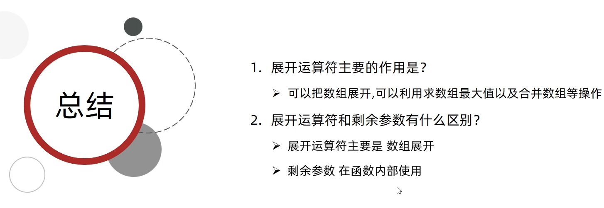


#### 3.箭头函数（重要）

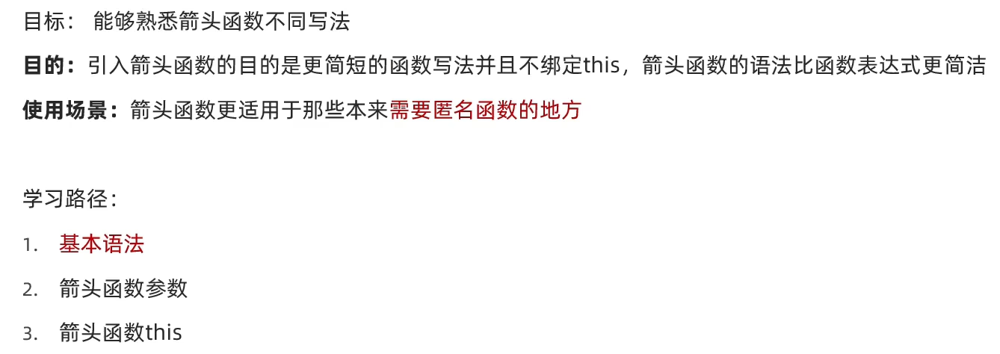

##### <span style='color:red;font-size:22px'>1.基本语法</span>

+ 箭头函数的基本语法如下：

  ```javascript
  const functionName = (parameter1, parameter2, ...) => {
    // 函数体
  }
  ```

  箭头函数使用箭头（=>）来表示函数的定义。括号中是函数的参数列表，如果只有一个参数，可以省略括号。箭头后面是函数体，如果函数体只有一条语句，则可以省略大括号并隐式返回该语句的结果。

  下面是几个例子来说明箭头函数的基本语法：

  1. 使用括号和大括号：

     ```javascript
     const greet = (name) => {
       console.log(`Hello, ${name}!`);
     };
     
     greet('Alice'); // 输出 "Hello, Alice!"
     ```

  2. 单个参数时可以省略括号：

     ```javascript
     const square = num => {
       return num * num;
     };
     
     console.log(square(5)); // 输出 25
     ```

  3. 省略大括号的隐式返回：

     ```javascript
     const double = num => num * 2;
     
     console.log(double(4)); // 输出 8
     ```

  4. 没有参数时使用空括号：

     ```javascript
     const sayHello = () => {
       console.log("Hello!");
     };
     
     sayHello(); // 输出 "Hello!"
     ```

  5. 箭头函数返回对象

     箭头函数可以返回对象，您可以使用括号来明确指示返回一个对象。

     以下是一个示例：

     ```JavaScript
     复制代码const getPerson = () => ({ name: 'John', age: 30 });
     
     console.log(getPerson()); // { name: 'John', age: 30 }
     ```

     在上面的示例中，箭头函数 `getPerson` 使用括号将要返回的对象进行了包裹。这样可以确保箭头函数返回一个对象而不是将花括号解析为函数体。

     

  请注意，在箭头函数中使用返回对象时，必须使用括号将对象包裹起来，以避免与函数体或语法冲突。

  需要注意的是，箭头函数具有自动绑定的特性，它的`this`值从外部作用域继承而来。在使用箭头函数时，要注意`this`的指向问题，确保其在预期范围内。

  + 使用箭头函数来阻止默认事件提交行为

    + 可以尝试在事件处理程序中结合使用箭头函数和 `event.preventDefault()`。

      以下是一个示例，展示如何使用箭头函数来阻止默认事件提交行为：

      ```javascript
      javascript复制代码const form = document.querySelector('form');
      
      // 使用箭头函数定义事件处理程序
      form.addEventListener('submit', (event) => {
        event.preventDefault(); // 阻止默认的提交行为
      
        // 其他逻辑代码...
      });
      ```

      在上述示例中，我们通过箭头函数定义了表单的 `submit` 事件处理程序。在箭头函数内部，我们使用 `event.preventDefault()` 来阻止表单的默认提交行为。

      请注意，由于箭头函数没有自己的 `this` 绑定，因此无法直接使用 `event.preventDefault()`。但是，在箭头函数内部，可以通过访问外部作用域中的 `event` 参数来调用 `event.preventDefault()` 方法，从而达到阻止默认事件提交的效果。


##### <span style='color:red;font-size:22px'>2.箭头函数参数</span>


+ 箭头函数和普通函数在参数上面的区别

  + 箭头函数和普通函数在参数上有几个区别：

    1. 参数括号的使用：箭头函数在只有一个参数的情况下可以省略参数的括号，而普通函数不可以。例如：

       ```javascript
       // 箭头函数省略参数括号
       const greet = name => {
         console.log(`Hello, ${name}!`);
       };
       
       greet('Alice'); // Hello, Alice!
       
       // 普通函数需要使用参数括号
       function greet(name) {
         console.log(`Hello, ${name}!`);
       }
       
       greet('Alice'); // Hello, Alice!
       ```

    2. `arguments` 对象的不可用性：在普通函数中，可以使用特殊的 `arguments` 对象访问所有传递给函数的参数，无论是否声明了形参。但是在箭头函数中，`arguments` 对象不可用，可以通过使用剩余参数来获取所有参数的值。例如：

       ```javascript
       function sum() {
         let total = 0;
         for (let i = 0; i < arguments.length; i++) {
           total += arguments[i];
         }
         return total;
       }
       
       console.log(sum(1, 2, 3, 4)); // 10
       
       // 使用剩余参数替代 arguments 对象
       const sum = (...numbers) => {
         let total = 0;
         for (let i = 0; i < numbers.length; i++) {
           total += numbers[i];
         }
         return total;
       }
       
       console.log(sum(1, 2, 3, 4)); // 10
       ```

    3. `this` 绑定的不同：在箭头函数中，`this` 的值是词法上继承自外部作用域，而不是动态绑定的。这意味着箭头函数内部的 `this` 值与其定义时所在的上下文相同，并且无法通过 `call()`、`apply()` 或 `bind()` 方法来改变。而普通函数中的 `this` 值是根据函数的调用方式动态确定的。例如：

       ```javascript
       const person = {
         name: 'Alice',
         sayHi: function() {
           console.log(`Hello, ${this.name}!`);
         }
       };
       
       person.sayHi(); // Hello, Alice!
       
       const person = {
         name: 'Alice',
         sayHi: () => {
           console.log(`Hello, ${this.name}!`);
         }
       };
       
       person.sayHi(); // Hello, undefined
       ```

    总结来说，箭头函数和普通函数在参数上最主要的区别是参数括号的使用，以及箭头函数中的 `arguments` 对象的不可用性和 `this` 绑定的差异。需要根据具体的场景和需求选择合适的函数类型。

    如果您有其他问题，请随时提问。

+ 箭头函数使用剩余参数

  + 箭头函数可以使用剩余参数（Rest parameters），剩余参数用于捕获函数调用时传递的多余参数，并将它们保存在一个数组中。剩余参数以三个点（...）开头，后面跟着一个标识符，表示接收剩余参数的变量名。

    以下是箭头函数使用剩余参数的示例：

    ```JavaScript
    javascript复制代码const sum = (...numbers) => {
      let total = 0;
      for (let i = 0; i < numbers.length; i++) {
        total += numbers[i];
      }
      return total;
    };
    
    console.log(sum(1, 2, 3, 4)); // 10
    ```

    在上面的例子中，箭头函数 `sum` 接收了一个剩余参数 `numbers`，它会将所有传递给函数的多余参数存储在 `numbers` 数组中。然后，在函数内部使用循环遍历该数组并计算总和。

    您可以看到，在调用箭头函数 `sum` 时传递了四个参数，但由于使用了剩余参数，这些多余的参数都被捕获并作为数组传递给了函数体。最后返回计算的总和。

    希望这个例子能够帮助您理解箭头函数如何使用剩余参数。


##### <span style='color:red;font-size:22px'>3.箭头函数this</span>


+ 箭头函数this

  + 箭头函数的 `this` 值是通过词法作用域继承而来的，而不是动态绑定的。在箭头函数内部，`this` 的值是外层最近一层非箭头函数的 `this` 值。

    这与普通函数（function）不同，普通函数的 `this` 值是在运行时动态确定的，取决于函数调用的方式和上下文。

    以下是一个示例来说明箭头函数和普通函数在 `this` 方面的区别：

      ```javascript
      const obj = {
        name: 'Alice',
        sayHello: function () {
          console.log('Hello, ' + this.name);
        },
        sayHelloArrow: () => {
          console.log('Hello, ' + this.name);
        }
      };
      obj.sayHello();        // 输出：Hello, Alice
      obj.sayHelloArrow();   // 输出：Hello, undefined || obj是 window调用的this指向window
      ```

    在上述示例中，`obj` 对象包含两个方法：`sayHello` 是普通函数，`sayHelloArrow` 是箭头函数。当调用 `obj.sayHello()` 方法时，`this` 指向的是对象 `obj`，因此打印出了正确的结果。然而，当调用 `obj.sayHelloArrow()` 方法时，由于箭头函数的 `this` 值是词法继承的，并且该箭头函数没有自己的 `this` 绑定，所以 `this` 指向的是全局作用域（浏览器环境中指向 `window` 对象），因此 `name` 属性为 `undefined`。

    请注意，在箭头函数内部无法通过显式绑定、隐式绑定或者 `call()`、`apply()`、`bind()` 方法来改变 `this` 的值，因为箭头函数的 `this` 值是固定不变的。

  + **在对象里面有一个方法里面套用了箭头函数在给定的代码中**，我们有-一个名为`obj`的对象，并定义了一个`sayHello`方法。在`sayHello`方法中，我们有两个`console.log(this)`语句，分别位于外部方法和嵌套的箭头函数内。函数中的`console.log(this)`会打印什么：

    ```javascript
    const obj = {
      name: "John",
      sayHello() {
        console.log(this);
        const greet = () => {
          console.log(this); // 输出：{name: "John", sayHello: ƒ}
        };
        greet();
      }
    };
    
    obj.sayHello(); 
    ```

    在箭头函数中，它继承了外部方法的上下文，即`sayHello`方法的`this`值。由于箭头函数没有自己的`this`绑定，它将使用外部方法中的`this`值，也就是`obj`对象。所以，第二个`console.log(this)`也会打印整个`obj`对象。

    因此，无论是在外部方法还是在箭头函数中的`console.log(this)`语句都将输出相同的结果，即`{name: "John", sayHello: ƒ}`，表示`obj`对象本身。

  + 

  + 


### 3.解构赋值

结构赋值（Destructuring assignment）是一种在 JavaScript 中通过解构方式来从数组或对象中提取值并进行赋值的语法。它可以方便地将数组或对象的元素/属性分配给单独的变量。

数组解构赋值的语法如下：

```javascript
let [var1, var2, ..., varN] = array;
```

其中，`array`是要进行解构的数组，`var1`至`varN`是要接收解构值的变量名。

示例：

```javascript
const numbers = [1, 2, 3];

let [a, b, c] = numbers;

console.log(a); // 输出：1
console.log(b); // 输出：2
console.log(c); // 输出：3
```

对象解构赋值的语法如下：

```javascript
let { prop1: var1, prop2: var2, ..., propN: varN } = object;
```

其中，`object`是要进行解构的对象，`prop1`至`propN`是要解构的属性名，`var1`至`varN`是要接收解构值的变量名。

示例：

```javascript
const person = {
  name: "John",
  age: 30
};

let { name, age } = person;

console.log(name); // 输出："John"
console.log(age); // 输出：30
```

通过结构赋值，我们可以将数组或对象中的值按需提取到单独的变量中，使得代码更简洁、可读性更好。同时，结构赋值也提供了默认值、嵌套解构等高级用法以满足不同场景的需求。

#### 1.数组解构


**数组解构赋值是一种通过模式匹配的方式，从数组中提取值并将其赋给变量。数组解构赋值使用方括号 `[]` 来表示，可以同时声明多个变量，并根据位置对应的方式从数组中提取值。**

下面是数组解构赋值的基本语法：

```javascript
let [var1, var2, ..., varN] = array;
```

其中，`array` 是要进行解构的数组，`var1` 到 `varN` 是接收解构值的变量名。

示例：

```javascript
const numbers = [1, 2, 3];

let [a, b, c] = numbers;

console.log(a); // 输出：1
console.log(b); // 输出：2
console.log(c); // 输出：3
```

在数组解构中，我们可以省略不需要的元素，并且可以指定默认值。同时，还可以使用扩展运算符（`...`）来获取剩余的元素为一个新的数组。

```javascript
const colors = ["red", "green", "blue"];

let [x, , y, z = "yellow"] = colors;

console.log(x); // 输出："red"
console.log(y); // 输出："blue"
console.log(z); // 输出："yellow"

let [first, ...rest] = colors;
console.log(first); // 输出："red"
console.log(rest); // 输出：["green", "blue"]
```

数组解构赋值可以方便地提取数组的值并分配给对应的变量，使得代码更简洁、可读性更高，并且可以灵活地处理不同长度和结构的数组。

+ 必须加分号（;）的情况

  + 

  + 在大多数情况下，JavaScript 中的语句之间不需要使用分号作为分隔符，因为 JavaScript 具有自动插入分号（Automatic Semicolon Insertion，ASI）的机制。这意味着分号可以被自动插入以正确分隔语句，所以在很多情况下分号是可选的。

    然而，有一些情况下在语句之前必须加上分号，以避免解析错误或歧义。以下是需要在语句前加上分号的主要情况：

    1. 在语句前如果以括号 `(`、方括号 `[` 或反引号 \` 开始，应该在前面加上分号。

    ```javascript
    // 需要加分号的情况：
    ;(function() {
      // 函数调用
    })();
    
    ;[a, b, c] = [1, 2, 3]; // 数组解构赋值
    
    ;`Hello world`; // 模板字符串
    
    // 不需要加分号的情况：
    let x = 5; // 没有以括号、方括号、反引号开始，不需要分号
    ```

    2. 当一行代码以关键字 `return`、`throw`、`break`、`continue` 或 `yield` 开始时，在前面加上分号。

    ```javascript
    // 需要加分号的情况：
    return;
    throw new Error("Something went wrong");
    
    // 不需要加分号的情况：
    console.log("Hello"); // 不是以关键字开始，不需要分号
    ```

    3. 当一行代码以除括号 `(` 开始的表达式时，在前面加上分号。这是为避免与前一行的表达式产生歧义。

    ```javascript
    // 需要加分号的情况：
    const a = 10;
    (a + b).toString();
    
    // 不需要加分号的情况：
    const x = 5; // 不以表达式开始，不需要分号
    ```

    总的来说，在大多数情况下，JavaScript 中的分号是可选的，但需要注意上述情况，如果语句之前满足其中任何一种情况，最好在语句前加上分号以避免潜在错误和解析问题。

+ 数组解构特殊情况

  + 变量多，单元值少

    + 

    + 1. 对于给定的数组 `[1, 2，3]`，你正在尝试使用数组解构赋值将其分配给变量 `a`、`b`、`c` 和 `d`。然而，由于数组的长度为3，而你尝试将其分配给4个变量，会造成无法正常解构的错误。

      ```javascript
      const numbers = [1, 2, 3];
      let [a, b, c,d] = numbers;
      
      console.log(a); // 输出：1
      console.log(b); // 输出：2
      console.log(c); // 输出：3
      console.log(d); // 输出：undefined
      ```

      这样，你可以正确地使用数组解构赋值将数组的单元值分配给所需的变量。

      2. 当需要进行多个变量的声明，但是提供的值少于变量数量时，可以使用数组解构赋值，并结合扩展运算符（`...`）来处理剩余的值。

      示例：

      ```javascript
      const numbers = [1, 2];
      
      let [a, b, ...rest] = numbers;
      
      console.log(a); // 输出：1
      console.log(b); // 输出：2
      console.log(rest); // 输出：[]
      ```

      在上面的示例中，`numbers` 数组只有两个元素，但我们使用了三个变量来接收这些值。通过使用 `...rest`，剩余的值将被捕获为一个空数组。

      3. 在数组 `numbers` 中的第二个元素后面多了一个逗号。JavaScript 解析器会认为这是一个语法错误。请删除多余的逗号并重新运行代码。

      示例：

      ```javascript
      const numbers = [1, 2];
      
      let [a, , b] = numbers;
      
      console.log(a); // 输出：1
      console.log(b); // 输出：2
      ```

      在此示例中，我们声明了变量 `a` 和 `b` 来分别接收数组 `numbers` 的第一个和第三个元素。输出结果将是 `1` 和 `3`。

      总之，当需要声明多个变量但提供的值较少时，可以使用数组解构赋值，并根据需要使用剩余的值或通过逗号占位来处理情况。

  + 变量少，单元值多

    + 

    + 如果你想将一个包含多个单元值的数组，解构为少量的变量，可以使用数组解构赋值。数组解构赋值允许你从数组中提取值，并将它们分配给指定的变量。

      假设有一个包含多个单元值的数组 `[10, 20, 30, 40, 50]`，你只想用两个变量来引用其中的前两个值。你可以使用数组解构来实现：

      ```javascript
      const [firstValue, secondValue] = [10, 20, 30, 40, 50];
      console.log(firstValue); // 输出：10
      console.log(secondValue); // 输出：20
      ```

      在上面的代码中，我们通过将数组 `[10, 20, 30, 40, 50]` 解构为两个变量 `firstValue` 和 `secondValue`，将数组的前两个值分配给了这两个变量。

      + 如果你想要解构数组中的少量变量，而数组中又有更多的单元值，你可以使用剩余运算符 `...` 来捕获剩余的单元值。

        在你的例子中，数组 `[1, 2，3]` 中有三个单元值，但你只想将前两个值分配给变量 `a` 和 `b`。你可以使用剩余运算符 `...` 来捕获剩下的元素，并将其分配给一个数组或忽略它们：

        ```javascript
        javascript复制代码const numbers = [1, 2, 3];
        let [a, b, ...rest] = numbers;
        
        console.log(a); // 输出：1
        console.log(b); // 输出：2
        console.log(rest); // 输出：[3]
        ```

        在上面的代码中，通过使用剩余运算符 `...rest`，我们将剩余的元素 `[3]` 分配给了变量 `rest`，并打印出该数组。这样，你就可以将数组中的前两个值赋给变量 `a` 和 `b`，并将剩余的值存储在变量 `rest` 中。

      你可以根据需要调整解构的数量和目标变量的名称，以获取你所需的单元值。只要保持解构的数量与目标变量的数量相匹配即可。

+ 多维数组解构

  + 

  + 对于多维数组，可以使用嵌套的数组解构来分配其中的值。

    假设我们有一个二维数组 `[[1, 2], [3, 4]]`，你想要将其中的值分配给变量 `a`、`b`、`c` 和 `d`。你可以按照嵌套的结构将数组进行解构赋值：

    ```javascript
    const matrix = [[1, 2], [3, 4]];
    let [[a, b], [c, d]] = matrix;
    
    console.log(a); // 输出：1
    console.log(b); // 输出：2
    console.log(c); // 输出：3
    console.log(d); // 输出：4
    ```

    在这个例子中，我们使用了嵌套的数组解构来分配二维数组中的每个值给对应的变量。通过指定相应的嵌套结构，我们可以正确地将二维数组的元素分配给变量 `a`、`b`、`c` 和 `d`。

    需要注意的是，嵌套的数组解构的层次结构必须与给定的多维数组结构一致，以确保正确地获取每个值。对于多维数组，你可以使用嵌套的数组解构来分配其中的值。

    假设我们有一个二维数组 `[[1, 2], [3, 4]]`，你想要将其中的值分配给变量 `a`、`b`、`c` 和 `d`。你可以按照嵌套的结构将数组进行解构赋值：

    ```javascript
    const matrix = [[1, 2], [3, 4]];
    let [[a, b], [c, d]] = matrix;
    
    console.log(a); // 输出：1
    console.log(b); // 输出：2
    console.log(c); // 输出：3
    console.log(d); // 输出：4
    ```

    在这个例子中，我们使用了嵌套的数组解构来分配二维数组中的每个值给对应的变量。通过指定相应的嵌套结构，我们可以正确地将二维数组的元素分配给变量 `a`、`b`、`c` 和 `d`。

    需要注意的是，嵌套的数组解构的层次结构必须与给定的多维数组结构一致，以确保正确地获取每个值。

+ 解构对象中的数组

  + 要解构对象中的数组，你可以使用数组解构语法。具体步骤如下：

    假设有一个包含数组的对象：

    ```javascript
    const person = {
      name: 'Alice',
      age: 25,
      hobbies: ['reading', 'painting', 'traveling']
    };
    ```

    要解构对象中的 `hobbies` 数组，你可以将该属性赋值给对应的变量：

    ```javascript
    const { name, age, hobbies } = person;
    console.log(name); // 输出：Alice
    console.log(age); // 输出：25
    console.log(hobbies); // 输出：['reading', 'painting', 'traveling']
    ```

    通过上述代码，我们从 `person` 对象中解构出 `hobbies` 属性，并将其值赋值给变量 `hobbies`。然后，我们可以使用这个变量进行后续操作。

    如果想要解构数组中的特定元素，你可以再次使用数组解构语法。例如，我们想要将数组中的第一个和第三个元素分别赋值给两个变量：

    ```javascript
    const [firstHobby, , thirdHobby] = hobbies;
    console.log(firstHobby); // 输出：'reading'
    console.log(thirdHobby); // 输出：'traveling'
    ```

    上述代码中，我们使用数组解构将 `hobbies` 数组的第一个元素赋值给 `firstHobby` 变量，而第三个元素则赋值给 `thirdHobby` 变量。通过这种方式，你可以选择性地解构数组中的元素并赋值给相应的变量。

    总结来说，通过对象解构语法可以将对象中的数组属性赋值给变量，而借助数组解构语法则可以进一步解构数组中的元素，并利用这些变量进行后续的操作。


#### 2.对象解构


+ 对象解构

  + 对象解构是一种从对象中提取属性值并将它们赋给对应变量的语法。在 JavaScript 中，你可以使用对象解构来轻松地访问和使用对象中的属性。

    以下是对象解构的基本语法：

    ```javascript
    const obj = { a: 1, b: 2, c: 3 };
    const { a, b, c } = obj;
    //等价于 const a = obj.a
    console.log(a); // 输出：1
    console.log(b); // 输出：2
    console.log(c); // 输出：3
    ```

    在上面的示例中，我们有一个包含属性 `a`、`b` 和 `c` 的对象 `obj`。通过使用对象解构，我们将对象中对应属性的值分配给了同名的变量 `a`、`b` 和 `c`。这样，我们就可以直接通过这些变量来访问对象属性的值。

    如果要为解构的属性指定不同的变量名称，可以使用冒号 `:` 进行重命名：

    ```javascript
    const obj = { a: 1, b: 2, c: 3 };
    const { a: x, b: y, c: z } = obj;
    
    console.log(x); // 输出：1
    console.log(y); // 输出：2
    console.log(z); // 输出：3
    ```

    在这个例子中，我们将属性 `a`、`b` 和 `c` 分别重命名为变量 `x`、`y` 和 `z`。通过指定新的变量名称，我们可以在解构过程中将属性值赋给这些新变量。

    如果要使用默认值，以便在对象中不存在特定属性时使用，可以使用等号 `=` 进行指定：

    ```javascript
    const obj = { a: 1, b: 2 };
    const { a, b, c = 3 } = obj;
    
    console.log(a); // 输出：1
    console.log(b); // 输出：2
    console.log(c); // 输出：3
    ```

    在上述代码中，属性 `c` 在对象中不存在，但我们通过在解构过程中提供默认值 `c = 3`，使得变量 `c` 保持了默认的值 `3`。

    总结一下，对象解构是一种方便的语法，可以从对象中提取属性值并将其赋给对应变量。它可以简化代码，并且让我们更轻松地访问和使用对象中的属性。

+ 解构数组中的对象

  + 要解构数组中的对象，你可以使用对象解构语法。具体步骤如下：

    假设有一个包含对象的数组：

    ```javascript
    const people = [
      { name: 'Alice', age: 25 },
      { name: 'Bob', age: 30 },
      { name: 'Charlie', age: 35 }
    ];
    ```

    要解构数组中的第一个对象，你可以将其属性赋值给对应的变量：

    ```javascript
    const { name, age } = people[0];
    console.log(name); // 输出：Alice
    console.log(age); // 输出：25
    ```

    通过上述代码，我们从 `people` 数组中解构出第一个对象，并将其 `name` 和 `age` 属性分别赋值给相应的变量。然后，我们可以使用这些变量进行后续的操作。

    如果想要依次解构数组中的每个对象，你可以使用循环结构（如 `for...of` 循环）或数组方法（如 `forEach()`、`map()` 等）来遍历数组，并在每次迭代中完成解构操作。

    例如，以下是使用 `forEach()` 方法解构数组中的每个对象的示例：

    ```javascript
    people.forEach(({ name, age }) => {
      console.log(`Name: ${name}, Age: ${age}`);
    });
    ```

    上述代码中，我们使用 `forEach()` 方法遍历 `people` 数组，通过对象解构将每个对象的 `name` 和 `age` 属性提取出来，并打印每个对象的名称和年龄。

    通过以上方法，你可以灵活地解构数组中的对象，并使用解构后的属性进行进一步的操作。

+ 多级对象解构

  + 

  + 多级对象解构是指在解构过程中访问嵌套在对象中的属性或子对象。具体步骤如下：

    假设有一个多级嵌套的对象：

    ```javascript
    const person = {
      name: 'Alice',
      age: 25,
      address: {
        street: '123 Main St',
        city: 'Exampleville',
        country: 'Exampleland'
      }
    };
    ```

    要解构对象中的嵌套属性，你可以使用嵌套的对象解构语法：

    ```javascript
    const { name, age, address: { street, city, country } } = person;
    console.log(name); // 输出：Alice
    console.log(age); // 输出：25
    console.log(street); // 输出：123 Main St
    console.log(city); // 输出：Exampleville
    console.log(country); // 输出：Exampleland
    ```

    通过上述代码，我们首先解构了 `person` 对象中的顶层属性 `name` 和 `age`。然后，在解构 `address` 属性时，我们将其赋值给名为 `address` 的变量，并继续在该变量上进行解构。

    最后，我们可以通过访问 `street`、`city` 和 `country` 变量来获取嵌套在 `address` 对象中的属性值。

    请注意，在多级对象解构中，需要确保每个嵌套级别的属性存在于目标对象中，否则将导致错误。你可以使用默认值来处理可能不存在的属性，或者使用合理的检查措施来避免这种情况。

    总结来说，多级对象解构使你能够方便地从嵌套的对象中提取所需的属性或子对象，从而简化操作和访问嵌套数据的过程。

+ <span style='color:red;font-size:20px'>可以直接使用对象解构来直接解构JSON格式的数据而不需要使用 JSON.parse() 方法将 JSON 数据转换为一个 JavaScript 对象进行解构吗？</span>

  + 

+ 对于 JSON 字符串，不能直接使用对象解构语法进行解构操作，而是需要先将其解析为 JavaScript 对象，然后再进行解构。

  以下是正确的方式：

  ```javascript
  const jsonString = '{"name": "Alice", "age": 25, "data": [{"name1": "Alice", "age": 23},{"name2": "Alice", "age": 22}]}';
  const parsedData = JSON.parse(jsonString);
  
  const { data } = parsedData;
  console.log(data); // 输出：[{"name1": "Alice", "age": 23},{"name2": "Alice", "age": 22}]
  ```

  在上述代码中，首先使用 `JSON.parse()` 方法将 JSON 字符串 `jsonString` 解析为 JavaScript 对象，并将结果赋值给 `parsedData` 变量。然后使用对象解构语法从 `parsedData` 中提取 `data` 属性并赋值给 `data` 变量。

  修正后的代码可以正确地解析 JSON 数据，并将目标属性进行解构。因此，必须先解析为 JavaScript 对象，然后再应用对象解构语法来获得所需数据。

+ <span style="color:red;font-size:22px">遍历数据forEach方法（重点）</span>

  + 

  + 

  + `forEach` 是 JavaScript 数组的一个常用方法，用于遍历数组并对每个元素执行指定的操作。它接受一个回调函数作为参数，该回调函数会被传递三个参数：当前迭代的元素、当前元素的索引和正在遍历的数组本身。

    以下是使用 `forEach` 遍历数组并打印每个元素的示例代码：

    ```javascript
    const array = [1, 2, 3, 4, 5];
    
    array.forEach((element, index) => {
      console.log(`Element at index ${index}: ${element}`);
    });
    ```

    在上述代码中，我们定义了一个数组 `array`，然后通过调用 `forEach` 方法来遍历每个元素。回调函数采用箭头函数的形式定义，接受 `element`（当前元素）和 `index`（当前索引）作为参数。在回调函数内部，我们使用 `console.log` 打印了每个元素及其索引。

    执行以上代码，输出如下：

    ```
    Element at index 0: 1
    Element at index 1: 2
    Element at index 2: 3
    Element at index 3: 4
    Element at index 4: 5
    ```

    通过 `forEach` 方法，我们可以方便地遍历数组并对其中的元素执行需要的操作，而不需要编写显式的循环逻辑。请注意，`forEach` 方法不会返回新的数组，它只用于遍历数组，并对每个元素执行指定的操作。如果需要返回一个新的数组，则可以使用其他方法（如 `map`）来实现。

+ 遍历数组的几种方法

  + 在 JavaScript 中，遍历数组有多种方法可以选择。我将介绍一些常用的遍历数组的方法：

    1. `for` 循环：
       使用传统的 `for` 循环可以遍历数组并访问每个元素。通过索引来迭代数组，可以采取以下方式：

    ```javascript
    const array = [1, 2, 3, 4, 5];
    for (let i = 0; i < array.length; i++) {
      console.log(array[i]);
    }
    ```

    2. `forEach` 方法：
       `forEach` 是数组提供的一个内置方法，它接受一个回调函数作为参数，用于处理每个元素。下面是使用 `forEach` 遍历数组的例子：

    ```javascript
    const array = [1, 2, 3, 4, 5];
    array.forEach((element) => {
      console.log(element);
    });
    ```

    3. `for...of` 循环：
       `for...of` 循环是 ES6  新引入的一种遍历方式，可以更简洁地遍历数组。它遍历数组中的每个元素，并将每个值分配给一个变量。以下是使用 `for...of` 遍历数组的示例：

    ```javascript
    const array = [1, 2, 3, 4, 5];
    for (const element of array) {
      console.log(element);
    }
    ```

    4. `map` 方法：
       `map` 方法创建一个新数组，其中包含原始数组经过某种操作后的结果。它接受一个回调函数作为参数，该函数对数组的每个元素进行操作并返回新的值。以下是使用 `map` 遍历数组的示例：

    ```javascript
    const array = [1, 2, 3, 4, 5];
    const newArray = array.map((element) => element * 2);
    console.log(newArray);
    ```

    5. `filter` 方法：
       `filter` 方法创建一个新数组，其中包含满足指定条件的原始数组中的元素。它接受一个回调函数作为参数，根据回调函数的返回值来决定是否保留元素。以下是使用 `filter` 遍历数组的示例：

    ```javascript
    const array = [1, 2, 3, 4, 5];
    const filteredArray = array.filter((element) => element > 2);
    console.log(filteredArray);
    ```

    这些仅是遍历数组的常见方法之一，具体使用哪种方法取决于你的需求和喜好。希望对你有所帮助！ 

### 4.综合案例

+ 渲染商品案例
+ 商品列表

1. 筛选数组filter方法（重点）

   1. 

2. 自定义数据属性

   1. 自定义数据属性（Custom Data Attributes）是指以 `"data-"` 开头的属性，用于在 HTML 元素中存储自定义的数据。

      自定义数据属性的格式如下：

      ```html
      <div data-属性名="属性值"></div>
      ```

      其中，`属性名` 是自定义数据属性的名称，可以使用任何有效的 attribute 名称（以下划线、字母和数字组成，不能以数字开头）；`属性值` 是该自定义属性所对应的值，可以是任意字符串。

      以下是几个示例：

      ```html
      <div data-name="John"></div>
      <p data-age="25"></p>
      <input type="text" data-custom-id="12345">
      ```

      在上述示例中，我们分别定义了三个不同元素的自定义数据属性。`data-name` 存储了一个名为 "John" 的值，`data-age` 存储了一个值为 "25" 的字符串，`data-custom-id` 存储了一个值为 "12345" 的字符串。

      通过这种方式，我们可以在 HTML 元素中嵌入自定义的数据，便于在 JavaScript 中进行访问和操作。

      在 JavaScript 中，可以通过 `dataset` 属性来读取和设置元素的自定义数据属性，具体用法可以参考我之前的回答。


## day02 -构造函数&数据常用函数


### 1.深入对象

#### 1.创建对象的三种方式


1. <span style="color:red;font-size:20px">使用对象字面量（Object Literal）：</span>

+ ​	使用对象字面量是 JavaScript 中一种简洁的方式来构造对象。以下是使用对象字面量构造对象的示例：

  ```javascript
  // 对象字面量（Object Literal）
  const person = {
    name: 'Alice',
    age: 25,
    sayHello: function() {
      console.log(`Hello, my name is ${this.name} and I'm ${this.age} years old.`);
    }
  };
  
  // 调用对象方法
  person.sayHello(); // 输出：Hello, my name is Alice and I'm 25 years old.
  ```

  在上面的示例中，我们直接使用大括号 `{}` 创建了一个对象字面量 `person`。在对象字面量中，我们可以定义对象的属性和方法。

  在示例中，我们定义了 `name` 和 `age` 作为对象的属性，并赋予相应的值。然后，我们使用匿名函数来定义 `sayHello` 方法，它打印一个包含个人信息的字符串。

  在使用对象字面量构造对象时，可以直接指定属性名称和对应的值，而无需使用构造函数或原型。

  通过对象字面量创建的对象可以直接调用其中定义的方法，并访问对象的属性。

  使用对象字面量的方式简洁明了，适合于快速创建只需要少量属性和方法的对象。

  希望这个示例对您有所帮助！如果您有任何进一步的问题，请随时提问。

2. <span style="color:red;font-size:20px">`new Object()` 创建对象</span>

+ 以下是一个使用 `new Object()` 创建对象的示例代码：

```javascript
javascript复制代码// 使用 new Object() 创建空对象
const person = new Object();

// 设置对象的属性
person.name = 'Alice';
person.age = 25;

// 设置对象的方法
person.sayHello = function() {
console.log(`Hello, my name is ${this.name} and I'm ${this.age} years old.`);
};

// 调用对象的方法
person.sayHello(); // 输出：Hello, my name is Alice and I'm 25 years old.
```

   在这个示例中，我们使用 `new Object()` 创建了一个空对象 `person`。然后，我们可以通过点运算符（`.`）为该对象设置属性（`name` 和 `age`）和方法（`sayHello`）。最后，我们调用 `person` 对象的 `sayHello` 方法来输出一条问候消息。

   尽管使用 `new Object()` 可以创建对象，但通常情况下，我们更倾向于使用字面量语法 `{}` 或者自定义的构造函数等方式来创建对象，因为它们更简洁、直观且易于阅读。

3. <span style="color:red;font-size:20px">使用类（Class）和构造函数（Constructor）构造对象</span>

+ 使用类（Class）和构造函数（Constructor）是 JavaScript 中一种常见且更现代的方式来构造对象。以下是使用类和构造函数构造对象的示例：

  ```javascript
  // 类（Class）
  class Person {
    constructor(name, age) {
      this.name = name;
      this.age = age;
    }
  
    sayHello() {
      console.log(`Hello, my name is ${this.name} and I'm ${this.age} years old.`);
    }
  }
  
  // 创建对象实例
  const person = new Person('Alice', 25);
  person.sayHello(); // 输出：Hello, my name is Alice and I'm 25 years old.
  ```

  在上面的示例中，我们使用 `class` 关键字定义了一个名为 `Person` 的类。在类内部，我们定义了一个构造函数 `constructor`，它接受 `name` 和 `age` 参数，并将其赋值给对象的属性。

  通过构造函数，我们可以初始化对象的属性。同时，在类中定义的其他方法，例如 `sayHello` 方法，也可以在对象实例上调用。

  通过使用 `new` 关键字来创建对象实例，就会自动触发构造函数，并将构造函数内部的 `this` 绑定到新创建的对象上。

  使用类和构造函数的方式具有更清晰的语法，更符合面向对象编程的思想，并且易于继承和扩展。

  希望这个示例对您有所帮助！如果您有任何进一步的问题，请随时提问。

<span style='color:red;'>在面向对象编程中，类（Class）和对象（Object）是两个重要的概念，它们有以下区别：</span>

+ ​	1. 定义和实例化：类是用于定义对象的模板或蓝图，它描述了对象应该具有的属性和方法。而对象是类的一个实	例，是类的具体化。

  ​	2. 通用性和特定性：类是抽象的，可以被多个对象实例化使用，具有一般化的特征。而对象则是具体的、具有特	定数据和状态的实体，每个对象都可以有自己的属性和方法。

  ​	3. 继承关系：类可以通过继承机制派生出子类和父类之间的继承关系，从而实现代码的重用和扩展。对象没有继	承关系，但是可以通过组合其他对象来获取其功能。

  ​	4. 内存分配：创建一个类不会占用内存，只有在实例化对象时才会分配相应的内存空间。

  ​	5. 对象身份：每个对象都有唯一的标识，并可以在程序中被引用。对象可以具有不同的状态和行为，也可以与其	他对象交互。

  总之，类是用于描述对象的模板，定义了对象应该具有的属性和方法。而对象是类的实例化结果，具体化了类的抽象描述，拥有自己的属性和方法，并且可以在程序中被引用和操作。

  希望这个解答能够帮助您理解类和对象的区别！如果您还有其他疑问，请随时提问。

4. <span style="color:red;font-size:20px">使用工厂模式（Factory Pattern）创建对象||对象创建器创建对象</span>

+ **对象创建器创建对象可以被称为工厂模式**。在工厂模式中，我们使用一个函数或方法来封装对象的创建过程，并返回新创建的对象实例。，示例中的对象创建器 可以看作是一个简单的工厂函数。它接受参数，并通过对象字面量的方式创建并返回一个新的对象实例。工厂模式的主要优势在于封装了对象的创建过程，使得对象的创建与具体的业务逻辑解耦，提高了代码的可维护性和可扩展性。通过工厂模式，我们可以在同一个工厂函数里创建不同类型的对象，根据传入的参数动态调整对象的属性和行为。

  ​	需要注意的是，工厂模式返回的对象实例通常都不会共享相同的原型对象（即每个实例都是独立的）使用工厂模式是一种常见的方式来构建对象，特别适用于需要创建多个相似对象的情况。以下是使用工厂模式构建对象的示例：

  ```javascript
  // 工厂函数（Factory Function）
  function createPerson(name, age) {
    const person = {};
  
    person.name = name;
    person.age = age;
  
    person.sayHello = function() {
      console.log(`Hello, my name is ${this.name} and I'm ${this.age} years old.`);
    };
  
    return person;
  }
  
  // 创建对象实例
  const person1 = createPerson('Alice', 25);
  const person2 = createPerson('Bob', 30);
  
  person1.sayHello(); // 输出：Hello, my name is Alice and I'm 25 years old.
  person2.sayHello(); // 输出：Hello, my name is Bob and I'm 30 years old.
  ```

  在上面的示例中，我们定义了一个工厂函数 `createPerson`，它接受参数 `name` 和 `age`，并返回一个新创建的对象 `person`。

  在工厂函数内部，我们先创建一个空对象 `person`。然后，给该对象添加属性 `name` 和 `age`，并定义方法 `sayHello`。

  最后，我们将创建的对象 `person` 返回给调用者，从而得到一个新的对象实例。

  使用工厂模式可以方便地复用代码，通过调用工厂函数并传递不同的参数，可以创建多个相似但具有不同属性值的对象。


5. ：<span style="color:red;font-size:20px">使用构造函数和原型（Constructor and Prototype）</span>

+ 使用构造函数和原型是 JavaScript 中另一种常见的方式来构造对象，它结合了构造函数和共享的原型对象。以下是使用构造函数和原型构造对象的示例：

  ```javascript
  // 构造函数（Constructor）
  function Person(name, age) {
    this.name = name;
    this.age = age;
  }
  
  // 原型方法（Prototype Method）
  Person.prototype.sayHello = function() {
    console.log(`Hello, my name is ${this.name} and I'm ${this.age} years old.`);
  };
  
  // 创建对象实例
  const person1 = new Person('Alice', 25);
  const person2 = new Person('Bob', 30);
  
  person1.sayHello(); // 输出：Hello, my name is Alice and I'm 25 years old.
  person2.sayHello(); // 输出：Hello, my name is Bob and I'm 30 years old.
  ```

  在上面的示例中，我们定义了一个构造函数 `Person`，它接受参数 `name` 和 `age`，并使用 `this` 关键字在新创建的对象上设置属性。

  我们还通过给构造函数的原型对象（`Person.prototype`）添加方法 `sayHello`，将该方法共享给所有通过构造函数创建的对象实例。

  通过使用 `new` 关键字调用构造函数，就可以创建对象实例，并且每个对象实例都会拥有自己的属性值，同时共享相同的原型方法。

  使用构造函数和原型的方式可以节省内存空间，因为所有对象实例共享原型方法，而不是每个对象实例都单独拥有一份方法的副本。

<span style="color:red;font-size:20px">使用构造函数和原型构造对象与对象创建器（工厂模式）构造对象的区别结合代码示例</span>

下面是一个使用构造函数和原型构造对象的代码示例：

```javascript
// 构造函数和原型构造对象
function Person(name, age) {
  this.name = name;
  this.age = age;
}

Person.prototype.sayHello = function() {
  console.log(`Hello, my name is ${this.name} and I'm ${this.age} years old.`);
};

const person1 = new Person('Alice', 25);
const person2 = new Person('Bob', 30);

person1.sayHello(); // 输出：Hello, my name is Alice and I'm 25 years old.
person2.sayHello(); // 输出：Hello, my name is Bob and I'm 30 years old.
```

上述示例中，我们定义了构造函数 `Person`，它接受参数 `name` 和 `age`。我们使用 `this` 关键字在新创建的对象上设置属性。

通过将方法添加到构造函数的原型对象（`Person.prototype`）上，我们实现了方法的共享，以便所有通过该构造函数创建的对象实例都可以访问该方法。

这样，我们可以通过多次调用构造函数并使用 `new` 关键字来创建不同的对象实例，每个实例都有自己的属性值，并且共享相同的方法。

现在我们来看一个使用对象创建器构造对象的示例：

```javascript
// 对象创建器构造对象
const personCreator = (name, age) => {
  return {
    name: name,
    age: age,
    sayHello: function() {
      console.log(`Hello, my name is ${this.name} and I'm ${this.age} years old.`);
    }
  };
};

const person1 = personCreator('Alice', 25);
const person2 = personCreator('Bob', 30);

person1.sayHello(); // 输出：Hello, my name is Alice and I'm 25 years old.
person2.sayHello(); // 输出：Hello, my name is Bob and I'm 30 years old.
```

在上述示例中，我们定义了一个名为 `personCreator` 的函数，它接受参数 `name` 和 `age`。该函数返回一个新的对象，该对象具有指定的属性和方法。

通过调用 `personCreator` 函数并传递参数，我们可以创建不同的对象实例。每个实例都是完全独立的对象，并且具有自己的属性值和方法。

总结起来，使用构造函数和原型构造对象的方式适合于需要创建多个相似对象，且它们共享相同的方法。而使用对象创建器构造对象的方式适合于根据具体需求动态地创建独立的对象。

希望以上示例能够清晰展示构造函数和原型与对象创建器之间的区别。如果您有任何进一步的问题，请随时提问。

#### 2.构造函数


+ 构造函数是一种特殊类型的函数，用于创建和初始化对象。它通常与 `new` 操作符一起使用来创建新的对象实例。

  构造函数的命名通常以大写字母开头，这有助于将其与普通函数区分开来。当我们使用 `new` 关键字调用构造函数时，会发生以下几个步骤：

  1. 创建一个空的对象。
  2. 将该空对象的原型设置为构造函数的原型（通过 `prototype` 属性）。
  3. 将构造函数的 `this` 绑定到新创建的对象上，使构造函数内部的 `this` 引用新对象。
  4. 执行构造函数内部的代码，进行属性赋值、方法定义等操作。
  5. 如果构造函数没有显式返回其他对象，则返回新创建的对象。

  下面是一个简单的构造函数示例：

  ```javascript
  function Person(name, age) {
    this.name = name;
    this.age = age;
    
    this.sayHello = function() {
      console.log(`Hello, my name is ${this.name} and I'm ${this.age} years old.`);
    };
  }
  
  const person1 = new Person('Alice', 25);
  const person2 = new Person('Bob', 30);
  
  person1.sayHello(); // 输出：Hello, my name is Alice and I'm 25 years old.
  person2.sayHello(); // 输出：Hello, my name is Bob and I'm 30 years old.
  ```

  在上述示例中，我们定义了一个 `Person` 构造函数，它接受参数 `name` 和 `age`。在构造函数内部，我们使用 `this` 关键字将属性 `name` 和 `age` 绑定到新创建的对象上，并定义了一个方法 `sayHello`。

  通过使用 `new` 关键字调用构造函数并传入参数，我们可以创建不同的 `Person` 对象实例。每个实例都具有自己的属性值，并且可以**调用共享的方法**[^1]。

  构造函数是面向对象编程中创建对象的一种常见方式，它允许我们通过定义通用的模板（构造函数）来实例化多个具有相似结构和行为的对象。

  ---

  

  >[^1]: 1 构造函数是一种创建和初始化对象的特殊方法。通过构造函数，我们可以创建多个具有相同属性和方法的对象实例。<br><br>每次使用构造函数创建新对象时，构造函数内部的代码都会执行一次，在这个过程中，可以为每个实例设置独立的属性值。这样，每个实例都具有自己的属性值，并且可以通过实例来访问和修改这些属性。<br><br>此外，构造函数还可以定义共享的方法。这些方法定义在构造函数的原型对象上，因此所有通过该构造函数创建的实例都可以共享这些方法。通过<span style="color:red;">原型链</span>[^原型链]的机制，实例可以调用构造函数原型对象上定义的方法。<br><br>因此，通过构造函数创建的每个实例都具有自己的属性值，并且可以调用共享的方法，同时也能够节省内存，因为共享的方法只需要在原型对象上定义一次，而不是每个实例都创建一次。<br><br><br>
  >
  >---
  >
  >
  >
  >>[^原型链]: [图解javascript原型链](https://herrylo.github.io/front/2019-09-05.html)原型链是 JavaScript 中实现对象继承的一种机制。每个对象都有一个内部属性 [[Prototype]]（可以通过 `__proto__` 或 `Object.getPrototypeOf()` 访问），它指向该对象的原型。<br><br>当我们访问一个对象的属性时，如果该对象自身没有定义这个属性，JavaScript 引擎会沿着原型链向上查找，直到找到该属性或到达原型链的顶端（即 `Object.prototype`）。这样就可以实现属性的继承和共享。<br><br>具体来说，当我们访问对象的属性时，JavaScript 引擎会按照以下步骤进行：<br><br>    1. 首先，在对象自身中查找是否存在该属性。<br><br>    2. 如果不存在，则沿着对象的原型链向上查找，即访问对象的 `[[Prototype]]` 指向的原型对象。<br><br>    3. 在原型对象中查找是否存在该属性。<br><br>    4. 如果仍然不存在，则继续在原型对象的原型上查找，直到找到属性或到达原型链的顶端。<br><br>这样，通过原型链的机制，对象可以从其原型继承属性，并且可以访问原型链上所有层级的属性。需要注意的是，对原型对象上属性的修改会影响到所有继承自该原型的对象。而对实例属性的修改只会影响当前实例，不会影响其他实例或原型对象。

  ---

---

>+ 在 JavaScript 中，每个函数都有一个特殊的属性称为 "prototype"，而构造函数则是用于创建对象实例的函数。这两者之间存在着一种关系。
>
>  1. prototype（原型）：
>     - 在每个函数中都有一个名为 "prototype" 的属性，它指向一个对象。
>     - 这个对象被称为原型对象，它定义了函数创建的所有实例共享的属性和方法。
>     - 通过函数的原型对象，可以给函数的实例添加新的属性和方法，或者重写原型对象上已有的属性和方法。
>     - 原型对象是通过函数的构造函数的 "prototype" 属性访问的。
>
>  2. constructor（构造函数）：
>     - 在原型对象中，还有一个特殊的属性称为 "constructor"，它指向原型对象所属的构造函数。
>     - 通过 "constructor" 属性，可以获取到创建实例的构造函数。
>     - 每个函数都有一个默认的 "constructor" 属性，它指向函数自身。
>
> 总结关系：
>
> - 每个函数都有一个原型对象，该原型对象存在一个 "constructor" 属性指向函数自身，形成闭环。
> - 对象实例通过原型链继承原型对象上的属性和方法，而原型对象又通过 "constructor" 属性指向函数，从而实现构造函数与实例之间的关联。
>
> 例如，以下是一个示例：
>
> ```javascript
> // 构造函数
> function Person(name) {
>   this.name = name;
> }
>
> // 添加原型上的方法
> Person.prototype.sayHello = function() {
>   console.log("Hello, my name is " + this.name);
> };
>
> // 创建实例
> var person1 = new Person("Alice");
> var person2 = new Person("Bob");
>
> person1.sayHello();  // 输出 "Hello, my name is Alice"
> person2.sayHello();  // 输出 "Hello, my name is Bob"
>
> console.log(person1.constructor === Person);  // 输出 true
> console.log(Person.prototype.constructor === Person);  // 输出 true
> ```
>
> 在以上示例中，构造函数 `Person` 的 `prototype` 属性指向了一个原型对象[^原型对象]。这个原型对象包含了一些属性和方法，其中包括一个特殊的 `constructor` 属性，它指向了 `Person` 构造函数本身。
>
> 当我们通过 `new Person()` 创建实例时，JavaScript 首先会在实例上查找相应的属性和方法。如果找不到，它会继续沿着原型链去原型对象中查找。因此，实例 `person1` 和 `person2` 可以通过原型链访问到原型对象上的 `sayHello` 方法。
>
> 同时，由于原型对象具有一个 `constructor` 属性，它指向了创建它的构造函数 `Person`。这就意味着我们可以通过实例的 `constructor` 属性来获取创建实例的构造函数。
>
> 举个例子来说明：
>
> ```javascript
> console.log(person1.sayHello === person2.sayHello);  // 输出 true
> console.log(person1.constructor === Person);  // 输出 true
> console.log(Person.prototype.constructor === Person);  // 输出 true
> ```
>
> 在上面的代码中，`person1.sayHello` 和 `person2.sayHello` 都调用了原型对象上的 `sayHello` 方法，并且它们是同一个函数的引用，因为它们共享了原型对象。
>
> 另外，`person1.constructor` 指向了创建实例 `person1` 的构造函数 `Person`，而 `Person.prototype.constructor` 则直接指向了构造函数 `Person` 本身。这表明实例的 `constructor` 属性引用了正确的构造函数。
>
> 这种关系使得我们可以轻松地通过原型链共享方法和属性，并且识别出每个实例的构造函数。
>
> 希望上述解释能够帮助您更好地理解示例中构造函数、原型对象以及构造函数与实例之间的关联。如果还有疑问，请随时提问。
>
> 希望这个解释能够帮助您理解 "prototype" 和 "constructor" 的概念及其关系。如果还有疑问，请随时追问。
>
>---
>
>[^原型对象]: 原型对象是 JavaScript 中每个对象都具有的特殊对象，它与对象实例之间存在着一种关联关系。每当创建一个新对象时（无论是通过字面量还是构造函数），JavaScript 都会自动为该对象关联一个原型对象。原型对象可以理解为被用作其他对象的模板或基础。它包含了一些属性和方法，在对象实例中无法找到某个属性或方法时，JavaScript 会去原型对象中查找这个属性或方法。这就构成了原型链，即从对象实例开始沿着原型链向上查找，直到找到或者到达原型链的末端为止。在 JavaScript 中，我们可以使用构造函数来创建对象实例。构造函数拥有一个特殊的属性叫做 `prototype`，它指向了构造函数的原型对象。我们可以在原型对象上定义属性和方法，这些属性和方法将在对象实例中共享。例如，我们可以通过以下方式定义一个构造函数 `Person` 并设置其原型对象上的方法：<span style='color:red;'>下面是代码示例：</span>
>
> ```javascript
> function Person(name) {
>   this.name = name;
> }
>
> Person.prototype.sayHello = function() {
>   console.log('Hello, my name is ' + this.name);
> };
> ```
>
> 在上述代码中，我们通过给 `Person.prototype` 添加 `sayHello` 方法，使得生成的实例能够调用这个方法。
>
> 接下来，我们可以通过 `new Person()` 来创建对象实例，并使用类似 `person.sayHello()` 的方式调用原型对象上的方法。这样，所有使用同一个构造函数创建的实例都可以通过原型链访问到相同的方法。
>
> ```javascript
> var person1 = new Person('Alice');
> person1.sayHello();  // 输出 "Hello, my name is Alice"
>
> var person2 = new Person('Bob');
> person2.sayHello();  // 输出 "Hello, my name is Bob"
> ```
>
> 通过原型链，对象实例能够共享原型对象上定义的方法和属性，从而实现了代码的重用和节省内存的效果。
>
> 希望以上解释能够帮助您更好地理解原型对象以及它与对象实例之间的关联。如果还有疑问，请随时提问。
>
>
>
>


#### 3.实例成员&静态成员

##### 1.实例成员


1. 实例成员

   1. 实例对象上的**属性**和**方法**属于实例成员

   2. 实例属性（Instance Properties）

      1. 实例属性（Instance Properties）是指在类的实例上定义的属性，每个类的实例都可以具有自己的一组属性值。实例属性通常用于存储对象特定的数据。

         在许多面向对象的编程语言中，包括 JavaScript，在创建对象时可以通过构造函数或类的实例化来定义和初始化实例属性。

         下面是一个使用构造函数来定义实例属性的简单示例：

         ```javascript
         // 定义一个构造函数
         function Person(name, age) {
           // 实例属性
           this.name = name;
           this.age = age;
         }
         
         // 创建 Person 类的实例
         const person1 = new Person('John', 30);
         console.log(person1.name); // 输出 "John"
         console.log(person1.age); // 输出 30
         
         const person2 = new Person('Jane', 25);
         console.log(person2.name); // 输出 "Jane"
         console.log(person2.age); // 输出 25
         ```

         在上述示例中，我们定义了一个构造函数 `Person`，该构造函数接受 `name` 和 `age` 参数，并将它们分别赋值给新创建的对象的 `name` 和 `age` 属性。通过使用 `new` 关键字和构造函数，我们可以创建多个不同的 `Person` 类的实例，每个实例都具有自己的 `name` 和 `age` 属性。

         需要注意的是，每个实例属性都是由各个实例所拥有的，它们不会被共享，因此更改一个实例的属性不会影响其他实例的属性。

         如果您使用的是 ES6 中引入的类语法，则可以使用构造函数和 `this` 关键字来定义实例属性，如下所示：

         ```javascript
         class Person {
           constructor(name, age) {
             this.name = name;
             this.age = age;
           }
         }
         
         const person = new Person('John', 30);
         console.log(person.name); // 输出 "John"
         console.log(person.age); // 输出 30
         ```

         在这个示例中，类 `Person` 的构造函数内部使用 `this` 来指向当前创建的对象，并将传入的参数赋值给 `name` 和 `age` 属性。

   3. 实例方法（Instance Methods）

      1. 实例方法（Instance Methods）是指定义在类的实例上的方法，可以通过类的实例来调用。每个实例都有自己的一组实例方法，它们可以访问实例的属性，并执行特定的操作。

         在面向对象的编程中，实例方法通常用于表示对象的行为或功能。它们与类相关联，但只能由类的实例调用。实例方法可以访问实例的数据，并可用于修改实例的状态。

         以下是一个简单的 JavaScript 类的示例，展示了如何定义和使用实例方法：

         ```javascript
         class Person {
           constructor(name, age) {
             this.name = name;
             this.age = age;
           }
         
           sayHello() {
             console.log(`Hello, my name is ${this.name}.`);
           }
         
           getAgeInFiveYears() {
             return this.age + 5;
           }
         }
         
         const john = new Person('John', 30);
         john.sayHello(); // 输出 "Hello, my name is John."
         console.log(john.getAgeInFiveYears()); // 输出 35
         ```

         在上述示例中，我们定义了一个名为 `Person` 的类，具有两个实例属性 `name` 和 `age`。我们还定义了两个实例方法 `sayHello()` 和 `getAgeInFiveYears()`。

         `sayHello()` 方法用于打印出实例的名字，而 `getAgeInFiveYears()` 方法返回实例的年龄加上五岁的结果。

         通过创建 `Person` 类的实例 `john`，我们可以调用实例方法 `sayHello()` 和 `getAgeInFiveYears()` 来访问实例的属性并执行相应的操作。

         综上所述，实例方法是类的实例拥有并可调用的方法，用于表示对象的行为和功能。

   4. 实例访问器（Instance Accessors）

      1. 实例访问器（Instance Accessors）是指在类的实例上定义的特殊方法，用于控制对实例属性的访问和设置。它们允许你使用像访问属性一样的语法来读取和修改实例的属性值。

         在面向对象的编程中，实例访问器通常与实例属性配合使用，以提供对属性的更严格控制或进行计算性属性的操作。

         下面是一个示例，展示了如何使用 JavaScript 类的实例访问器：

         ```javascript
         class Circle {
           constructor(radius) {
             this.radius = radius;
           }
         
           get diameter() {
             return this.radius * 2;
           }
         
           set diameter(value) {
             this.radius = value / 2;
           }
         
           get area() {
             return Math.PI * this.radius * this.radius;
           }
         }
         
         const circle = new Circle(5);
         console.log(circle.diameter); // 输出 10
         circle.diameter = 14;
         console.log(circle.radius); // 输出 7
         console.log(circle.area); // 输出 153.93804002589985
         ```

         在上述示例中，我们定义了一个名为 `Circle` 的类，具有一个实例属性 `radius`。然后，我们使用实例访问器定义了 `diameter` 和 `area` 两个访问器。

         `get diameter()` 方法用于获取圆的直径，它计算并返回 `this.radius` 的两倍。`set diameter()` 方法用于设置圆的直径，它将给定的值除以 2 并存储到 `this.radius` 上。

         `get area()` 方法用于获取圆的面积，它计算并返回使用圆的半径计算得出的面积值。

         通过创建 `Circle` 类的实例 `circle`，我们可以使用实例访问器 `diameter` 和 `area` 来读取和修改实例的属性。例如，我们通过 `circle.diameter` 访问了圆的直径，并将其设置为 14，然后使用 `circle.area` 计算并输出了圆的面积。

         总之，实例访问器是在类的实例上定义的特殊方法，用于控制对实例属性的访问和设置。它们提供了属性访问的灵活性，并允许执行自定义逻辑来处理属性的读取和写入操作。

         ---

         **`constructor(radius)` 是一个构造函数**，用于初始化类的实例并设置初始属性值。

         在你提供的示例中，`constructor(radius)` 是一个用于 Circle 类的构造函数。它接受一个参数 `radius`，用于指定圆的半径。在构造函数内部，我们可以使用 `this.radius = radius` 来将传入的 `radius` 值赋给类的实例属性 `radius`。

         下面是一个完整的示例，展示了如何使用构造函数来创建 Circle 类的实例：

         ```javascript
         class Circle {
           constructor(radius) {
             this.radius = radius;
           }
         
           // 其他方法...
         }
         
         const circle = new Circle(5);
         console.log(circle.radius); // 输出 5
         ```

         在上述示例中，我们通过 `new Circle(5)` 调用构造函数，并传入半径值 5。构造函数将创建一个新的 Circle 实例，并将传入的半径值赋给实例的 `radius` 属性。

         之后，我们可以通过 `circle.radius` 来访问和使用实例的 `radius` 属性。在这种情况下，输出将是 5，因为我们使用构造函数传递了初始的半径值。

         总结来说，`constructor(radius)` 是一个构造函数，用于初始化类的实例并设置初始属性值。它在创建类的实例时被调用，并允许传递参数以设置实例的初始状态。

---

**实例成员包括实例属性和实例方法。**

1. 实例属性：实例属性是类的每个实例独有的属性，它们用于存储实例的状态和数据。实例属性可以在构造函数内部通过`this`关键字进行定义和初始化，并且可以在整个实例的生命周期内访问和修改。

2. 实例方法：实例方法是绑定到类的每个实例上的方法，它们用于执行操作、处理数据以及与实例属性交互。实例方法可以通过在类的原型对象上定义来创建，从而使所有类实例共享相同的方法实现。在实例中调用实例方法时，方法内部的`this`关键字将引用当前实例本身。

下面是一个示例，展示了实例成员的概念：

```javascript
class Circle {
  constructor(radius) {
    this.radius = radius;
  }

  get diameter() {
    return this.radius * 2;
  }

  set diameter(value) {
    this.radius = value / 2;
  }

  get area() {
    return Math.PI * this.radius * this.radius;
  }

  getCircumference() {
    return 2 * Math.PI * this.radius;
  }
}

const circle1 = new Circle(5);
console.log(circle1.radius); // 输出 5
console.log(circle1.diameter); // 输出 10
circle1.diameter = 14;
console.log(circle1.radius); // 输出 7
console.log(circle1.area); // 输出 153.93804002589985
console.log(circle1.getCircumference()); // 输出 43.982297150257104

const circle2 = new Circle(8);
console.log(circle2.radius); // 输出 8
console.log(circle2.diameter); // 输出 16
console.log(circle2.area); // 输出 201.06192982974676
console.log(circle2.getCircumference()); // 输出 50.26548245743669
```

在上述示例中，`Circle` 类具有实例属性 `radius` 和计算性访问器属性 `diameter`、`area`，以及实例方法 `getCircumference`。

通过创建 `Circle` 类的两个实例 `circle1` 和 `circle2`，我们可以分别访问它们的实例属性和调用实例方法。每个实例都有自己的独立状态，并且可以通过实例成员进行操作和访问。

总之，实例成员包括实例属性和实例方法。实例属性用于存储实例的状态和数据，而实例方法用于执行操作和处理数据。这些成员是与类的每个实例相关联的，并且可以通过实例访问和使用。

##### 2.静态成员


静态成员（Static members）是指属于类本身而不是类的实例的成员。它们在类定义的过程中创建，并且可以通过类本身访问，而不需要创建类的实例。

在JavaScript中，可以使用`static`关键字定义静态成员。静态成员可以是静态属性或静态方法。下面是一个示例代码，说明如何在JavaScript中使用静态成员：

```javascript
class Circle {
  // 静态属性
  static PI = 3.14159;

  constructor(radius) {
    this.radius = radius;
  }

  // 静态方法
  static getCircumference(radius) {
    return 2 * Circle.PI * radius;
  }
}

// 访问静态属性
console.log(Circle.PI); // 输出: 3.14159

// 调用静态方法
let circumference = Circle.getCircumference(5);
console.log(circumference); // 输出: 31.4159
```

在上述代码中，我们在`Circle`类中通过`static`关键字定义了一个静态属性`PI`和一个静态方法`getCircumference`。

静态属性`PI`属于类本身，可以通过类名直接访问。我们使用`Circle.PI`来获取静态属性的值。

静态方法`getCircumference`也属于类本身，不需要通过类的实例调用。我们直接通过`Circle.getCircumference(5)`调用静态方法，并将半径值传递给方法。静态方法内部可以访问静态属性。

请注意，静态成员与类的实例成员是相互独立的。静态成员属于类本身，而不是类的每个实例。

总结起来，静态成员是属于类本身而不是类的实例的成员，可以通过类名直接访问。它们在类定义时创建，并且可以是静态属性或静态方法。

---

**这段代码是一个类的构造函数**，它接受一个`radius`参数，并将该参数赋值给类的实例属性`radius`。

在JavaScript中，构造函数用于在创建类的实例时初始化对象的状态。构造函数通过使用`this`关键字来引用正在创建的对象，并将传入的参数或默认值赋给对象的属性。

在您提供的代码中，构造函数定义了一个名为`constructor`的方法，并以`radius`作为参数。在构造函数内部，使用`this.radius = radius;`将传入的`radius`值赋值给类的实例属性`radius`。

当使用`new`关键字创建类的实例时，会自动调用构造函数，并按照指定的参数进行初始化。以下是使用示例：

```javascript
class Circle {
  constructor(radius) {
    this.radius = radius;
  }
}

// 创建Circle类的实例
let circle = new Circle(5);

console.log(circle.radius); // 输出: 5
```

在上述代码中，我们创建了一个`Circle`类的实例`circle`，并将半径值5作为参数传递给构造函数。构造函数将该值赋给实例的`radius`属性。通过`console.log(circle.radius)`输出了实例的`radius`属性值，结果为5。

构造函数在创建类的实例时非常有用，可以用于执行一些初始化操作并设置初始属性值。


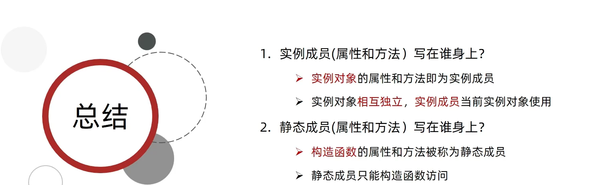


##### 3.实例成员和静态成员的区别

实例成员和静态成员在类中具有不同的特性和用途。

1. 实例成员：
   - 属于类的每个实例，每个实例都有自己的一份属性或方法。
   - 实例属性用于存储实例的状态和数据，每个实例都可以拥有不同的属性值。
   - 实例方法用于执行操作和处理数据，可以访问和修改实例属性，方法内部的`this`关键字指向当前实例。
   - 可以通过创建类的新实例来访问和使用实例成员。

2. 静态成员：
   - 不属于类的任何特定实例，而是与类本身关联。常称为"类成员"。
   - 静态属性是类级别的属性，存储共享的数据。所有**实例共享相同的静态属性值**。
   - 静态方法用于执行与类相关的任务，**无法直接访问实例属性**，因为它们不依赖于实例的状态。
   - 可以通过类本身来访问和使用静态成员，而无需创建类的实例。

下面是一个示例，演示了实例成员和静态成员之间的区别：

```javascript
class Circle {
  constructor(radius) {
    this.radius = radius; // 实例属性，属于每个实例独有
  }

  get area() {
    return Math.PI * this.radius * this.radius; // 实例方法，可以访问实例属性
  }

  static createDefaultCircle() {
    return new Circle(1); // 静态方法，与实例无关
  }

  static description = "This is a circle."  // 静态属性

  static getMaxRadius(circles) {
    let maxRadius = -1;
    for (const circle of circles) {
      if (circle.radius > maxRadius) {
        maxRadius = circle.radius;
      }
    }
    return maxRadius;
  }
}

const circle1 = new Circle(5);
console.log(circle1.radius); // 输出 5
console.log(circle1.area); // 输出 78.53981633974483

console.log(Circle.description); // 输出 "This is a circle."
const circle2 = Circle.createDefaultCircle();
console.log(circle2.radius); // 输出 1
console.log(circle2.area); // 输出 3.141592653589793

const circles = [circle1, circle2];
console.log(Circle.getMaxRadius(circles)); // 输出 5
```

代码示例中定义了一个名为 `Circle` 的类，包含实例属性 `radius`、计算性访问器属性 `area`、静态方法 `createDefaultCircle()` 和静态方法 `getMaxRadius()`。

在代码执行过程中，你创建了两个 `Circle` 类的实例 `circle1` 和 `circle2`，分别使用不同的半径进行初始化。然后，通过实例 `circle1` 和 `circle2` 访问其实例属性 `radius` 和计算性访问器属性 `area`，得到相应的结果。

接下来，你将这两个实例分别添加到一个数组 `circles` 中，并通过静态方法 `getMaxRadius()` 找到数组中半径最大的圆的半径值，并将其打印输出。

总之，你的代码展示了如何使用实例属性、计算性访问器属性和静态方法来创建和操作 `Circle` 类的实例。

### 2.内置构造函数


#### 1.Object 

[Object-MDN](https://developer.mozilla.org/zh-CN/docs/Web/JavaScript/Reference/Global_Objects/Object)


>1. 静态方法
>
>  构造函数`Object`具有一些静态方法，这些方法可以直接通过`Object`访问，并用于执行与对象操作相关的功能。下面是几个常用的静态方法以及相应的代码示例：
>
>  1. `Object.keys(obj)`
>
>     - 描述：返回一个包含给定对象的所有可枚举属性的数组。
>
>     - 示例：
>
>       ```javascript
>       const obj = { a: 1, b: 2, c: 3 };
>       const keys = Object.keys(obj);
>       console.log(keys); // 输出: ['a', 'b', 'c']
>       ```
>
>  2. `Object.values(obj)`
>
>     - 描述：返回一个包含给定对象的所有可枚举属性值的数组。
>
>     - 示例：
>
>       ```javascript
>       const obj = { a: 1, b: 2, c: 3 };
>       const values = Object.values(obj);
>       console.log(values); // 输出: [1, 2, 3]
>       ```
>
>  3. `Object.entries(obj)`
>
>     - 描述：返回一个包含给定对象的所有可枚举属性和对应属性值的二维数组（每个子数组包含键和值）。
>
>     - 示例：
>
>       ```javascript
>       const obj = { a: 1, b: 2, c: 3 };
>       const entries = Object.entries(obj);
>       console.log(entries); // 输出: [['a', 1], ['b', 2], ['c', 3]]
>       ```
>
>  4. `Object.assign(target, ...sources)`
>
>     - 描述：将一个或多个源对象的属性复制到目标对象中，并返回更新后的目标对象。
>
>     - 示例：
>
>       ```javascript
>       const target = { a: 1 };
>       const source = { b: 2, c: 3 };
>       const result = Object.assign(target, source);
>       console.log(result); // 输出: { a: 1, b: 2, c: 3 }
>       ```
>
>  5. `Object.freeze(obj)`
>
>     - 描述：冻结给定对象，使其属性不可更改。
>
>     - 示例：
>
>       ```javascript
>       const obj = { a: 1, b: 2 };
>       Object.freeze(obj);
>       obj.a = 10;
>       console.log(obj); // 输出: { a: 1, b: 2 }
>       ```
>
>  这些静态方法提供了在对象操作中非常有用的功能。通过`Object.keys()`、`Object.values()`和`Object.entries()`可以方便地获取对象的属性、属性值以及属性和属性值对的信息。而`Object.assign()`方法可以将多个对象的属性合并到一个目标对象中。`Object.freeze()`方法则允许你冻结一个对象，防止其属性被修改。
>
>  注意：静态方法是直接通过构造函数访问的，而不是通过具体的实例。
>
>+++
>
>2. 静态属性
>
>  3. 
>
>

#### 2.Array

[Array---MDN](https://developer.mozilla.org/zh-CN/docs/Web/JavaScript/Reference/Global_Objects/Array)

+++

>+ <span style="color:red">Array.prototype</span>
>
> `Array.prototype` 是 JavaScript 中数组对象的原型（prototype）。它是一个特殊的对象，包含了可以被**数组实例继承和访问的方法和属性**。
>
> 当我们创建一个数组实例时，该实例会从 `Array.prototype` 继承方法和属性，这意味着我们可以在数组实例上直接调用 `Array.prototype` 上定义的方法。
>
> 一些常见的 `Array.prototype` 方法包括：
>
>  1. `join()`：将数组的所有元素连接成一个字符串并返回结果。
>  2. `toString()`：将数组转换为一个字符串表示。
>  3. `concat()`：将两个或多个数组合并成一个新数组，并返回新数组。
>  4. `slice()`：截取数组的一部分，返回一个新的数组副本。
>  5. `splice()`：从数组中删除、插入或替换元素。
>  6. `indexOf()`：返回数组中指定元素首次出现的索引。
>  7. `lastIndexOf()`：返回数组中指定元素最后一次出现的索引。
>  8. `forEach()`：对数组的每个元素执行提供的函数。
>  9. `filter()`：通过提供的函数过滤数组的元素，返回符合条件的新数组。
>  10. `map()`：根据提供的函数对数组的每个元素进行映射，返回映射后的新数组。
>
> 除了上述常见的方法之外，`Array.prototype` 还定义了其他一些有用的方法，比如 `reduce()`、`every()`、`some()`、`find()` 等，可以根据具体的需求选择合适的方法来操作和处理数组。
>
> 需要注意的是，`Array.prototype` 上定义的方法是作为原型链的一部分被继承的，因此可以在所有的数组实例上使用。例如：
>
> ```javascript
> const array = [1, 2, 3];
> array.join(); // 调用 Array.prototype.join()
> array.slice(1); // 调用 Array.prototype.slice()
> // ...
> ```
>
> 通过使用 `Array.prototype` 上的方法，我们可以对数组进行各种操作和转换，实现不同的功能和需求。

+++


>+++
>
>1. <span style='color:red'> **forEach方法**</span>

+++

>+++
>
>2. filter方法
>
>

+++

>+++
>
>3. map方法

+++


>+++
>
>4. 数组的 `reduce()` 方法
>
>数组的 `reduce()` 方法用于将数组中的元素进行累积计算，并返回一个最终结果。下面是 `reduce()` 方法的语法和一个代码示例：
>
>语法：
>
>```javascript
>array.reduce(callback, initialValue)
>```
>
>参数说明：
>
>- `callback`：表示对数组中每个元素执行的回调函数，该函数接受四个参数：
>  - `accumulator`：累计器，存储回调函数的返回值
>  - `currentValue`：当前元素的值
>  - `currentIndex`：当前元素的索引（可选）
>  - `array`：原始数组（可选）
>- `initialValue`：可选参数，作为累计的初始值。如果不提供该参数，则使用数组的第一个元素作为初始值，并从第二个元素开始迭代。
>
>代码示例：
>
>```javascript
>let array = [1, 2, 3, 4, 5];
>
>// 计算数组元素之和
>let sum = array.reduce((accumulator, currentValue) => accumulator + currentValue);
>console.log(sum); // 输出: 15
>
>// 计算数组元素的乘积
>let product = array.reduce((accumulator, currentValue) => accumulator * currentValue);
>console.log(product); // 输出: 120
>
>// 拼接数组元素为字符串
>let str = array.reduce((accumulator, currentValue) => accumulator + currentValue.toString(), "");
>console.log(str); // 输出: "12345"
>```
>
>在上面的示例中，我们首先使用 `reduce()` 方法计算了数组元素的和、乘积和拼接成字符串，可根据需求选用不同的累积计算逻辑。`reduce()` 方法非常灵活，可以根据具体需求进行定制化的累计操作。

+++


#### 3.String


+++

>1. split方法
>
>

+++


+++

>2. substring方法
>
>

+++


+++

>3. startWith方法
>
>

+++


+++

>4. includes方法
>
>

+++

#### 4.Number

[Number---MDN](https://developer.mozilla.org/zh-CN/docs/Web/JavaScript/Reference/Global_Objects/Number)

### 3.综合案例

购物车


## day03-深入面向对象


### 1.编程思想

+++

>1. 面向过程编程
>  1. 

+++


+++

>2. 面向对象编程（oop）
>  3. 
>  4. 
>
>

+++

+++

>
>
>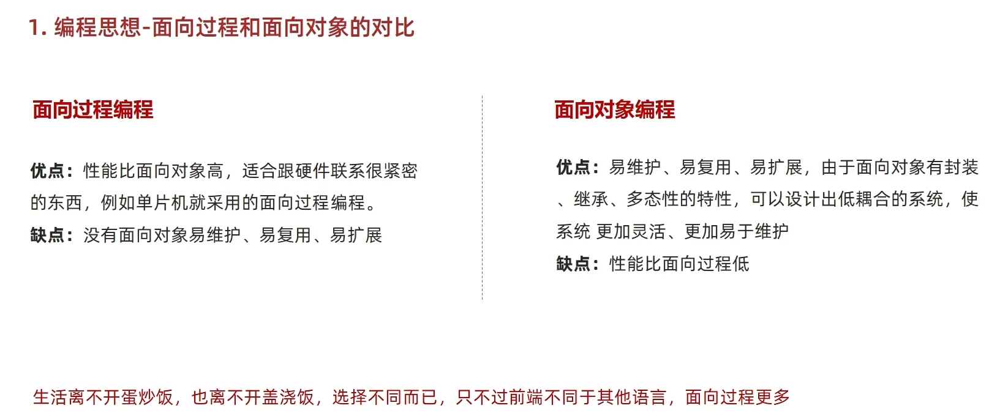
>
>

+++

### 2.构造函数

+++

>1. 封装
>  2. 
>  3. 
>  4. 
>  5. 
>
>

+++


### 3.原型

+++

>1. 原型
>
>  + 
>  + 公共的属性写在构造函数里面，公共的方法写在原型对象里面
>    + 
>  + 
>  + 
>    + 
>    + 
>
>+++
>
>
>
>+ 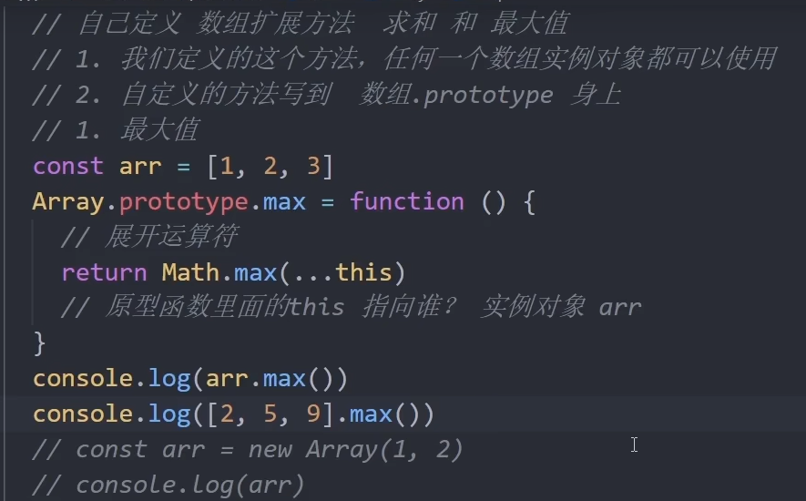
>+ 
>+ 
>
>

+++


+++

>2. constructor属性
>
>  + 
>  + 
>  + 
>  + 
>  + 
>
>

+++


+++

>3. 对象原型
>
>  + 
>  + 
>  + 
>  + 
>  + 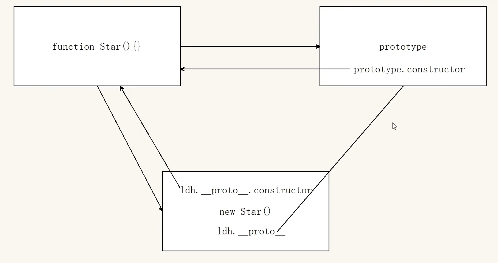
>  + 
>
>

+++


+++

>4. 原型继承
>
>  +  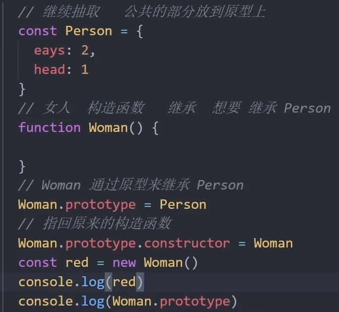
>  +  
>  +  
>  +  
>  +   
>
>+  ​	

+++


+++

>5. 原型链   
>
>
>
>+ 原型链为<br>
> + 
> + 
> + 

+++

### 4.综合案例

+++

>1. 
>2. 
>
>3. 
>  4. 
>  5. 
>6. 
>  7. 

+++


## day04-高阶技巧


### 1.深浅拷贝


#### 1.浅拷贝


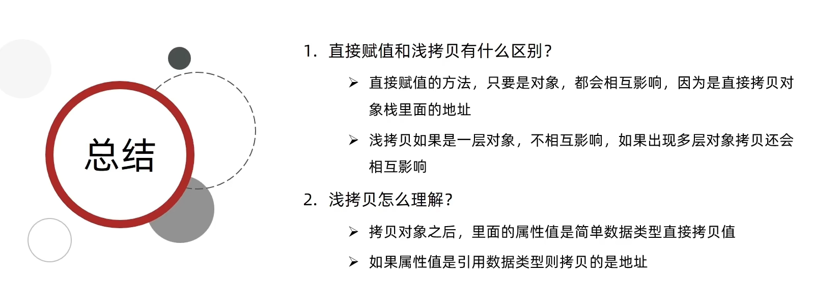

#### 2.深拷贝

##### 1.通过递归实现

+++

>
>
>
>
>
>
>
>
>
>
>
>
>+ tips
>
> + 在 JavaScript 中，对象的属性可以使用两种方式访问：点表示法和方括号表示法。
>
>   `emptyObj.key` 使用点表示法来访问对象的属性，其中 `key` 是一个字符串常量或者标识符。该方式适用于已知属性名的情况，例如 `emptyObj.name`、`emptyObj.age` 等。它更简洁易懂，代码可读性较高。
>
>   而在循环中，我们往往需要动态地访问对象的属性，并且属性名可能是一个变量值。这时候就需要使用方括号表示法，即 `emptyObj[key]`。方括号内可以是任意表达式，包括变量、字符串拼接等。
>
>   使用 `emptyObj[key]` 的好处是可以通过变量来动态地获取对象的属性值。而使用 `emptyObj.key` 要求属性名是一个固定的字符串常量或标识符。在循环中，我们无法提前知道每次迭代的属性名是什么，因此需要使用方括号表示法来动态访问对象的属性。
>
>   总结一下：
>
>   - `emptyObj.key` 适用于已知属性名的情况，属性名是一个字符串常量或标识符。
>   - `emptyObj[key]` 适用于动态获取对象属性值的情况，属性名可以是一个变量或表达式。
>
>   在循环中，我们通常会使用方括号表示法来根据变量值动态地访问对象的属性。
>
>
>
>
>
>

+++

##### 2.通过第三方库

[Lodash](https://www.lodashjs.com/)

+++

>1. 使用Loadsh里面的cloneDeep()
>  2. 
>3. 

+++

##### 3.使用JSON字符串转换

+++

>1. 使用JSON.stringify(obj)
>  2. 使用JSON.stringify(obj)将对象（存在堆中）转化为JSON字符串（存在栈中）再使用JSON.parse(JSON.stringify(obj))将JSON字符串转化为对象，和原来的对象没有任何关系
>  3. 
>  4. 
>
>
>
>

+++


### 2.异常处理

#### 1.throw抛异常

+++

>
>
>
>
>

++++


#### 2.try/catch捕获异常

+++

>
>
>
>
>

+++

#### 3.debugger

+++

>
>
>

+++

### 3.处理this

#### 1.this指向

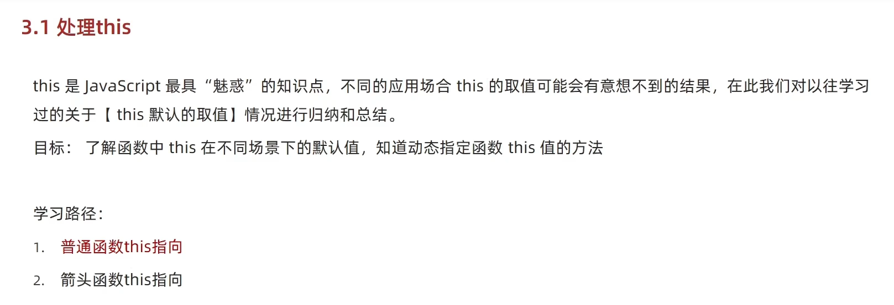

##### 1.普通函数this指向

+++

>
>
>
>
>
>
>

+++

##### 2 .箭头函数this指向

+++

>
>
>
>
>
>
>
>
>
>
>

+++

#### 2.改变this


##### 1.call()

+++

>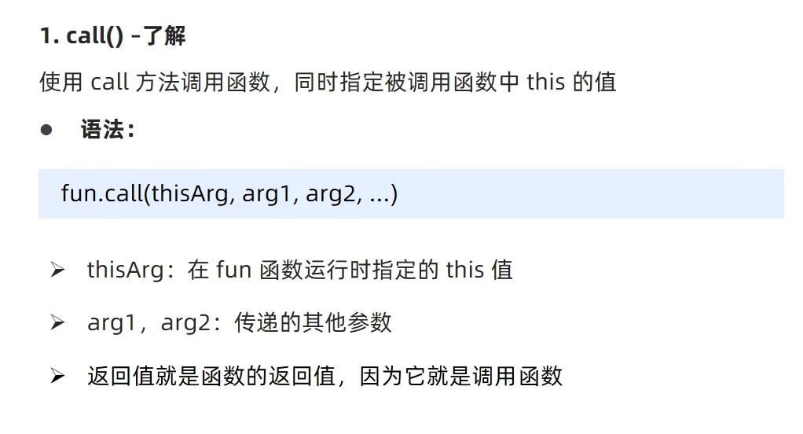
>
>
>
>

+++

##### 2.apply()

+++

>
>
>
>
>
>
>`apply()` 是 JavaScript 中的一个函数方法，它的作用是在指定的上下文中调用函数并传递参数。
>
>具体来说，`apply()` 方法的语法如下：
>```
>function.apply(thisArg, [argsArray])
>```
>
>- `thisArg`：可选参数，指定函数执行时的上下文对象。如果该参数为空或者为 `null`、`undefined`，则默认使用全局对象（在浏览器环境下为 `window` 对象）作为上下文。
>- `argsArray`：可选参数，要传递给函数的参数构成的数组。如果该参数为空或者为 `null`、`undefined`，则表示不传递任何参数给函数。
>
>`apply()` 方法的作用主要有两个方面：
>
>1. 指定函数的执行上下文：通过传递 `thisArg` 参数，可以显式地指定函数执行时的上下文对象。这样在函数内部的 `this` 关键字就会引用 `thisArg` 所指定的对象。
>
>2. 传递参数给函数：通过传递 `argsArray` 参数，可以将一个数组中的元素依次作为参数传递给函数。这样可以灵活地控制函数接收的参数数量和内容。
>
>举个例子，假设有一个对象 `person` 和一个函数 `sayHello`：
>```javascript
>var person = {
>  name: 'Alice'
>};
>
>function sayHello(greeting) {
>  console.log(greeting + ', ' + this.name);
>}
>```
>我们可以使用 `apply()` 方法调用 `sayHello` 函数，并指定上下文为 `person` 对象，同时传递参数：
>```javascript
>sayHello.apply(person, ['Hello']);
>// 输出: 'Hello, Alice'
>```
>在上面的例子中，`apply()` 方法将 `thisArg` 参数设置为 `person` 对象，使得在 `sayHello` 函数内部的 `this` 会引用 `person` 对象。同时，通过 `argsArray` 参数将字符串 `'Hello'` 作为参数传递给函数。
>
>总结：`apply()` 方法可以通过指定上下文和传递参数来调用函数，并且具有灵活性和可控性，方便处理函数的执行环境和参数传递。

+++


##### 3.bind()重点

+++

>
>
>
>
>

+++


### 4.优化性能

#### 1.防抖(debounce)

+++

>
>
>
>
>
>
>

+++

#### 2.节流-thtottle

+++

>
>
>
>
>
>
>
>
>
>
>
>
>

+++

###   5.综合案例

+++

>
>
>
>
>

+++

