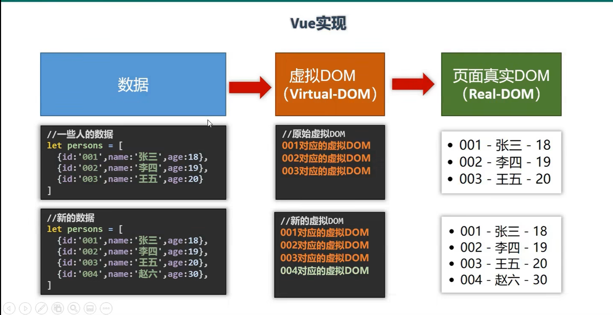

Vue简介

vue特点

1. 采用组件化模式，提高代码复用率，且让代码更好的维护
2. 声明式编码，让编码人员无需直接操作DOM（命令式编码），提高开发效率，
3. 使用虚拟的DOM + 优秀的Diff算法，尽量复用DOM节点

4.学习Vue之前要掌握的javaScript基础知识

+ ES6语法规范
+ ES6模块化
+ 包管理器
+ 原型，原型链
+ 数组常用的方法
+ axios
+ promise
+ ........
+ 