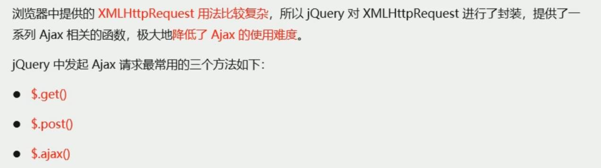
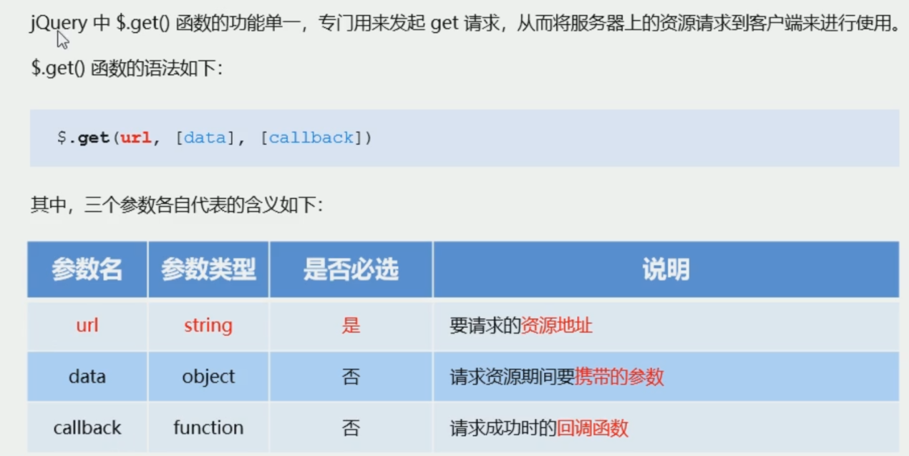
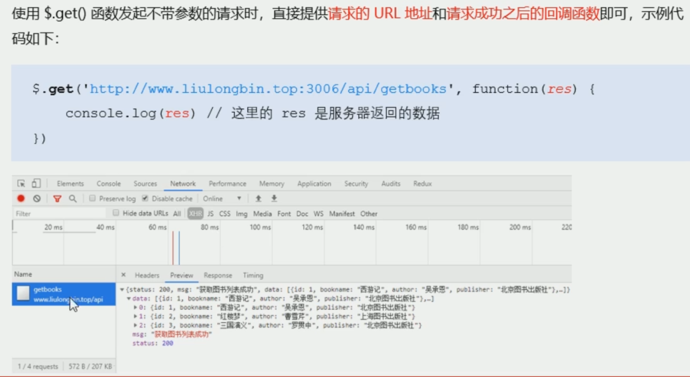
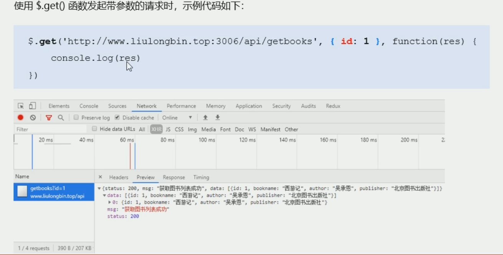
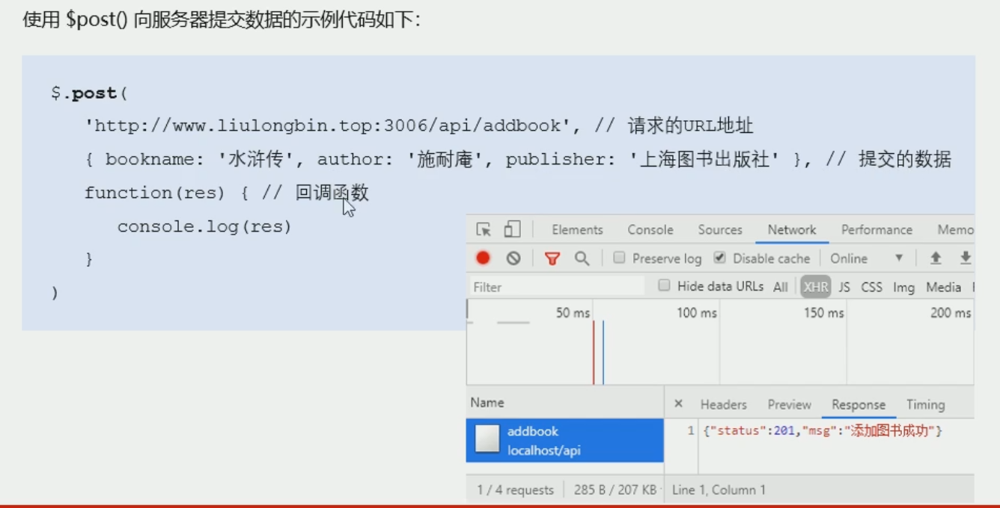
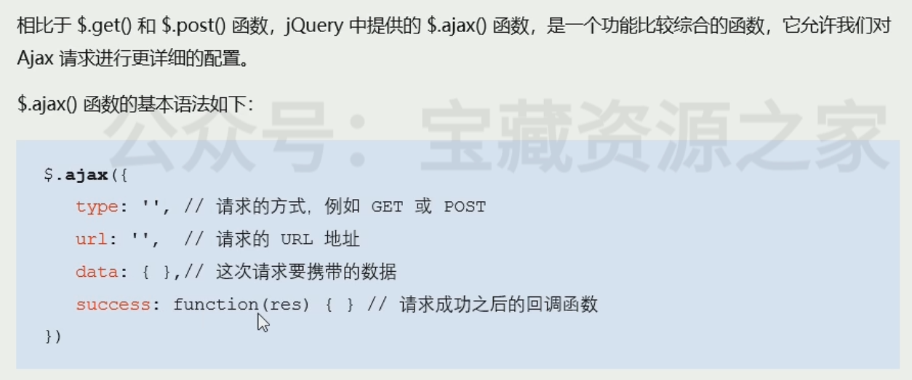
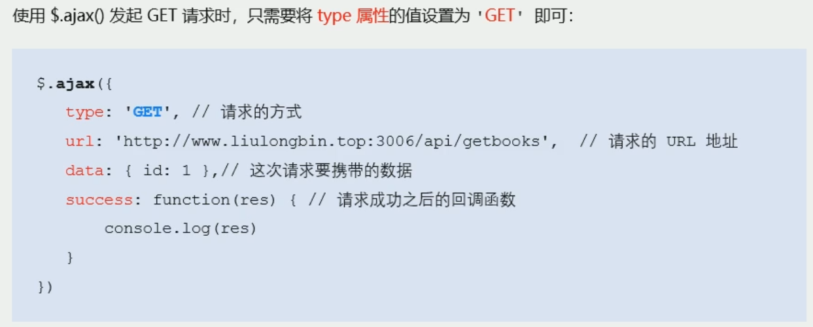
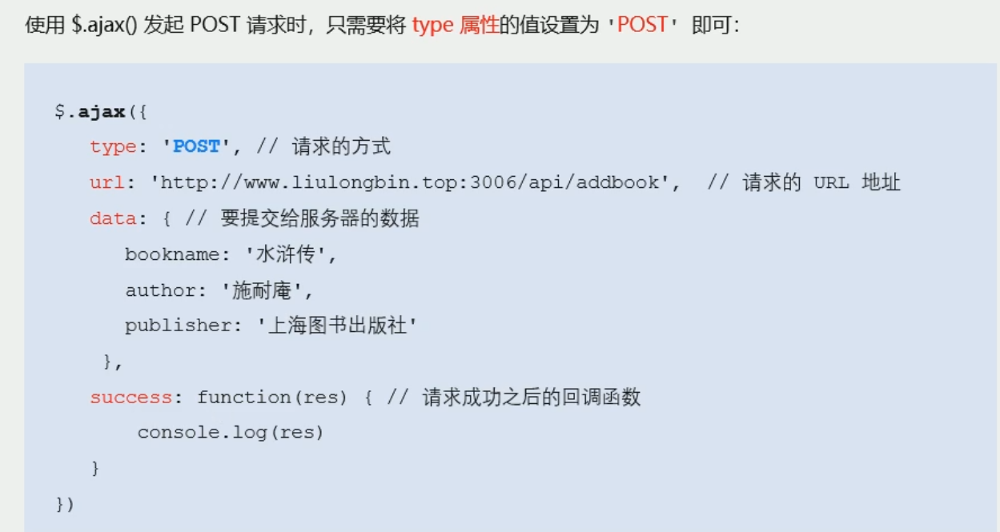

# 6.jQuery中的Ajax

## 6.1 了解jQuery中的Ajax

## 6.2 $.get()函数的语法

### $.get()发送不带参数的请求

###  $.get()发送带参数的请求  

## 6.3 $post()函数的语法

### $.post()向服务器提交数据

## 6.4 $.ajax()函数的语法

+++

### 使用$.ajax()发起GET请求 

 

### 使用$.ajax()发起POST请求

