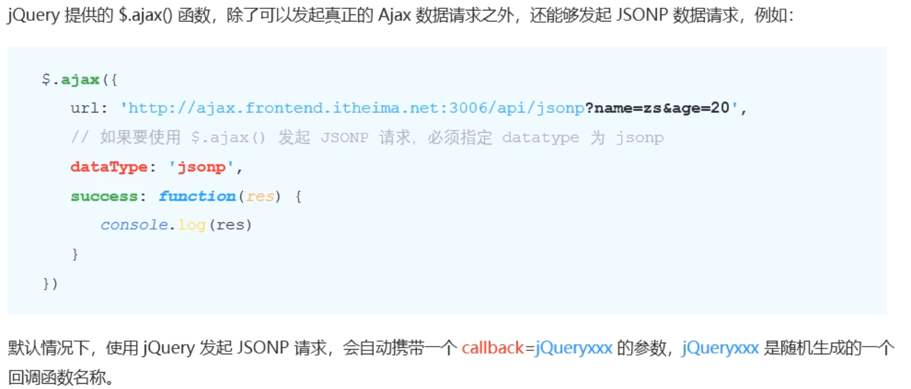
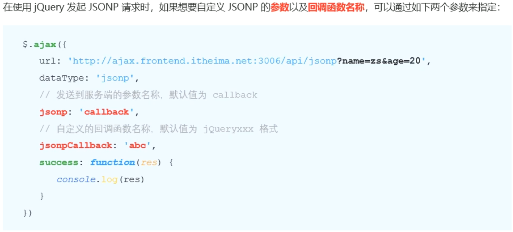
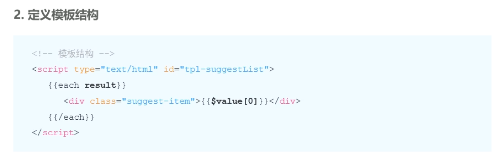

 


# 1. 跨域与JSONP

## 1. 了解同源策略和跨域


### 1.1 同源策略


### 1.2 跨域


##  2. JSONP

### 2.1 什么是JSONP


### 2.2 JSONP的实现原理


### 2.3 实现简单的JSONP


### 2.4 JSONP的缺点


### 2.5 jQuery中的JSONP



### 2.6 自定义参数及回调函数名称

 

### 2.7 jQuery中JSONP的实现过程


## 3. 案例 - 淘宝搜索

### 3.1 要实现的UI效果

### 3.2 获取用户输入的搜索关系词


### 3.3 封装getSuggestList（自定义）函数


### 3.4 渲染建议列表的UI结构


、


### 3.5 输入框的防抖


### 3.6 缓存搜索的建议列表 


## 4. 防抖和节流

### 4.1 什么是节流


+++

>节流（Throttling）是一种限制函数执行频率的技术，用于控制函数在一定时间段内被调用的频率。通过节流，可以确保函数在频繁触发的情况下以指定的时间间隔执行，从而避免过多的函数调用，减少资源消耗和提高性能。
>
>常见的节流实现方式有两种：时间戳节流（Timestamp Throttling）和定时器节流（Timer-Based Throttling）。
>
>1. 时间戳节流：每次触发事件时，记录当前的时间戳，与上一次执行函数的时间戳进行比较，如果时间间隔大于等于设定的阈值，则执行函数并更新上一次执行的时间戳。
>
>```javascript
>function throttle(func, delay) {
>  let previous = 0; // 上一次执行函数的时间戳
>
>  return function() {
>    const now = Date.now();
>    if (now - previous >= delay) {
>      func.apply(this, arguments);
>      previous = now;
>    }
>  };
>}
>
>// 使用示例
>const throttledFn = throttle(function() {
>  // 要执行的函数逻辑
>}, 1000);
>
>// 在事件处理函数中调用节流函数
>element.addEventListener('scroll', throttledFn);
>```
>
>匿名函数可以使用 `apply` 方法。`apply` 方法是 JavaScript 函数对象的内置方法之一，用于调用函数，并指定函数内部的 `this` 值和参数数组。
>
>匿名函数可以通过 `apply` 方法调用，并传递相应的 `this` 值和参数数组。在你提供的代码示例中，匿名函数通过 `func.apply(this, arguments)` 的方式进行调用。
>
>在这里，`func` 是一个匿名函数，`apply` 方法将它作为调用者，并将当前的 `this` 值和 `arguments`（当前函数的参数数组）传递给它。
>
>总而言之，无论是匿名函数还是具名函数，只要是合法的 JavaScript 函数对象，都可以使用 `apply` 方法来调用它们。
>
>1. 定时器节流：每次触发事件时，设置一个定时器，在指定的延迟时间后执行函数，并清除之前的定时器。这样可以保证在一定的时间间隔内只有一次函数执行。
>
>```javascript
>function throttle(func, delay) {
>  let timerId = null;
>
>  return function() {
>    if (!timerId) {
>      timerId = setTimeout(() => {
>        func.apply(this, arguments);
>        timerId = null;
>      }, delay);
>    }
>  };
>}
>
>// 使用示例
>const throttledFn = throttle(function() {
>  // 要执行的函数逻辑
>}, 1000);
>
>// 在事件处理函数中调用节流函数
>element.addEventListener('scroll', throttledFn);
>```
>
>通过使用节流技术，可以有效控制函数的执行频率，特别适用于需要限制网络请求、滚动事件、鼠标移动事件等高频触发的场景，提高页面性能和用户体验。
>
>希望以上解释对你有所帮助！如果还有其他问题，请随时提问。
>
>+++
>
>在这个例子中，`this` 指的是 `element`，也就是事件处理函数所绑定的元素对象。
>
>让我们逐步分析这段代码：
>
>```javascript
>function throttle(func, delay) {
>  let previous = 0; // 上一次执行函数的时间戳
>
>  return function() {
>    const now = Date.now();
>    if (now - previous >= delay) {
>      func.apply(this, arguments);
>      previous = now;
>    }
>  };
>}
>
>// 使用示例
>const throttledFn = throttle(function() {
>  // 要执行的函数逻辑
>}, 1000);
>
>// 在事件处理函数中调用节流函数
>element.addEventListener('scroll', throttledFn);
>```
>
>首先，我们定义了一个 `throttle` 函数，并接受两个参数：`func` 和 `delay`。它返回一个匿名函数。
>
>当我们调用 `throttledFn` 函数时，实际上是调用了返回的匿名函数。在匿名函数内部，我们首先获取了当前的时间戳 `now`，然后检查与上一次执行函数的时间戳 `previous` 的时间间隔是否超过了设定的延迟时间 `delay`。
>
>如果时间间隔超过了 `delay`，则说明可以执行函数，并将 **`this` 设置为匿名函数内部的执行上下文**。在这个例子中，`element.addEventListener` 将事件处理函数绑定到了 `element` 元素上，因此在事件触发时，匿名函数的执行上下文将是 `element`。
>
>总结一下，**`this` 在这段代码中指的是事件处理函数所绑定的元素对象，也就是 `element`。**
>
>+++
>
>当使用 `apply` 方法时，它可以帮助我们在指定的上下文中调用函数，并将一个类数组对象作为参数列表传递给该函数。
>
>在给出的代码示例中，我们有一个名为 `throttle` 的函数，它接受两个参数：`func` 和 `delay`。
>
>```javascript
>function throttle(func, delay) {
>  let previous = 0; // 上一次执行函数的时间戳
>
>  return function() {
>    const now = Date.now();
>    if (now - previous >= delay) {
>      func.apply(this, arguments);
>      previous = now;
>    }
>  };
>}
>```
>
>让我们来详细解释 `func.apply(this, arguments)` 在这段代码中的作用。
>
>首先，我们在 `return` 语句中返回了一个匿名函数。这个函数将在每次调用 `throttle` 函数后返回，并且会被赋值给变量 `throttledFn`。
>
>这个匿名函数是一个闭包，它保留了对外部函数 `throttle` 的变量引用（如 `func` 和 `previous`），并且在每次调用时会检查时间间隔是否已达到设定的 `delay`。
>
>当条件满足时，即当前时间与上一次函数执行的时间间隔大于等于 `delay` 时，我们通过 `func.apply(this, arguments)` 来调用传入的函数 `func`。
>
>具体来说，`func.apply` 接收两个参数：
>
>- 第一个参数 `this` 是执行函数时的上下文。在这个例子中，我们希望**保持执行函数的上下文**与**事件处理函数中的上下文一致**。因此，`this` 的值也就是匿名函数中的 `this`（即事件处理函数所绑定的元素）。
>- 第二个参数 `arguments` 是一个类数组对象，包含了传递给匿名函数的所有参数。通过使用 `apply` 方法，我们可以将这些参数作为函数 `func` 的参数列表传递进去。
>
>这样，每当事件处理函数被触发时，匿名函数就会被调用。如果时间间隔满足条件，那么传入的 `func` 函数就会在正确的上下文和参数下被执行。
>
>总而言之，`func.apply(this, arguments)` 的作用是使用指定的上下文和参数列表来调用函数 `func`。在这段代码中，它确保了传入的函数在正确的时间间隔内以正确的上下文被调用，并实现了节流的效果。
>
>+++
>
>**函数的上下文**是在函数被调用时所处的执行环境。它决定了函数体内部的 `this` 关键字的值，以及函数能够访问的变量和函数。
>
>在 JavaScript 中，函数的上下文可以通过不同的方式确定：
>
>1. 全局上下文：当函数不作为对象的方法被调用时，它的上下文是全局对象（例如浏览器中的 `window` 对象，Node.js 环境中的 `global` 对象）。
>
>```javascript
>function greet() {
>  console.log(this); // 指向全局对象（如 window）
>}
>
>greet(); 
>```
>
>2. 对象上下文：当函数作为对象的方法被调用时，它的上下文是调用这个方法的对象。
>
>```javascript
>const obj = {
>  name: "Alice",
>  greet: function() {
>    console.log(this.name); // 指向调用该方法的对象的 name 属性
>  }
>};
>
>obj.greet(); 
>```
>
>3. 使用 `call`、`apply` 或 `bind` 改变上下文：可以通过 `call`、`apply` 或 `bind` 方法显式改变函数的上下文。
>
>```javascript
>function greet() {
>  console.log(this.name); 
>}
>
>const obj = {
>  name: "Alice"
>};
>
>greet.call(obj); // 使用 call 改变上下文为 obj
>greet.apply(obj); // 使用 apply 改变上下文为 obj
>const boundFn = greet.bind(obj); // 使用 bind 返回一个新的函数，上下文为 obj
>boundFn(); 
>```
>
>4. 构造函数上下文：当使用 `new` 操作符创建一个实例时，构造函数内部的上下文将指向新创建的实例对象。
>
>```javascript
>function Person(name) {
>  this.name = name;
>}
>
>const person = new Person("Alice");
>console.log(person.name); // Alice
>```
>
>函数的上下文通常决定了函数在执行过程中能够访问的变量和方法。了解函数的上下文是理解函数执行行为的重要部分。
>
>+++
>
>**`arguments` 对象是 JavaScript 中的一个内置对象**，它在函数内部自动创建，并包含了传递给函数的所有参数。
>
>`arguments` 对象类似于数组，但并不是一个真正的数组。它具有类似数组的属性和方法，例如 `length` 属性和索引访问元素的能力，但不具备数组特有的方法，如 `push()` 和 `pop()`。
>
>以下是关于 `arguments` 对象的一些重要特点：
>
>1. 访问参数：
>   - 可以使用索引访问 `arguments` 对象中的每个参数，就像通过数组索引访问数组元素一样。
>   - 例如，`arguments[0]` 表示第一个参数，`arguments[1]` 表示第二个参数，依此类推。
>
>2. 参数数量：
>   - `arguments.length` 属性返回传递给函数的参数个数。
>   - 这使得我们可以在不事先知道传递给函数的参数个数的情况下，进行动态处理。
>
>3. 不定参数个数：
>   - `arguments` 对象使得函数能够接受任意数量的参数，而不需要显式地声明它们。
>   - 可以在函数内部使用 `arguments.length` 来确定传递了多少个参数，并根据需要进行处理。
>
>```javascript
>function sum() {
>  let total = 0;
>  for (let i = 0; i < arguments.length; i++) {
>    total += arguments[i];
>  }
>  return total;
>}
>
>console.log(sum(1, 2, 3)); // 输出：6
>console.log(sum(4, 5, 6, 7)); // 输出：22
>```
>
>需要注意的是，虽然 `arguments` 对象具有数组类似的特性，但它不是一个真正的数组，不能使用数组方法和迭代器。如果想要对 `arguments` 对象应用数组方法，可以将其转换为真正的数组。
>
>```javascript
>function toArray() {
>  return Array.from(arguments); // 将 arguments 转换为真正的数组
>}
>
>const arr = toArray(1, 2, 3);
>console.log(arr); // 输出：[1, 2, 3]
>```
>
>总之，`arguments` 对象是一个在函数内部自动创建的类数组对象，用于访问传递给函数的参数，以及获取参数的个数和动态处理不定数量的参数。
>
>+++
>
>在 JavaScript 中，`arguments` 是一个特殊的对象，它包含了函数被调用时传递的所有参数。
>
>在给定的代码中，`arguments` 表示匿名函数内部的参数。这里的匿名函数是 `throttle()` 函数的返回值，也称为“节流函数”。
>
>当调用节流函数时，传递给节流函数的参数将被存储在 `arguments` 对象中。通过使用 `func.apply(this, arguments)`，我们将这些参数传递给了 `func` 函数，以便在每次执行函数之前将其应用到 `func` 函数上。
>
>具体来说，`func.apply(this, arguments)` 将会以当前的 `this` 值和 `arguments` 参数数组作为参数，在节流函数内部调用 `func` 函数。这样，无论节流函数被调用时传递了多少个参数，它们都可以被正确地传递给 `func` 函数。
>
>需要注意的是，`arguments` 对象是一个类数组对象，它并不是一个真正的数组，因此它没有数组的方法，如 `forEach` 或 `map`。如果需要对参数使用数组方法，可以将 `arguments` 转换为真正的数组，例如通过使用 `Array.from(arguments)` 或 `Array.prototype.slice.call(arguments)` 来实现。
>
>总而言之，`arguments` 是一个包含函数调用时传递的所有参数的特殊对象。在这个例子中，`arguments` 用于将参数传递给 `func` 函数。
>
>+++
>
>在 JavaScript 中，函数的上下文可以通过两种方式来指定：对象上下文和使用 `apply()` 方法实现的上下文。
>
>1. **对象上下文**：当一个函数作为对象的属性调用时，函数的上下文就是该对象。可以使用点运算符（`.`）或方括号运算符（`[]`）来调用对象上的方法，并自动将该对象作为函数的上下文。例如：
>
>```javascript
>const person = {
>  name: 'Alice',
>  sayHello() {
>    console.log(`Hello, ${this.name}!`);
>  }
>};
>
>person.sayHello(); // 输出：Hello, Alice!
>```
>
>在上述示例中，`sayHello` 方法作为 `person` 对象的属性被调用。因此，`this` 关键字在函数内部指向 `person` 对象，从而可以访问到 `person` 对象的 `name` 属性。
>
>2. **使用 apply() 方法实现的上下文**：`apply()` 方法允许我们显式地指定一个对象作为函数的上下文。通过将函数本身作为 `thisArg` 参数传递给 `apply()` 方法，可以在函数调用时显式设置函数的上下文。例如：
>
>```javascript
>function sayHello() {
>  console.log(`Hello, ${this.name}!`);
>}
>
>const person = {
>  name: 'Alice'
>};
>
>sayHello.apply(person); // 输出：Hello, Alice!
>```
>
>在这个示例中，将 `person` 对象作为 `thisArg` 参数传递给 `apply()` 方法，使得 `sayHello` 函数在调用时的上下文为 `person` 对象。因此，`this` 关键字在函数内部指向了 `person` 对象，从而访问到了 `person` 对象的 `name` 属性。
>
>总结来说，对象上下文是通过将函数作为对象的属性来调用，并自动将该对象设置为函数的上下文。而使用 `apply()` 方法实现的上下文是显式地将一个对象传递给 `apply()` 方法，将该对象设置为函数的上下文。两种方式都可以实现函数的上下文指定，但是实现的方式不同。

+++


### 4.2 节流的应用场景


### 4.3 节流案例 - 鼠标跟随效果

 


### 4.4 总结防抖和节流的区别

