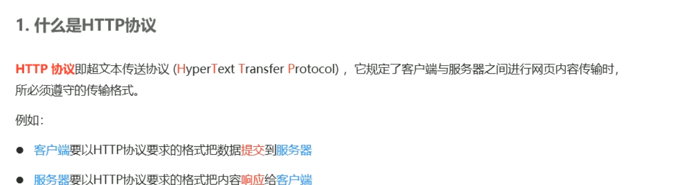

# HTTP协议加强


## 1. HTTP协议简介

### 1.1 什么是通信


### 1.2 什么是通信协议


+ 通信协议是指在计算机网络中，用于规定和管理通信过程中数据交换的约定和规则。它定义了在通信系统中发送和接收实体之间进行数据传输的格式、顺序、错误检测和纠正方法等。

  通信协议的作用是使得不同的设备、系统或者程序能够相互交流和理解，确保数据能够按照一定的方式被准确地传递和解释。它定义了通信双方所需执行的操作、使用的语法和语义，以及必要的控制流程。

  通信协议可以包括以下几个方面的内容：

  1. 数据格式：规定了数据的结构和表示方法，例如数据包的头部、消息的字段以及数据的编码方式。

  2. 传输方式：确定了数据在网络中的传输方式，例如使用哪种传输介质（如以太网、无线网络等）、使用的传输速率和传输模式（如单工、半双工或全双工）。

  3. 错误检测与纠正：定义了检测和处理数据传输过程中出现的错误的方法，例如使用校验和、冗余校验码（如循环冗余检验码 CRC）等。

  4. 数据交换流程：规定了通信双方之间数据交换的顺序、流程和控制方式，包括建立连接、数据传输和连接关闭等步骤。

  通信协议可以应用于不同的网络层级，例如物理层、数据链路层、网络层和应用层等。常见的网络通信协议包括 TCP/IP、HTTP、SMTP、FTP 等。

  总而言之，通信协议是计算机网络中用于规范和管理数据交换的约定和规则，它定义了数据格式、传输方式、错误处理和数据交换流程等内容，确保不同设备、系统或程序之间能够正确地进行数据通信。

  

  

  ### 1.3 HTTP

  + HTTP（Hypertext Transfer Protocol，超文本传输协议）是一种用于在计算机网络上传输超文本（如 HTML、XML、图片等）的应用层协议。它是互联网中最常用的协议之一，被用于在客户端和服务器之间传输信息。

    HTTP协议的特点如下：

    1. **无连接性**：HTTP是一种无连接的协议，即每个请求-响应对都是独立的，服务器不会保留与之前请求的关联。这意味着每个请求都需要建立一个新的连接，并在响应完成后立即关闭连接。

    2. **无状态性**：HTTP协议是无状态的，即服务器不会保留客户端的任何状态信息。每个请求都是独立的，服务器仅根据当前请求和响应来进行处理，不会保持对之前请求的记录。

    3. **基于请求-响应模型**：HTTP通信采取请求-响应模型，客户端发送一个请求给服务器并等待服务器的响应。请求由HTTP方法（GET、POST等）和URL组成，而响应则包含了请求的结果，例如网页内容、状态码等。

    4. **灵活的数据传输**：HTTP可以在不同的传输层协议上运行，最常用的是基于TCP/IP的传输方式。它可以通过使用不同的媒体类型（如文本、图片、音频等）来传输各种类型的数据。

    HTTP协议通常由客户端发起请求并发送给服务器，服务器在接收到请求后处理并返回响应。HTTP使用URL（Uniform Resource Locator，统一资源定位符）来标识和定位要获取或操作的资源。常见的HTTP方法包括GET、POST、PUT和DELETE等，它们用于指定对资源的不同操作。

    除了基本的HTTP协议，还有HTTPS（HTTP Secure）协议，它在HTTP的基础上增加了安全性，通过使用SSL或TLS协议对通信进行加密和认证。

    总结来说，HTTP是一种应用层协议，用于在客户端和服务器之间传输超文本信息。它具有无连接性、无状态性、基于请求-响应模型和灵活的数据传输等特点，是互联网中最常用的协议之一。

    

    

## 2. HTTP请求

### 2.1 什么是HTTP请求消息 


### 2.2 HTTP请求消息的组成部分


### 2.2 HTTP请求消息的组成部分

1. **请求行**：请求行包含了客户端发送的请求方法、URL和HTTP协议版本。常见的请求方法有GET、POST、PUT和DELETE等，URL表示请求的资源位置，HTTP协议版本通常是HTTP/1.1。

2. **请求头部**：请求头部包含了客户端向服务器传递的附加信息，以键值对的形式表示。一些常见的头部字段包括：
   - Host：指定服务器的主机名和端口号。
   - User-Agent：标识客户端的应用程序或浏览器信息。
   - Content-Type：指定请求体中所发送数据的类型。
   - Cookie：包含客户端的状态信息。
   - Accept：指定客户端可以接受的响应内容类型。

3. **空行**：空行是请求头部和请求体之间的空行，用于分隔头部和请求体。

4. **请求体**：请求体包含了客户端向服务器发送的数据。在一些请求方法（如POST）中，请求体可用于传输表单数据、JSON数据等。：

以下是一个示例的HTTP请求，包含请求行、请求头部、空行和请求体：

```
POST /api/login HTTP/1.1      // 请求行：使用POST方法请求路径为/api/login的资源，HTTP协议版本为1.1
Host: www.example.com        // 请求头部：指定主机名为www.example.com
Content-Type: application/json   // 请求头部：指定请求体中的数据类型为JSON
Content-Length: 45          // 请求头部：指定请求体的长度
Authorization: Bearer abcdef1234567890    // 请求头部：指定身份验证令牌

                           // 空行

{                          // 请求体：JSON格式的请求体数据
  "username": "example_user",
  "password": "example_password"
}
```

在这个示例中，使用POST方法向路径为/api/login的资源发起请求。请求头部包含了Host、Content-Type、Content-Length和Authorization等字段。空行用于分隔请求头部和请求体。请求体是一个JSON格式的数据，包含了用户名和密码。


## 3. HTTP响应

### 3.1 什么是HTTP响应消息

HTTP响应消息是由Web服务器返回给客户端的消息，用于响应之前客户端发送的HTTP请求。它包含了服务器处理请求后的结果和相关的元数据信息。

### 3.2 HTTP响应消息的组成部分


HTTP响应消息通常由以下几个部分组成：

1. 状态行（Status Line）：包含HTTP协议版本、状态码和对应的状态消息。例如：HTTP/1.1 200 OK。状态码表示服务器对请求的处理结果，常见的状态码有200表示请求成功，404表示请求的资源未找到，500表示服务器内部错误等。

2. 响应头部（Response Headers）：包含一系列键值对，用于描述服务器的信息、响应的资源、所支持的压缩算法等。常见的响应头部字段包括Server、Content-Type、Content-Length等。

3. 空行（Blank Line）：响应头部和响应体之间必须有一个空行。它表示响应头部的结束。

4. 响应体（Response Body）：实际的响应内容，可以是HTML页面、JSON数据、文件等，根据请求所要求的资源类型而定。响应体的长度由响应头部中的Content-Length字段指定。

一个完整的HTTP响应消息示例：

```
HTTP/1.1 200 OK  // 状态行，表示请求成功
Server: Apache/2.4.29 (Ubuntu)  // 响应头部，指定服务器软件及其版本
Content-Type: text/html; charset=UTF-8  // 响应头部，指定响应体的内容类型及编码
Content-Length: 1234  // 响应头部，指定响应体的长度

// 空行，表示响应头部结束，响应体开始

<!DOCTYPE html>
<html>
<head>
    <title>Example</title>
</head>
<body>
    <h1>Welcome to Example</h1>
    <p>This is an example webpage.</p>
</body>
</html>
```

## 4. HTTP请求方法

### 4.1 什么是HTTP请求方法


## 5. HTTP响应状态代码

### 5.1 什么是HTTP响应状态码

 

### 5.2 HTTP响应状态码的组成及分类


HTTP响应状态码是Web服务器在响应客户端请求时返回的表示处理结果的数字代码。它们指示了请求的处理状况，客户端可以根据状态码来判断请求是否成功以及采取相应的操作。

常见的HTTP响应状态码有以下几个范围：

1xx （信息性状态码）：表示接收到请求并正在处理。

- 100 Continue：表示服务器已接收到请求的初始部分，并且客户端应继续发送其余部分。

2xx （成功状态码）：表示请求被成功接收、理解和处理。

- 200 OK：表示请求成功，服务器返回请求的内容。
- 201 Created：表示请求已成功处理，并在服务器上创建了新的资源。
- 204 No Content：表示请求成功处理，但响应中不包含实体的主体部分。

3xx （重定向状态码）：表示需要进一步的操作来完成请求。

- 301 Moved Permanently：请求的资源已永久移动到新位置。
- 302 Found：请求的资源暂时移动到新位置。
- 304 Not Modified：客户端可以使用缓存的版本，而无需从服务器重新获取资源。

4xx （客户端错误状态码）：表示客户端发送的请求有错误。

- 400 Bad Request：请求有语法错误或无法被服务器理解。
- 401 Unauthorized：请求需要身份验证。
- 403 Forbidden：服务器拒绝请求，没有权限访问请求的资源。
- 404 Not Found：请求的资源不存在。

5xx （服务器错误状态码）：表示服务器在处理请求时发生错误。

- 500 Internal Server Error：服务器遇到了意外的错误，无法完成请求。
- 502 Bad Gateway：服务器作为网关或代理，从上游服务器接收到无效的响应。
- 503 Service Unavailable：服务器暂时无法处理请求，通常是由于过载或维护导致。

这只是一些常见的HTTP响应状态码，具体的状态码和其含义可以通过HTTP协议规范进行查阅。不同的状态码提供了不同的信息，有助于客户端和服务器进行通信和故障排除。

### 5.3 常见的HTTP响应请求


