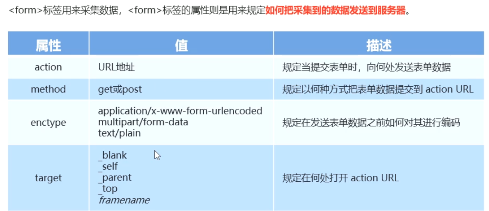
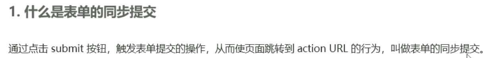
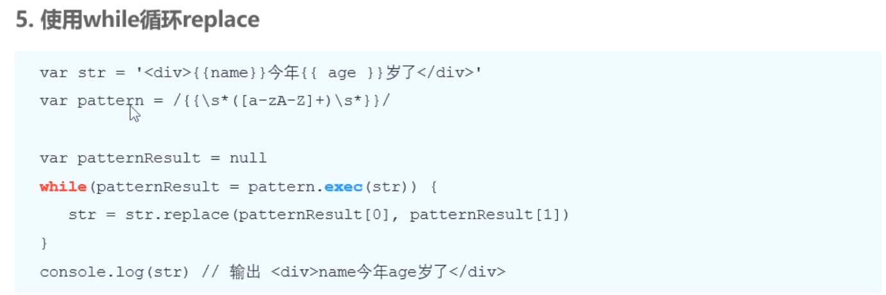

# 1.form表单与模版引擎

## 

## 1. form表单的基本使用

### 1.1 什么是表单


###  1.2 表单的组成部分


### 1.3 \<form>标签的属性




### 1.4 表单的同步提交及缺点




<div style="width:%100;height:5px;background-color: #ff0000;;border:1px solid red"></div>

## 2.1 通过Ajax提交表单数据

在jQuery中，可以使用如下两种方式，监听到表单提交事件：


### 2.2 阻止表单默认提交行为


### 2.3快速获取表单中的数据


<div style="width:%100;height:5px;background-color: #ff0000;;border:1px solid red"></div>

## 3. 案例 -评论列表

<div style="width:%100;height:5px;background-color: #ff0000;;border:1px solid red"></div>

## 4. 模版引擎的基本概念

### 4.1 渲染UI结构时遇到的问题


### 4.2 什么是模版引擎


### 4.3 模版引擎的好处


<div style="width:%100;height:5px;background-color: #ff0000;;border:1px solid red"></div>

## 5. art-template模版引擎

### 5.1 art-template简介


### 5.2 art-tempalte的安装


### 5.3 art-template引擎的基本使用


>当您将模板定义在另一个 `<script>` 标签内时，可以使用 jQuery 和 art-template 模板引擎来提取模板并进行渲染。以下是具体步骤：
>
>首先，在 HTML 文件中定义一个 `<script>` 标签，用于存储模板字符串。为了将模板字符串与页面其他内容区分开，可以为该标签添加自定义的 `type` 属性，如 `"text/template"`。
>
>```html
><script id="myTemplate" type="text/template">
>  <div>
>    <h1>{{ title }}</h1>
>    <p>{{ content }}</p>
>  </div>
></script>
>```
>
>接下来，您可以使用 jQuery 的 `.html()` 方法获取该 `<script>` 标签的内容，并将其作为模板字符串传递给 art-template 的 `template` 函数进行渲染。
>
>```javascript
>// 获取模板字符串
>var templateString = $('#myTemplate').html();
>
>// 准备数据对象
>var data = {
>  title: 'Hello',
>  content: 'Welcome to art-template'
>};
>
>// 使用 art-template 的 template 函数渲染模板
>var renderedHtml = template(templateString, data);
>
>// 将渲染后的 HTML 插入到页面中的某个元素中
>$('#myElement').html(renderedHtml);
>```
>
>在上述代码中，使用了 jQuery 的选择器 `$('#myTemplate')` 来获取带有指定 id 的 `<script>` 标签。然后，使用 `.html()` 方法获取该标签的内容，并将其赋值给 `templateString` 变量。
>
>接下来，继续使用 art-template 的 `template` 函数来渲染模板字符串。最后，通过 jQuery 的 `.html()` 方法将渲染后的 HTML 插入到页面的某个元素中（id 为 `myElement`）。
>
>请确保将代码放在适当的位置，以确保模板标签和目标元素都存在于 DOM 中。

+++

### 5.4 art-template标准语法


>art-template 是一款功能丰富的 JavaScript 模板引擎，它具有简单易用、高性能和强大的模板语法。以下是 art-template 的标准语法：
>
>1. 输出变量值：
>   使用双大括号 `{{}}` 来输出变量的值。
>   ```html
>   <p>{{ username }}</p>
>   ```
>
>2. 嵌套对象或数组的取值：
>   使用点 `.` 或者方括号 `[]` 来访问嵌套对象或数组中的值。
>   ```html
>   <p>{{ user.name }}</p>
>   <p>{{ user["age"] }}</p>
>   <p>{{ arr[0] }}</p>
>   ```
>
>3. 判断条件：
>   使用 `{{if}}` 来进行条件判断，可以搭配 `{{else}}` 和 `{{/if}}` 使用。
>   ```html
>   {{if isAdmin}}
>     <p>Welcome Admin</p>
>   {{else}}
>     <p>Welcome User</p>
>   {{/if}}
>   ```
>
>4. 循环遍历：
>   使用 `{{each}}` 进行循环遍历，可以使用 `{{each obj}}` 或 `{{each obj as value index}}` 两种方式，搭配 `{{/each}}` 使用。
>   ```html
>   {{each list}}
>     <li>{{ $value }}</li>
>   {{/each}}
>   ```
>
>5. 注释：
>   使用 `{{!-- comment --}}` 进行注释，注释内容不会被渲染到最终生成的 HTML 中。
>   ```html
>   {{!-- This is a comment --}}
>   ```
>
>6. 原样输出：
>   使用 `{{@ expression }}` 进行原样输出，不会对表达式进行解析。
>   ```html
>   {{@ "<p>This is a paragraph</p>" }}
>   ```
>
>7. 过滤器：
>   使用管道符 `|` 来使用过滤器对变量进行处理。
>   ```html
>   <p>{{ username | capitalize }}</p>
>   ```
>
>以上是 art-template 的一些常用的标准语法。art-template 还提供了更多强大的功能和语法，如局部模板、逻辑表达式、自定义辅助方法等，您可以查阅 art-template 的文档以获取更详细的信息。
>
>

### 5.5 案例-新闻列表

<div style="width:%100;height:5px;background-color: #ff0000;;border:1px solid red"></div>

## 6. 引擎模版的实现原理

### 6.1 正则与字符串操作





<div style="width:%100;height:5px;background-color: #ff0000;;border:1px solid red"></div>

## 6.2 实现简易的模版引擎


