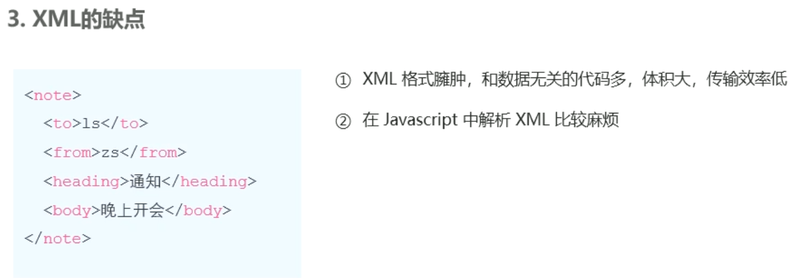
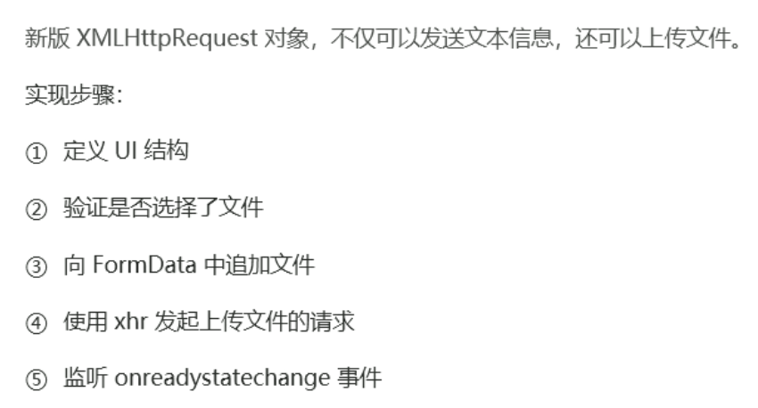
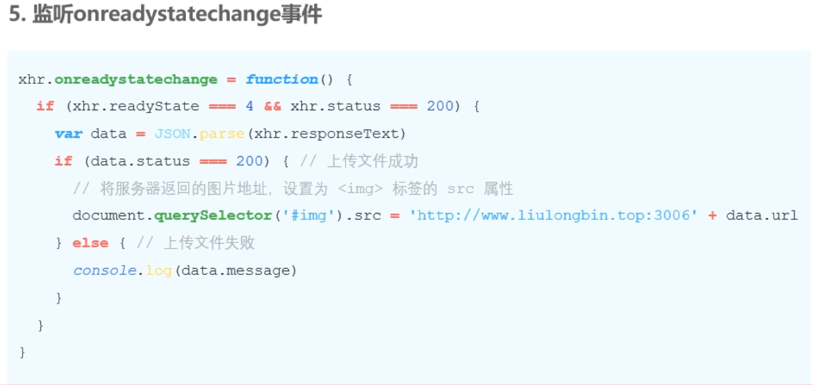
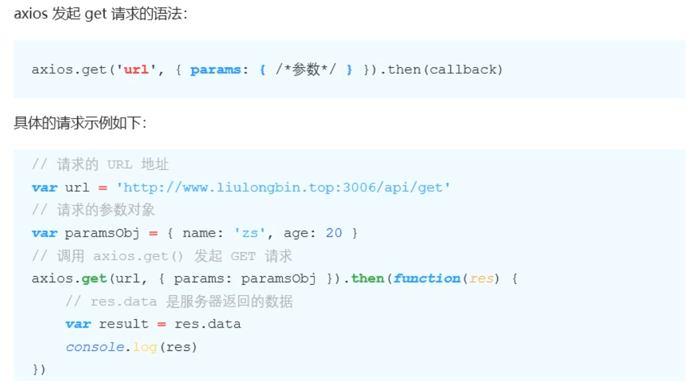

# 1.Ajax强化


## 1. XMLHttpRequest的基本使用

### 1.1 什么是XMLHttpRequest

 

### 1.2 使用xhr发起GET请求


### 1.3 了解xhr对象的readyState属性


### 1.4 使用xhr发起带参数的GET请求


### 1.5 查询字符串


### 1.6 URL编码与解码


### 1.7 使用xhr发起POST请求

###  


## 2. 数据交换格式

### 2.1 什么是数据交换格式

 

### 2.2 XML




### 2.3 JSON


## 3. 封装自己的Ajax函数

### 3.1 实现的效果


### 3.2 定义options参数选项


### 3.3 处理data参数


### 3.4 自定义函数


### 3.5  判断请求的类型


## 4. XMLHttpRequest Level2的新特性

### 4.1 XMLHttpRequest Level2


### 4.2 设置HTTP请求时限


### 4.3 FormData对象管理表单数据


### 4.4 上传文件






### 4.5 显示文件的上传进度


+ 拓展（选择上传的网速）
  + 

+ 导入需要的库（bootstrap）


## 5. jQuery高级用法

### 5.1 jQuery实现文件上传


+++

>**要使用 jQuery 和 Bootstrap 实现文件上传以及结合进度条显示上传进度，可以按照以下步骤进行操作：**
>
>1. 引入 jQuery 和 Bootstrap 的库文件。在 HTML 文件的 `<head>` 部分添加如下代码：
>
>```html
><link rel="stylesheet" href="https://cdn.jsdelivr.net/npm/bootstrap@5.3.0/dist/css/bootstrap.min.css">
><script src="https://code.jquery.com/jquery-3.6.0.min.js"></script>
>```
>
>2. 在 HTML 页面中添加一个文件选择输入框、上传按钮和进度条。例如：
>
>```html
><input type="file" id="fileInput">
><button id="uploadButton" class="btn btn-primary">上传文件</button>
><div class="progress mt-3" style="display: none;">
>  <div id="progressBar" class="progress-bar progress-bar-striped" role="progressbar" style="width: 0%" aria-valuenow="0" aria-valuemin="0" aria-valuemax="100"></div>
></div>
>```
>
>3. 使用 jQuery 编写上传文件的 JavaScript 代码。在页面加载完成后，添加如下代码：
>
>```javascript
>$(document).ready(function() {
>  // 上传按钮点击事件
>  $('#uploadButton').click(function() {
>    var fileInput = $('#fileInput')[0];
>    var file = fileInput.files[0];
>    uploadFile(file);
>  });
>
>  // 上传文件函数
>  function uploadFile(file) {
>    var formData = new FormData();
>    formData.append('file', file);
>
>    $.ajax({
>      url: 'upload.php', // 后端处理上传的脚本地址
>      type: 'POST',
>      data: formData,
>      processData: false,
>      contentType: false,
>      xhr: function() {
>        var xhr = new window.XMLHttpRequest();
>        xhr.upload.addEventListener('progress', function(e) {
>          if (e.lengthComputable) {
>            var percent = Math.round((e.loaded / e.total) * 100);
>            $('#progressBar').width(percent + '%');
>            $('#progressBar').attr('aria-valuenow', percent);
>            $('#progressBar').text(percent + '%');
>          }
>        });
>        return xhr;
>      },
>      success: function(response) {
>        // 处理上传成功后的响应
>        console.log('上传成功');
>      },
>      error: function() {
>        // 处理上传失败后的响应
>        console.log('上传失败');
>      }
>    });
>  }
>});
>```
>
>4. 在后端编写处理上传文件的脚本。在示例中，我们将上传的文件通过 POST 请求发送到 `upload.php` 脚本进行处理。你需要根据实际情况编写后端脚本来保存上传的文件。
>
>请注意，示例中的代码仅展示了如何使用 jQuery 和 Bootstrap 实现文件上传和进度条显示上传进度的基本逻辑。在实际应用中，你可能需要进行更多的错误处理、安全性验证和其他功能的添加。
>
>上述代码中的 `upload.php` 文件是一个占位符，你需要根据自己的需求编写真实的后端处理逻辑来保存上传的文件。
>
>希望这个示例能帮助到你实现文件上传并结合进度条显示上传进度。如果有任何问题，请随时提问。

+++

### 5.2 jQuery实现loading效果


## 6. axios

### 6.1 什么是axios


###  6.2 axios发起GET请求

 

### 6.3 axios发起POST请求


### 6.4 直接使用axios发起请求


