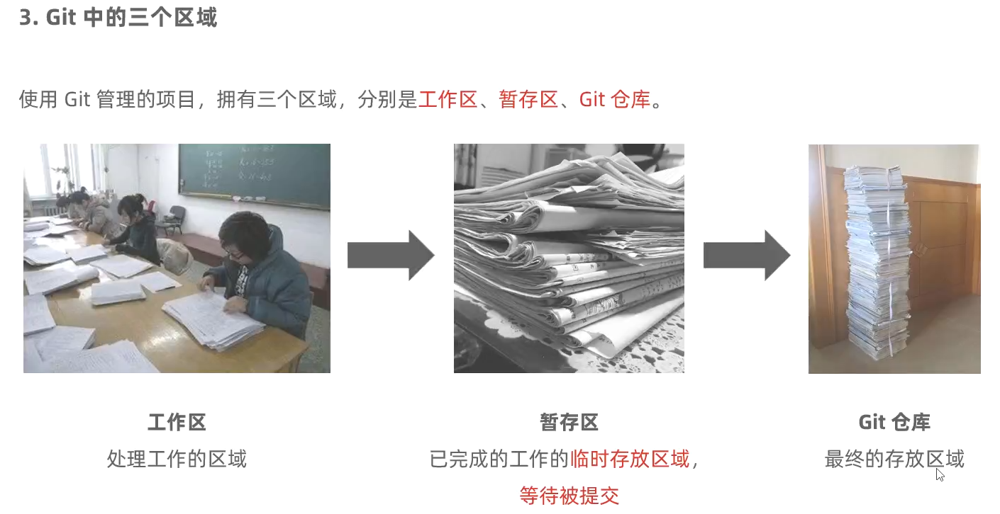
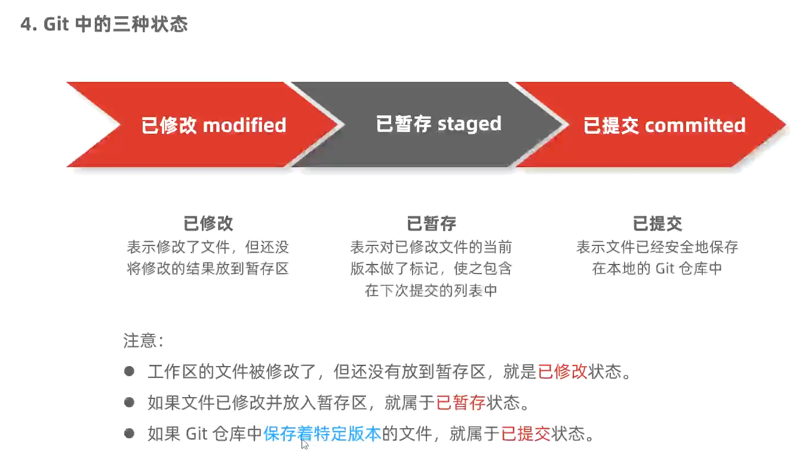
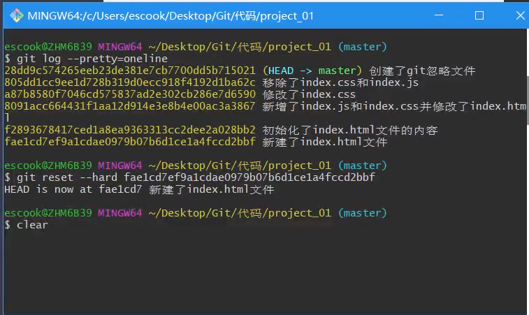

 n'n'n'n'n'n 


# Git

## 0. 资源

[Git 的完整命令列表](https://git-scm.com/docs)

## 1. Git起步

### 1. 关于版本控制


### 2. Git基础概念


+ **快照（snapshot）和复制（copy）在概念上是不同的。**

  在Git中，快照指的是记录项目当前状态的方式，它是通过保存文件的更改内容来创建一个项目的完整副本。每次提交都会创建一个新的快照，它包含了整个项目的当前状态，包括所有修改过的文件。

  复制通常是指将一个文件或目录进行拷贝，并创建一个全新的副本。在这种情况下，原始文件和副本是两个独立的实体，它们可以独立地进行修改和操作。如果在复制后修改了原文件，不会影响副本的内容，反之亦然。

  在Git中，虽然每次提交都会创建一个新的快照，但这些快照并不是简单的副本，而是基于前一次提交的差异进行存储。Git使用了一种名为"增量存储"的技术，只记录每个提交与上一个提交之间的变化，而不是每次提交都复制整个项目。这使得Git非常高效，即使对大型项目进行跟踪和存储也非常快速和节省空间。

  因此，尽管快照和复制都涉及到数据的复制和存储，但在概念上它们是不同的。快照是一种记录项目状态的方式，而复制则是对文件或目录进行完全的数据复制。

+ **当我们谈论快照时，可以将其类比为照相机拍摄的照片。**

  想象一下，你正在照相机中的一个场景前拍照。当你按下快门按钮时，相机会捕捉到当前的景象，并在照片上创建一个静止的图像。这个图像就是一个快照，它记录了当时的场景和细节。

  在版本控制系统中，快照的概念类似。每当你在项目中进行了一些更改或提交时，版本控制系统（如Git）会记录下当前项目的状态，就像拍下当前场景的照片一样。这个记录包含了所有修改过的文件和目录的内容。

  不同于仅记录文件的差异或变化，快照完整地保存了项目的状态，包括所有文件和目录的内容、结构和配置等。这意味着每个快照都可以独立地表示一个项目的特定版本或状态。

  通过记录每个提交的快照，你可以轻松地查看、比较和还原之前的版本。就像你可以翻看相册中的照片来回顾以往的记忆一样，你也可以使用版本控制系统来浏览项目的提交历史并还原到先前的状态。

  因此，快照作为版本控制系统中的一个重要概念，帮助我们跟踪项目的演变过程、比较不同版本之间的差异，并灵活地管理和恢复项目的特定状态。

 






 

## 2. Git基础

### 0. 补充

#### 1. 选项

在Git中，可以使用各种选项来修改和自定义不同的命令行操作。这些选项通常以短格式（例如 `-f`）或长格式（例如 `--force`）的形式提供。

下面是一些常见的Git选项示例：

1. 短格式选项：
   - `-f` 或 `--force`：强制执行操作，即使可能存在冲突或警告。
   - `-m <message>` 或 `--message=<message>`：指定提交的消息。
   - `-a` 或 `--all`：将所有已修改的文件添加到暂存区。
   - `-v` 或 `--verbose`：显示更详细的输出信息。
   - `-q` 或 `--quiet`：减少输出信息，使操作更安静。
   - `-b <branch>` 或 `--branch=<branch>`：指定分支的名称。
   - `-d` 或 `--delete`：删除指定的分支。
   - `-u` 或 `--set-upstream`：设置上游分支。
   - `-p` 或 `--patch`：交互式地选择文件的部分进行提交。

2. 长格式选项：
   - `--force`：与 `-f` 选项相同，强制执行操作。
   - `--message=<message>`：与 `-m` 选项相同，指定提交的消息。
   - `--all`：与 `-a` 选项相同，将所有已修改的文件添加到暂存区。
   - `--verbose`：与 `-v` 选项相同，显示更详细的输出信息。
   - `--quiet`：与 `-q` 选项相同，减少输出信息。
   - `--branch=<branch>`：与 `-b` 选项相同，指定分支的名称。
   - `--delete`：与 `-d` 选项相同，删除指定的分支。
   - `--set-upstream`：与 `-u` 选项相同，设置上游分支。
   - `--patch`：与 `-p` 选项相同，交互式地选择文件的部分进行提交。

这只是一小部分示例，不同的Git命令会有不同的选项。你可以通过查阅相关命令的文档或使用命令 `git help <command>` 来获取关于特定命令及其选项的更多信息。

+++


### 1. 安装并配置Git


### 2. Git的基本操作 

#### 1. 获取Git仓库的两种方式

+ 

+++

#### 2. 在现有的目录中初始化仓库

+ 
+ 

+++

#### 3. 工作区中文件的4种状态

+ 

+++

#### 4. 检查文件的状态

+ 

+++

#### 5. 已精简的方式显示文件状态

+  

+ 在Git中，状态前面的字母是表示文件状态的缩写。

  >以下是常见的Git状态缩写及其含义：

  - "M"：Modified（已修改）：表示文件已被修改但尚未暂存（即未通过git add命令添加到暂存区）。
  - "A"：Added（已添加）：表示文件是新添加的，尚未提交过。
  - "D"：Deleted（已删除）：表示文件已被删除，并且已经提交了该删除操作。
  - "R"：Renamed（已重命名）：表示文件已被重命名。
  - "C"：Copied（已复制）：表示文件已被复制。
  - "U"：Untracked（未跟踪）：表示文件没有被Git追踪，即Git不知道文件的存在。
  - "?"：Untracked（未跟踪）：与"U"状态类似，但在某些Git版本中，对于未跟踪的文件会显示为"?"。
  - "!"：Ignored（已忽略）：表示文件已被忽略，即Git会自动忽略对该文件的追踪和提交。

  这些状态缩写通常在Git命令输出、版本控制工具界面或者IDE中用于标识文件的当前状态。通过查看状态缩写，你可以了解文件是否被修改、删除、重命名、复制、新增或者忽略等，从而更好地管理和处理项目文件。

#### 6. 跟踪新文件

+ 

+++

#### 7. 提交更新 

+  
+ 

+++

#### 8. 对已提交的文件进行修改 

+  

+++

#### 9. 暂存已修改的文件

+  

+++

#### 10. 提交以暂存的文件

+ 

+++

#### 11. 撤销对文件的修改 

+ 

+++

#### 12. 向暂存区中一次添加多个文件

+ 

+++

#### 13. 取消暂存的文件

+ 
  + 
  + 

+++

#### 14. 跳过使用暂存区

+ 
+ 

+++

#### 15. 移除文件

+ 

+ **两种移除方式的区别：**

  + 当你要从Git中移除文件时，有两个常用的命令：`git rm` 和 `git rm --cached`。它们的区别在于如何处理删除操作。

    1. `git rm <file>`：
       - 这个命令会从工作目录中彻底删除文件，并将此删除操作添加到暂存区。
       - 删除后的文件不再出现在工作目录和版本历史中。
       - 因此，如果你只是单纯地想从工作目录中删除文件，但保留在Git的版本历史中，这是一个合适的选项。
       - 需要注意的是，执行完 `git rm <file>` 后，你需要进行一次提交 (`git commit`) 来将该删除操作纳入到版本控制中。

    2. `git rm --cached <file>`：
       - 这个命令会从Git的版本历史中删除文件，但会保留在工作目录中。
       - 删除后的文件仍然存在于工作目录，但不再被Git跟踪和管理。
       - 这意味着该文件不再出现在未暂存或已提交的更改中，但可以继续在本地使用。
       - 如果你希望彻底删除Git版本历史中的文件，但保留该文件的最新版本在工作目录中，这是一个合适的选项。
       - 并且，执行 `git rm --cached <file>` 后，你需要手动进行一次提交 (`git commit`) 来移除该文件的版本历史记录。

    无论使用哪个命令，都要记得在操作之前备份重要的文件，以免意外删除。以及在完成删除操作后，通过适当的提交将更改纳入版本控制，以确保操作的生效。

+ **删除操作在提交前储存在哪里：**

  + 在 Git 中，删除操作的更改会首先被储存在暂存区（也称为索引）中，然后才能提交到版本记录中。

    当你使用 `git rm <file>` 命令或 `git rm --cached <file>` 命令删除文件时，Git 会将这些删除操作添加到暂存区。暂存区相当于一块缓冲区，用于暂时存储将包含在下一次提交中的更改。

    通过将删除操作添加到暂存区，你可以在提交之前对删除操作进行检查和确认。这样做可以避免无意中删除了重要文件，确保只删除所需的文件。

    一旦你执行了提交 (`git commit`) 操作，暂存区中的更改将被永久地记录到版本控制系统中，成为一个新的提交。这意味着删除操作现在是正式的，并且会保存在版本历史记录中。

    需要注意的是，一旦提交了删除操作，除非使用特定的恢复命令，否则无法直接恢复被删除的文件。因此，在删除文件之前，请确保你不再需要该文件的内容。

    总结起来，删除操作首先被添加到暂存区，然后通过提交操作储存在版本历史记录中。

+ 

+ 

#### 16. 忽略文件

+ 
+ 

#### 17. glob模式

+ 

+ 在计算机编程中，"glob模式"是一种用于匹配文件路径或字符串的通配符模式。它可以被用于在文件系统中查找文件、筛选文件列表或匹配特定格式的字符串。在很多编程语言和工具中都有支持glob模式的函数或工具。

  - 当使用glob模式结合git命令时，以下是对特殊字符的详细解释：

    1. `*`：星号匹配任意数量的字符（包括0个字符）。例如，`*.txt`可以匹配所有以`.txt`结尾的文件。
    2. `?`：问号匹配单个字符。例如，`file?.txt`可以匹配`file1.txt`、`file2.txt`等。
    3. `[abc]`：方括号内的字符集合匹配方括号中的任何字符。例如，`[abc].txt`可以匹配`a.txt`、`b.txt`或`c.txt`。
    4. `[0-9]`：连字符（减号）用于指定字符的范围。例如，`file[0-9].txt`可以匹配`file0.txt`到`file9.txt`。
    5. `{ab,cd}`：大括号内逗号分隔的选项可用于匹配多个字符串。例如，`{apple,banana}.jpg`可以匹配`apple.jpg`和`banana.jpg`。
    6. `**`：双星号可以用于递归匹配子目录，并在整个文件树中搜索。它通常与其他模式结合使用，以便匹配特定目录及其子目录中的文件。例如，`src/**/*.py`可以匹配`src`目录及其所有子目录中的`.py`文件。

    这些特殊字符可以帮助你更精确地匹配文件名，从而在git命令中进行文件操作时更加灵活。你可以根据需求组合这些模式，以便选择特定的文件或目录进行操作。但请注意，在使用时要小心避免误操作，确保理解每个模式的含义并按照预期进行操作。

#### 18. .gitignore

+ 

#### 19. 查看提交历史

+ 

+ git log命令选项和示例：

  + 当使用 `git log` 命令时，可以结合不同的选项来查看和定制提交历史的输出。以下是常见的 `git log` 命令选项和示例：

    1. `--oneline`：以简洁的一行摘要显示每个提交。
       示例：`git log --oneline`

    2. `-n <number>`：限制输出的提交记录数量。
       示例：`git log -n 5`

    3. `--author=<author>`：只显示特定作者的提交记录。
       示例：`git log --author=John`

    4. `--after=<date>`：只显示指定日期之后的提交记录。
       示例：`git log --after="2023-01-01"`

    5. `--before=<date>`：只显示指定日期之前的提交记录。
       示例：`git log --before="2023-01-31"`

    6. `--since=<time>`：只显示指定时间之后的提交记录。时间格式可以是相对时间，比如 "2 weeks ago" 或者绝对时间 "2023-01-01 12:00:00"。
       示例：`git log --since="2 weeks ago"`

    7. `--until=<time>`：只显示指定时间之前的提交记录。
       示例：`git log --until="2023-01-31 23:59:59"`

    8. `--grep=<pattern>`：只显示包含指定模式（正则表达式）的提交消息的记录。
       示例：`git log --grep="bug fix"`

    9. `--all`：显示所有分支的提交历史，包括合并提交。
       示例：`git log --all`

    10. `--graph`：以图形化的方式显示提交历史，显示分支和合并的关系。
        示例：`git log --graph`

    这些选项可以组合使用，以满足特定的需求。同时，还可以添加其他选项来定制输出的格式，如 `--pretty=format` 来定义自定义的输出格式。

  + 补充如下常见的 `git log` 命令选项和示例：

    1. `--pretty=format:"<format>"`：使用指定的格式显示提交历史记录。你可以自定义输出的格式，例如 `%h`（简短的提交哈希值）、`%an`（作者姓名）、`%s`（提交消息）等。
       示例：`git log --pretty=format:"%h - %an, %s"`

    2. `--abbrev-commit`：在显示提交哈希值时，使用缩写的形式。
       示例：`git log --abbrev-commit`

    3. `--since=<date1> --until=<date2>`：只显示位于指定日期范围内的提交记录。
       示例：`git log --since="2023-01-01" --until="2023-12-31"`

    4. `--no-merges`：仅显示没有合并提交的历史记录。
       示例：`git log --no-merges`

    5. `--stat`：显示每个提交的文件更改统计信息，包括被修改的文件和添加/删除的行数。
       示例：`git log --stat`

    6. `--graph` 和 `--oneline`：以图形化、简洁的方式显示提交历史和分支情况。
       示例：`git log --graph --oneline`

    7. `--decorate`：在日志中显示分支和标签的引用名称。
       示例：`git log --decorate`

    这些选项可以按照你的需求进行组合和定制，以获得更符合你期望的提交历史记录输出。

+++

#### 20. 回退到指定版本

+ 
+ 
+ 

#### 21. 小结

+  

## 3. Github

### 1. 了解开源相关的概念

#### 1. 什么是开源

+ 

#### 2. 什么是开源许可协议

+ 

#### 3. 常见的5种开源许可协议

+ 

#### 4. 为什么要拥抱开源

+ 

#### 5. 开源项目托管平台

+ 

#### 6. 什么是Github

+ 

### 2. 注册账号

#### 1. 注册Github账号的流程

+ 

#### 2. 激活Github账号

#### 3. 完成注册

### 2. 远程仓库的使用

#### 1. 新建空白远程仓库

+ 

+++

#### 2. 新建空白远程仓库成功

+ 

+++

#### 3.  远程仓库的两种访问方式

+  

#### 4. 基于HTTPS将本地仓库上传到Github

+ 

+ 已经连接后：

  + `git push` 是一个用于将本地代码推送到远程仓库的 Git 命令。它的基本用法是：

    ```
    git push <remote> <branch>
    ```

    其中，`<remote>` 指的是远程仓库的名称或远程仓库的 URL，而 `<branch>` 是要推送的分支名称。

    以下是几个常见的 `git push` 用法示例：

    1. 将当前分支的更改推送到与其关联的远程分支上（通常与本地分支同名）：

       ```
       git push
       ```

    2. 将当前分支的更改推送到与其关联的远程分支上，同时指定远程仓库和分支名称：

       ```
       git push <remote> <branch>
       ```

    3. 将当前分支的更改推送到远程仓库的指定分支上：

       ```
       git push <remote> <local-branch>:<remote-branch>
       ```

    4. 强制推送更改，覆盖远程仓库的内容（慎用）：

       ```
       git push --force
       ```

    5. 推送所有分支到远程仓库：

       ```
       git push --all <remote>
       ```

    6. 删除远程分支：

       ```
       git push <remote> --delete <branch>
       ```

    这些是 `git push` 命令的一些常见用法。根据你的具体需求，你可以选择适合的用法来推送你的代码到远程仓库。

    希望这些示例对你有所帮助！如果还有其他问题，请随时提问。

+ **当使用 `git push` 命令时，可以根据需要在命令中添加不同的参数。**以下是一些常见的示例：

  1. 推送当前分支到远程仓库：
  ```
  git push origin
  ```
  这将把当前分支的提交推送到名为 `origin` 的远程仓库的同名分支。

  2. 推送指定分支到远程仓库：
  ```
  git push origin branch-name
  ```
  这将把名为 `branch-name` 的本地分支的提交推送到名为 `origin` 的远程仓库的同名分支。

  3. 设置上游分支并推送：
  ```
  git push -u origin branch-name
  ```
  这将把名为 `branch-name` 的本地分支的提交推送到名为 `origin` 的远程仓库的同名分支，并将其设置为默认的上游分支。

  4. 强制推送更改：
  ```
  git push --force origin branch-name
  ```
  这将强制将名为 `branch-name` 的本地分支的提交推送到名为 `origin` 的远程仓库的同名分支，即使可能会覆盖其他人的提交。

  5. 推送所有分支到远程仓库：
  ```
  git push --all origin
  ```
  这将推送本地的所有分支到名为 `origin` 的远程仓库。

  6. 删除远程仓库中的一个分支：
  ```
  git push origin --delete branch-name
  ```
  这将删除名为 `branch-name` 的远程仓库分支。

  请注意，具体的命令和参数取决于你所使用的场景和要推送的分支。你可以根据需要组合和调整这些参数来满足你的需求。

  希望以上示例对你有所帮助！如果还有其他问题，请随时提问。

#### 5. SHH key

+ 

#### 6. 生成SSH key

+ 

+ 详细解释过程：

  + 要生成 SSH 密钥，请按照以下步骤操作：

    1. 打开命令行终端窗口（例如，Windows 的 PowerShell、macOS 的 Terminal）。

    2. 输入以下命令，并将 `<email>` 替换为你的电子邮件地址。这个邮箱地址将与你的 SSH 密钥相关联。
    ```
    ssh-keygen -t rsa -b 4096 -C "<email>"
    ```

    3. 按下回车键后，系统将提示你选择保存密钥的文件路径和文件名。如果你不需要自定义路径和文件名，只需按下回车键即可。

    4. 系统还会要求你输入一个密码，用于保护你的私钥。在输入密码时，屏幕上不会显示任何字符。请注意，这是可选的，如果你留空密码，则每次使用密钥时都不需要输入密码。但建议为私钥设置密码，以增加安全性。

    5. 生成 SSH 密钥后，系统会显示公钥的路径和文件名以及私钥的路径和文件名。默认情况下，公钥文件名为 `id_rsa.pub`，而私钥文件名为 `id_rsa`。

    现在，你已经成功生成了 SSH 密钥对。公钥文件 `.pub` 是需要提供给远程服务器或代码托管网站的文件，而私钥文件则必须妥善保存在本地，并确保私密性。

    希望以上步骤对你有所帮助！如有任何进一步的问题，请随时提问。

#### 7. 配置SSH key

+ 

#### 8. 检测Github的SSH key是否配置成功

+ 

#### 9. 基于SSH将本地仓库上传到Github

+ 

#### 10. 将远程仓库克隆到本地 

+ 

+ 
+ 

#### 拓展

+ SSH（Secure Shell）和HTTP（Hypertext Transfer Protocol）是两种不同的网络协议，用于不同的目的和场景。它们在以下几个方面存在区别：

  1. 功能和用途：
     - SSH：SSH是一种加密的网络协议，主要用于安全地远程登录和执行命令或管理远程服务器。它提供了身份验证、加密通信和数据完整性等功能，保护了数据传输的安全性。
     - HTTP：HTTP是一种用于在客户端和服务器之间传输超文本的协议。它主要用于获取网页、发送和接收数据，支持浏览器和服务器之间的通信。

  2. 安全性：
     - SSH：SSH通过使用加密机制和身份验证来确保安全性，可以防止中间人攻击和窃听。它使用公钥和私钥对进行身份验证，并通过加密传输数据。
     - HTTP：HTTP在传输过程中不提供加密，数据以明文形式传输。这意味着信息可以被窃听或篡改，缺乏安全性。

  3. 默认端口：
     - SSH：SSH默认使用22号端口。
     - HTTP：HTTP默认使用80号端口。

  4. 使用场景：
     - SSH：SSH广泛应用于服务器管理、远程登录和终端访问。它可以在终端上执行命令、编辑文件，提供了一种安全的远程管理方式。
     - HTTP：HTTP主要用于在Web上传输超文本和资源。它是支持网页浏览、发送请求和接收响应的协议，用于进行网页浏览、下载文件等操作。

  综上所述，SSH和HTTP是两种不同的协议，分别用于远程登录和服务器管理以及Web浏览和数据传输。它们在功能、安全性、端口和使用场景等方面存在明显的区别。

  + 在GitHub上，SSH和HTTP是两种用于与Git仓库进行通信的协议。

    1. SSH：
       - 使用SSH协议可以实现安全地访问和操作GitHub上的Git仓库。
       - 使用SSH连接到GitHub时，数据传输是加密的，因此更安全。
       - 首先，您需要在GitHub帐户中设置SSH密钥，并将公钥添加到您的GitHub账户中。
       - 使用SSH协议进行操作时，您需要使用SSH URL（以"git@github.com"开头）来克隆、推送和拉取Git仓库。

    2. HTTP：
       - 使用HTTP协议也可以与GitHub上的Git仓库进行通信。
       - 与SSH相比，HTTP通常更简单和易于设置。
       - 当使用HTTP协议时，数据传输不是加密的，相对较少安全。
       - 使用HTTP协议进行操作时，您需要使用HTTP URL（以"https://github.com"开头）来克隆、推送和拉取Git仓库。

    总之，在GitHub上，您可以选择使用SSH或HTTP协议与Git仓库进行交互。SSH提供了更高的安全性，而HTTP则更简单方便。具体选择哪种协议取决于您的需求和个人偏好。

## 4. Git分支

### 1. 本地分支操作

+ 在本地分支上进行操作时，你可以执行以下一些常见的操作：

  1. 创建新的本地分支：
  ```
  git branch branch-name
  ```
  这会在当前提交位置创建一个名为 `branch-name` 的新分支。

  2. 切换到指定的本地分支：
  ```
  git checkout branch-name
  ```
  这将切换到名为 `branch-name` 的本地分支。你可以在不同的分支之间切换来进行不同的工作。

  3. 创建并切换到新的本地分支：
  ```
  git checkout -b branch-name
  ```
  这将创建一个名为 `branch-name` 的新本地分支，并立即切换到该分支上开始工作。

  4. 查看本地分支列表：
  ```
  git branch
  ```
  这将列出所有本地分支。当前所在的分支会有一个星号 (*) 标记。

  5. 将本地分支与远程分支关联起来：
  ```
  git push -u origin branch-name
  ```
  这将把名为 `branch-name` 的本地分支推送到名为 `origin` 的远程仓库，并将其与远程分支关联。

  6. 合并其他分支到当前分支：
  ```
  git merge other-branch
  ```
  这将将 `other-branch` 分支中的更改合并到当前所在的分支。

  7. 删除本地分支：
  ```
  git branch -d branch-name
  ```
  这将删除名为 `branch-name` 的本地分支。请注意，只有当分支中的更改已经被合并到其他分支或丢失时，才能成功删除。

  以上是一些常见的本地分支操作。通过使用这些命令，你可以在本地仓库中有效地管理和操作分支。


#### 1. 分支的概念

+ 

+ 分支概念

  + 在版本控制系统（Version Control System，VCS）中，分支（Branch）是指从主线（主分支）上创建的一个独立的开发路径。它允许团队在不影响主分支的同时并行地进行开发、测试和实验。

    以下是关于分支的一些基本概念：

    1. 主分支（Master/Main Branch）：主分支是最重要的分支，通常用于存储稳定的、可发布的代码。它被视为项目的主要代码线，并且应该保持稳定和可用。
    2. 特性分支（Feature Branch）：特性分支用于从主分支上开发和测试新功能。当开始开发新功能时，可以从主分支上创建一个特性分支，开发完毕后将其合并回主分支。
    3. 发布分支（Release Branch）：发布分支用于准备发布软件的版本。在发布前，可以从主分支上创建一个发布分支，进行最终的测试、修复和准备工作。
    4. 修复分支（Hotfix Branch）：修复分支用于紧急修复主分支上的问题。当发现主分支上的严重错误或漏洞时，可以创建一个修复分支，进行修复，并将其合并回主分支。
    5. 合并（Merge）：合并是将一个分支的更改合并到另一个分支的过程。它可以将一个分支的代码和修改应用到另一个分支上。

+++

#### 2. 分支在实际开发中的功能

+ 

+++

#### 3. master主分支

+ 

+++

#### 4. 功能分支

+ 

+++

#### 5. 查看分支列表

+ 

+++

#### 6. 创建新分支

+ 

+ 

+++

#### 7. 切换分支

+ 

+ 

+++

#### 8. 分支的快速创建和切换

+ 

+ 

+ 在Git中，创建并切换到一个新的分支可以通过以下命令来完成：

  1. 创建分支：
     ```
     git branch <branch_name>
     ```

     - `<branch_name>`是您要创建的新分支的名称。

  2. 切换分支：
     ```
     git checkout <branch_name>
     ```

     - `<branch_name>`是您要切换到的目标分支的名称。

  3. 创建并切换分支（合并上述两个步骤）：
     ```
     git checkout -b <branch_name>
     ```

     - `<branch_name>`是您要创建和切换到的新分支的名称。

  请注意，以上命令只是在本地创建和切换分支。如果您希望将新分支推送到远程仓库，需要使用`git push`命令。

  下面是一个具体的示例：

  1. 创建一个名为`feature/new-feature`的新分支：
     ```
     git branch feature/new-feature
     ```

  2. 切换到新分支：
     ```
     git checkout feature/new-feature
     ```

  或者使用合并命令：
     ```
     git checkout -b feature/new-feature
     ```

  以上命令将创建一个名为`feature/new-feature`的新分支，并将当前工作区切换到该分支。您可以在该分支上进行开发、修改和提交代码。

+++

#### 9. 合并分支

+ 
+ 切换到login分支编辑文件后
  + 
  + 

+ 切换到master分支后
  + 合并前：<br>

+ 合并后：<br>

+++

#### 10. 删除分支

+ 
+ 

#### 11. 遇到冲突时的分支合并

+ 
+ 
+ 
+ 
+ 

+++

### 2. 远程分支操作

+ 在处理远程分支时，你可以执行以下一些常见操作：

  1. 查看远程分支列表：
  ```
  git branch -r
  ```
  这将显示远程仓库中的所有分支。

  2. 拉取远程分支到本地：
  ```
  git checkout -b local-branch-name origin/remote-branch-name
  ```
  这将从远程仓库中拉取 `remote-branch-name` 分支并创建一个名为 `local-branch-name` 的本地分支，并切换到该分支上开始工作。

  3. 推送本地分支到远程仓库：
  ```
  git push origin local-branch-name:remote-branch-name
  ```
  这会将名为 `local-branch-name` 的本地分支推送到远程仓库，并在远程仓库中创建或更新名为 `remote-branch-name` 的远程分支。

  4. 删除远程分支：
  ```
  git push origin --delete remote-branch-name
  ```
  这会删除名为 `remote-branch-name` 的远程分支。

  5. 设置本地分支跟踪远程分支：
  ```
  git branch --set-upstream-to=origin/remote-branch-name local-branch-name
  ```
  这会将名为 `local-branch-name` 的本地分支设置为跟踪名为 `remote-branch-name` 的远程分支。

  6. 获取远程分支最新提交：
  ```
  git fetch origin remote-branch-name
  ```
  这会获取远程仓库中名为 `remote-branch-name` 的分支上的最新提交。

  通过这些操作，你可以有效地管理和操作远程分支。

  +++

+ `git pull` 命令用于从远程仓库拉取最新的更改，并将其合并到当前分支中。它实际上是 `git fetch` 和 `git merge` 两个操作的组合。

  执行以下命令来使用 `git pull`：
  ```
  git pull
  ```
  这会自动从与当前分支关联的远程分支中拉取最新的提交，并将其合并到当前分支中。

  你还可以指定特定的远程仓库和分支：
  ```
  git pull <remote> <branch>
  ```
  其中 `<remote>` 是远程仓库的名称，如 `origin`， `<branch>` 是要拉取的远程分支的名称。

  `git pull` 会尝试自动合并远程分支和当前分支的更改。如果存在冲突，你需要解决冲突后再进行提交。

  该命令还有其他一些选项，例如使用 `--rebase` 选项可以使用变基（rebase）方式合并远程提交。你可以通过阅读 Git 文档或运行 `git pull --help` 来获取更多详细信息。

  如果有任何进一步的问题，请随时提问。

  +++

+ 当处理远程分支时，除了`git pull`命令之外，还有一些其他常见的操作：

  1. 检出远程分支到本地：
     ```
     git checkout -b local-branch-name origin/remote-branch-name
     ```
     这将从远程仓库中检出名为`remote-branch-name`的分支，并创建一个名为`local-branch-name`的本地分支。

  2. 查看远程仓库信息：
     ```
     git remote -v
     ```
     这将显示与本地仓库关联的远程仓库的详细信息，包括名称和URL。

  3. 创建新的远程分支：
     ```
     git push origin local-branch-name:remote-branch-name
     ```
     这将推送名为`local-branch-name`的本地分支到远程仓库，并在远程仓库中创建名为`remote-branch-name`的新分支。

  4. 删除远程分支：
     ```
     git push origin --delete remote-branch-name
     ```
     这会删除名为`remote-branch-name`的远程分支。

  5. 查看远程分支列表：
     ```
     git branch -r
     ```
     这将显示远程仓库中的所有分支。

  6. 拉取远程分支的最新更改：
     ```
     git fetch origin remote-branch-name
     ```
     这会获取远程仓库中名为`remote-branch-name`的分支上的最新提交。

  7. 将本地分支推送到远程仓库：
     ```
     git push origin local-branch-name:remote-branch-name
     ```
     这将名为`local-branch-name`的本地分支推送到远程仓库，并在远程仓库中创建或更新名为`remote-branch-name`的远程分支。

  请注意，在进行远程分支操作时，确保你具有适当的权限和操作权限。

  +++

#### 1. 将本地分支推送到远程仓库、

+ 
+ 

+++

#### 2. 查看远程仓库中所有的分支列表

+ 

+ 

+++

#### 3. 跟踪分支

+ 
+  
+ 
+ 

+++

#### 4. 拉取远程分支的最新代码

+ 
+ 
+ 
+ 
+ 
+ 

+++

#### 5. 删除远程分支

+ 
+ 
+ 

#### 总结

+ 